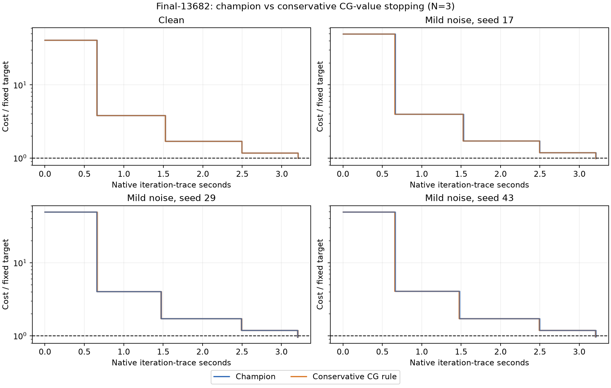

# Final-13682: calibrated initialization stress

13,682 cameras, 4,456,117 points, 28,987,644 observations. The user requested this largest-scene extension after the small-scene stress test; it does not override those counterexamples or automatically promote a solver.

Completed 24 runs. Fixed-target hits: champion 12/12; conservative CG-value rule 12/12. Both arms hit all repeats on 4/4 inputs.

Geometric speedup over the four matched inputs: 1.0006x.

Both arms use the same frozen binary, lambda 0.1 and sustained eta multiplier 2. Candidate adds OCA_CGV=3. No Caspar or pixel-observation-noise runs. All input observation bytes and initial intrinsic values were preserved; the objective and fixed target 27,591,576.557625167 remain the same. SIMPLE_RADIAL, k2 fixed zero, half sum of squared original pixel residuals.

## Input calibration

Clean input plus three seeded perturbations (17,29,43), each calibrated to 1.10x initial full reprojection RMS, or 1.21x initial cost. Additive angle-axis coordinate noise, camera-center and point-coordinate noise; translations reconstructed as t=-R*C. Calibration uses all observations in chunks, before any solver run. It is not isotropic SO(3) noise.

Full-RMS matching controls starting cost, not uniform pose displacement, conditioning or attraction basin. Here the median projected displacement is only about 2–3 micro-pixels, despite maximum displacements of 237–289 pixels. A few extreme observations dominate this calibration. This is a cost-sensitivity test, not evidence of recovery from broadly displaced poses. No seed was resampled based on solver outcomes.

| Input | Initial cost | RMS ratio | Amplitude | Projection displacement px: median / p95 / max | Depth-sign changes |
|---|---:|---:|---:|---:|---:|
| final-13682-clean | 1126369344.673923 | 1.0000000 | 0 | 0 / 0 / 0 | 0 |
| final-13682-mild-seed17 | 1362906663.337376 | 1.0999999 | 7.389647e-07 | 3.19164e-06 / 1.76125e-05 / 241.116 | 0 |
| final-13682-mild-seed29 | 1362906700.800196 | 1.0999999 | 4.669137e-07 | 1.99693e-06 / 1.09743e-05 / 289.098 | 0 |
| final-13682-mild-seed43 | 1362906899.843764 | 1.1000000 | 4.263802e-07 | 1.82938e-06 / 9.82861e-06 / 237.26 | 0 |

## Paired results

N3 timing repeats for each identical input/arm. Seeds are separate initializations, not timing repeats or independent scenes. Each run has 20 native seconds and 600 outers. Target hits require an actual TARGET event within the cap and an independently audited endpoint <=target. No interpolated crossing times.

| Input | Arm | Hits | Target seconds median [min,max] | Final audited cost | Gap to target | Outers | Rejects | Matvecs | Extra stops |
|---|---|---:|---:|---:|---:|---:|---:|---:|---:|
| final-13682-clean | champion | 3/3 | 3.2431 [3.2378, 3.2480] | 27422876.355720 | -0.6114% | 4 | 0 | 19 | 0 |
| final-13682-clean | conservative | 3/3 | 3.2415 [3.2383, 3.2423] | 27422876.552307 | -0.6114% | 4 | 0 | 19 | 0 |
| final-13682-mild-seed17 | champion | 3/3 | 3.2415 [3.2384, 3.2447] | 27158910.586515 | -1.5681% | 4 | 0 | 19 | 0 |
| final-13682-mild-seed17 | conservative | 3/3 | 3.2436 [3.2423, 3.2440] | 27158910.525938 | -1.5681% | 4 | 0 | 19 | 0 |
| final-13682-mild-seed29 | champion | 3/3 | 3.2514 [3.2414, 3.2839] | 26565481.352070 | -3.7189% | 4 | 0 | 19 | 0 |
| final-13682-mild-seed29 | conservative | 3/3 | 3.2434 [3.2388, 3.2494] | 26565481.351695 | -3.7189% | 4 | 0 | 19 | 0 |
| final-13682-mild-seed43 | champion | 3/3 | 3.2412 [3.2374, 3.2484] | 26803273.707338 | -2.8570% | 4 | 0 | 19 | 0 |
| final-13682-mild-seed43 | conservative | 3/3 | 3.2404 [3.2386, 3.2438] | 26803273.686838 | -2.8570% | 4 | 0 | 19 | 0 |

Endpoint and work columns summarize all three runs, including misses; hit-only times are marked.

| Input | Speedup (champion time / candidate time) |
|---|---:|
| final-13682-clean | 1.0005x |
| final-13682-mild-seed17 | 0.9994x |
| final-13682-mild-seed29 | 1.0025x |
| final-13682-mild-seed43 | 1.0003x |

## Interpretation

The sustained-eta2 champion remains the selected configuration. The candidate made zero additional CG stops across all 12 runs, so these timings provide no evidence of a convergence improvement from marginal-value stopping. Tiny timing differences cannot establish a controller benefit when it never changes a stopping decision.

The existing solves are shallow at this target. The new rule requires two consecutive eligible three-increment windows, so it cannot stop before CG depth four; it also requires a residual between the incumbent tolerance and 0.5 and a sufficiently low marginal model-gain rate. Aggregate logs show zero proposals, but do not identify which condition prevented each proposal. This experiment does not isolate a single blocking condition.

These are four initializations of one scene, not four independent large scenes. The prior small-scene counterexamples still prevent promotion. A useful subsequent stress test would pre-register distributed image-displacement or pose-noise scales and a stricter fixed quality target; increasing problem size alone did not exercise this controller.

## Convergence curves

All three repeats are drawn per arm and mostly overlap. Curves show recorded outer-iteration costs as steps; the horizontal line is the fixed target. The CSV timer starts after some solver setup, so its time axis is slightly shorter than the TARGET timer used in the table. Crossings are scored from native TARGET events, not from interpolation of the plot.

## Verification and evidence

All 24 original-observation CPU FP64 endpoint audits passed, maximum relative discrepancy 1.11e-13; maximum native/calibrated initial-cost discrepancy 3.15e-14. Native solver work: 78.850s. Candidate extra stops: 0; numerical repair disabled the controller in 0 runs.

Same host2237c6528e79 and RTX2000 Ada, serialized GPU runs and alternating arm order. Input preparation, loading/export and independent CPU audits are outside native target time. Solver defaults unchanged. Existing small-scene counterexamples still apply regardless of this one scene's outcome.

[Protocol](cg_value_noise_large_protocol.md). Driver: `bench/cg_value_noise_large.py`; reporter: `bench/report_cg_value_noise_large.py`. Exact input files, states, manifests, logs and traces: `/tmp/prism-cg-value-noise-large/`. Compact durable package: `/workspace/prism-cg-value-noise-large-evidence.tar.xz`; raw inputs and endpoint states remain under /tmp.

Storage update: the generated seed17 BAL has been losslessly compacted after reconstructed SHA256 verification. Its unchanged observation prefix is referenced from the original BAL; its exact remaining bytes are gzip-compressed under `/tmp/prism-cg-value-noise-large/compressed_inputs/`. Use `restore.py` there with the accompanying seed17 JSON metadata to recreate the original raw path. This changes storage only; all benchmark inputs and results are preserved.
