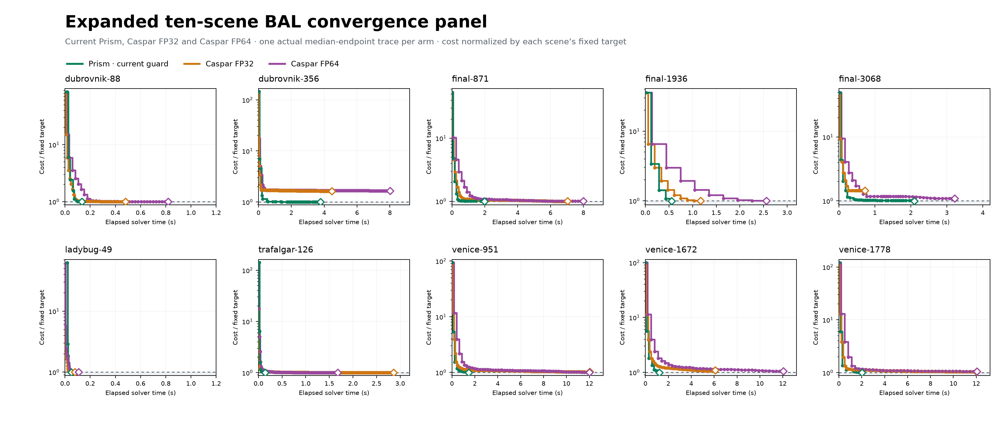

# Expanded ten-scene convergence panel

Ten predeclared BAL scenes, each measured three fresh times with current Prism, Caspar FP32 and Caspar FP64. Targets were fixed before collection. All reported endpoints passed the independent FP64 audit; target misses remain in the table and figures.

| Scene | Prism | Caspar FP32 | Caspar FP64 | Fixed target |
|---|---:|---:|---:|---:|
| [dubrovnik-88](figures/convergence/expanded_dubrovnik88_convergence.png) | 3/3, 0.134 s | 3/3, 0.480 s | 3/3, 0.818 s | 360,790.000 |
| [dubrovnik-356](figures/convergence/expanded_dubrovnik356_convergence.png) | 1/3, 1.000× endpoint | 0/3, 1.632× endpoint | 0/3, 1.656× endpoint | 724,007.275 |
| [final-871](figures/convergence/expanded_final871_convergence.png) | 3/3, 1.987 s | 2/3, 0.999× endpoint | 0/3, 1.003× endpoint | 1,953,211.780 |
| [final-1936](figures/convergence/expanded_final1936_convergence.png) | 3/3, 0.553 s | 3/3, 1.167 s | 3/3, 2.561 s | 5,125,687.352 |
| [final-3068](figures/convergence/expanded_final3068_convergence.png) | 3/3, 2.101 s | 0/3, 1.454× endpoint | 0/3, 1.087× endpoint | 1,819,435.970 |
| [ladybug-49](figures/convergence/expanded_ladybug49_convergence.png) | 3/3, 0.051 s | 3/3, 0.077 s | 3/3, 0.109 s | 13,704.320 |
| [trafalgar-126](figures/convergence/expanded_trafalgar126_convergence.png) | 3/3, 0.141 s | 0/3, 1.001× endpoint | 3/3, 1.676 s | 105,579.584 |
| [venice-951](figures/convergence/expanded_venice951_convergence.png) | 3/3, 1.468 s | 0/3, 1.019× endpoint | 1/3, 1.005× endpoint | 2,019,363.949 |
| [venice-1672](figures/convergence/expanded_venice1672_convergence.png) | 3/3, 1.217 s | 1/3, 1.084× endpoint | 0/3, 1.047× endpoint | 2,571,594.878 |
| [venice-1778](figures/convergence/expanded_venice1778_convergence.png) | 3/3, 2.016 s | 0/3, 1.035× endpoint | 0/3, 1.050× endpoint | 2,099,386.589 |

The panel uses native solver clocks. Prism includes solver-local setup; Caspar graph setup is excluded. Parsing, state export and independent endpoint audit are excluded. FP32 has its predeclared 0.1% inward native stopping margin; qualification always uses the independent original-observation FP64 audit.

All 90 reported endpoints passed the audit. One Venice-1778 FP32 execution completed its solve but had its stdout truncated before the driver’s final check; its raw state/log are retained and excluded, and one audited replacement is included in the N=3 set.

Individual PNG/PDF/SVG plots and the aggregate normalized panel are in [docs/figures/convergence](figures/convergence/). [Raw curve CSV](expanded10_convergence.csv).
