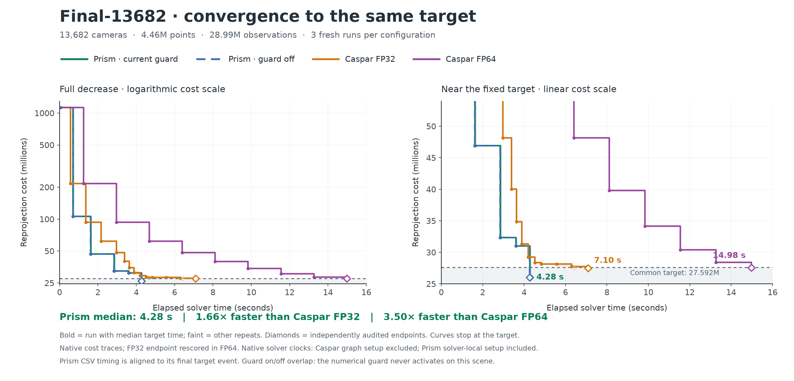

# Final-13682 convergence curves

Fresh N=3 comparison of all four configurations from the latest primary benchmark. Prism reaches the common target in median **4.275 s**, **1.66×** faster than Caspar FP32 and **3.50×** faster than Caspar FP64 on this scene.



| Configuration | Hits | Median target time | Range | Median audited endpoint cost |
|---|---:|---:|---:|---:|
| Prism · current guard | 3/3 | 4.275 s | 4.261–4.316 s | 26,022,217.673 |
| Prism · guard off | 3/3 | 4.269 s | 4.266–4.292 s | 26,022,217.677 |
| Caspar FP32 | 3/3 | 7.096 s | 6.434–7.102 s | 27,498,095.529 |
| Caspar FP64 | 3/3 | 14.982 s | 14.977–14.984 s | 27,580,841.408 |

The fixed target is **27,591,576.557625**, 1% above the previously fixed anchor of 27,318,392.631312. Cost is half the sum of squared pixel residuals over all 28,987,644 observations, using SIMPLE_RADIAL with k2=0. Lower is better. All 12 exported endpoints pass the same independent FP64 audit as the previous study (relative agreement tolerance 1e-6).

This is convergence **to useful quality**, with each solver stopping at its target. The curves do not show continued optimization after the target or establish the eventual best achievable cost. Prism overshoots the target on its fifth accepted step; the lower terminal cost is not an equal-budget final-error comparison.

The current guard and guard-off arms use the same camera-radius TR solver; only the numerical Schur-recovery switch differs. Guard off is not vanilla BA. There are no numerical repairs in these six Prism runs, so their numerical trajectories coincide to rounding and any small time difference is descriptive run variability.

## Timing and plotting method

- Three fresh repeats per configuration, same host and GPU, rotating run order and serialized GPU execution. Frozen executable hashes and exact commands are recorded. Native budget: 20 s, secondary limit: 600. No binary was rebuilt or solver policy changed.
- Bold lines show the entire actual run whose verified target time is the median. Faint lines retain the other two repeats. These are not pointwise median curves or confidence intervals.
- Staircases show the last recorded accepted-state cost until a new state is available. No interpolation is used to invent an earlier target crossing. Curves end at their last measurement; diamonds mark independently audited final states.
- Prism uses the frozen executable’s existing `--csv` logger. Its clock starts after solver-local setup, while the TARGET clock starts at solver entry. The CSV’s final row is immediately before TARGET in the source. We shift every CSV time by `TARGET_seconds - final_CSV_wall_s`, aligning the same endpoint and restoring setup time. This also conservatively retains the final CSV flush-to-TARGET delay in intermediate timestamps; CSV times are rounded to 0.0001 s. The known initial state is placed at solver time zero. No timing is inferred from iteration counts or product counts.
- Caspar TRACE timestamps and runtime share its native solver clock. Caspar graph setup is excluded; Prism solver-local setup is included. Parsing, state export and independent audit are excluded. This follows the existing speed-comparison convention and is not an end-to-end COLMAP pipeline measurement.
- Internal costs are plotted without rescaling. Only final states were independently rescored. The largest native-versus-independent FP32 endpoint discrepancy in this batch is **0.02937%**. The FP32 stopping threshold retains the predeclared 0.1% inward margin; reported target times refer to independently verified terminal states, not an unaudited earlier native crossing.

## Artifacts and reproduction

[PNG](figures/convergence/final13682_convergence.png) · [PDF](figures/convergence/final13682_convergence.pdf) · [SVG](figures/convergence/final13682_convergence.svg) · [curve data CSV](final13682_convergence.csv)

Raw logs, complete CSV traces, manifests, exported states, audit results, protocol and full curve JSON are in `/workspace/prism-final13682-convergence`. Existing benchmark runs remain separate.

```bash
python3 bench/run_final13682_convergence.py
python3 bench/plot_final13682_convergence.py
```

The collection script resumes completed runs without replacing them. Plotting only reads saved traces and audited results. Copies of the scripts are included with the raw artifacts.
