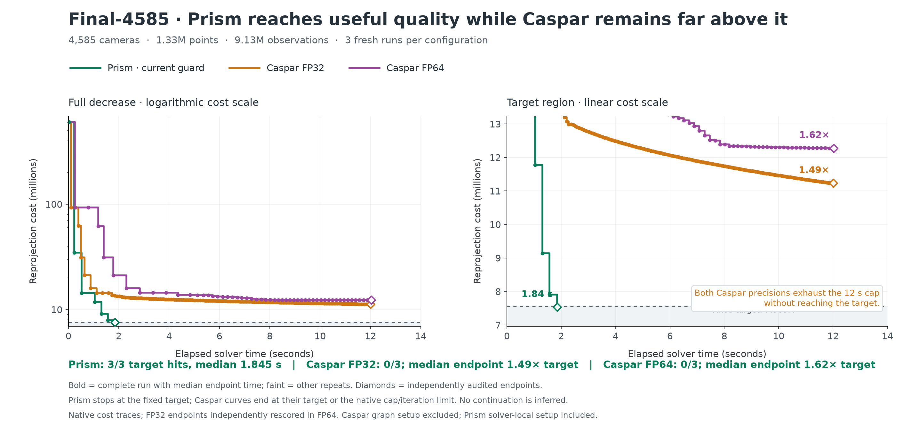

# Final-4585 convergence

Both Caspar precisions exhaust the 12 s cap without reaching the target.

| Configuration | Target hits | Median target time | Median final audited cost | Final / target |
|---|---:|---:|---:|---:|
| Prism · current guard | 3/3 | 1.845 s | 7,531,022.923 | 0.996× |
| Caspar FP32 | 0/3 | — | 11,232,445.433 | 1.485× |
| Caspar FP64 | 0/3 | — | 12,279,225.826 | 1.624× |

Fixed historical target: **7,563,160.303493**, 1% above its historical anchor. It was copied unchanged from `/workspace/prism-model-followup/final-caspar-pairs/protocol.json`. All nine fresh endpoints passed the independent FP64 audit (relative tolerance 1e-6).

This is a large-scene solver/configuration separation; it is not an FP32-only precision claim.

The bold curve is the complete run with median endpoint time; faint curves are the other repeats. The plot does not smooth, interpolate, or continue a stopped solver. Prism uses the frozen current guard configuration. Caspar FP32 uses its predeclared 0.1% inward native stop margin; target qualification uses the independent original-observation FP64 audit.

[PNG](figures/convergence/final4585_convergence.png) · [PDF](figures/convergence/final4585_convergence.pdf) · [SVG](figures/convergence/final4585_convergence.svg) · [curve data CSV](final4585_convergence.csv)
