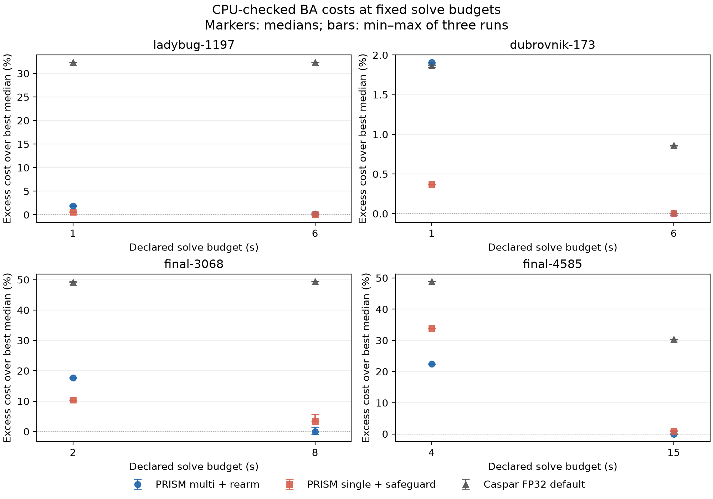

# Fixed-policy validation against Caspar FP32

2026-09-07. Completed 96/96 planned timed runs (24/24 development, 72/72 budget/transfer), 0 failures. Cumulative native solver time: 8.64 minutes. Input parsing, state exports, CPU audits and separate smoke tests are additional.

All settings and the selection rule were fixed in `/workspace/prism-validation/PROTOCOL.md` before the development runs. The broad queue remains paused. All GPU runs use the same lock; N=3 per cell, rotating order. Batching is off. SIMPLE_RADIAL, per-camera f/k1, k2=0, original BAL observations.

## Four-way development ablation

60 outer iterations per run on Ladybug-1197 and Dubrovnik-173. Costs below are independent CPU FP64 scores of exported final matrix states.

| Scene | Policy | N | Median seconds [range] | Median CPU cost [range] | Median retries | Median matvecs | Rearms across runs |
|---|---|---:|---|---|---:|---:|---|
| ladybug-1197 | multi | 3 | 12.083 [11.809, 12.402] | 366,634.48 [366,615.47, 366,659.07] | 101 | 6706 | 0, 0, 0 |
| ladybug-1197 | progressive | 3 | 6.789 [6.789, 7.218] | 365,921.17 [365,727.39, 365,994.40] | 7 | 3404 | 0, 0, 0 |
| ladybug-1197 | rearm | 3 | 6.041 [4.747, 6.048] | 368,234.69 [367,040.77, 368,246.24] | 10 | 3073 | 1, 4, 1 |
| ladybug-1197 | combined | 3 | 7.569 [6.672, 7.618] | 365,883.20 [365,858.28, 365,908.39] | 7 | 3849 | 0, 0, 0 |
| dubrovnik-173 | multi | 3 | 5.470 [5.157, 5.642] | 374,923.99 [374,884.77, 374,939.41] | 17 | 2320 | 0, 0, 0 |
| dubrovnik-173 | progressive | 3 | 5.071 [5.070, 5.959] | 374,886.27 [374,876.82, 374,886.65] | 0 | 2183 | 0, 0, 0 |
| dubrovnik-173 | rearm | 3 | 5.120 [4.696, 7.849] | 374,928.53 [374,884.32, 374,939.29] | 10 | 2314 | 0, 1, 0 |
| dubrovnik-173 | combined | 3 | 6.453 [4.929, 7.867] | 374,877.80 [374,873.93, 374,901.49] | 23 | 2815 | 0, 0, 0 |

Activation matters: in this 60-outer screen, none of the six combined runs rearms. Those runs therefore exercise the progressive policy without an active rearming intervention; their differences from progressive alone are not evidence of policy interference. Rearming alone activates on Ladybug but not Dubrovnik, so the Dubrovnik differences cannot be attributed to rearming.

### Frozen selection

Eligibility: all runs pass their CPU audit and the median endpoint is within 3% of the best median on **both** development scenes. Rank by geometric mean of runtime normalized to existing multi-shift on each scene. Within 3% of the fastest geometric mean, prefer fewer enabled changes; progressive precedes rearm for equal complexity. This rule allows small quality regressions and selects one policy for all subsequent scenes.

Selected: **rearm**, flags `{"OCA_BACKTRACK_REARM": "1"}`. Selection saved before any new budget/transfer results.

| Eligible policy | Normalized geometric-mean runtime |
|---|---:|
| multi | 1.0000 |
| progressive | 0.7217 |
| rearm | 0.6841 |
| combined | 0.8597 |

### Development time-to-quality

Reference: lowest median CPU endpoint among the four development arms per scene. Times are PRISM FP64 trace crossings with all untraced solve overhead charged before the crossing. Endpoints are independently audited; intermediate states are not each exported. `x/3 reached` retains runs that fail to cross under the outer cap.

| Scene | Policy | Within 1% (s) | Within 3% (s) | Within 5% (s) |
|---|---|---|---|
| ladybug-1197 | multi | 1.740 | 0.897 | 0.733 |
| ladybug-1197 | progressive | 0.967 | 0.633 | 0.512 |
| ladybug-1197 | rearm | 3.353 | 0.903 | 0.747 |
| ladybug-1197 | combined | 0.958 | 0.620 | 0.499 |
| dubrovnik-173 | multi | 1.117 | 0.811 | 0.408 |
| dubrovnik-173 | progressive | 0.951 | 0.365 | 0.365 |
| dubrovnik-173 | rearm | 1.104 | 0.785 | 0.385 |
| dubrovnik-173 | combined | 0.950 | 0.366 | 0.366 |

## Fixed wall-budget comparison and transfer

Fresh runs of the selected fixed policy, guarded single shift and Caspar FP32 default parameters. The outer cap is raised to 100,000 so the time budget or existing convergence criterion controls stopping. Both solvers check the budget before committing an outer candidate and before starting the next attempt. A candidate completed after the deadline is discarded. Returned endpoints therefore receive no benefit from an unfinished over-budget iteration; actual process return can exceed the target by that attempt and cleanup. These are budget-eligible state comparisons, not hard real-time return guarantees.

Clocks are native solve clocks: file parsing, output and audits excluded. Caspar graph setup is separate, while PRISM solver allocations remain in its solve clock. This is not an equal end-to-end latency comparison. Existing convergence exits remain enabled.

Transfer uses final-3068 and final-4585 without retuning after selection. Both have appeared earlier in the investigation, so they are not globally unseen benchmarks.

| Scene | Budget (s) | Method | N | Median CPU cost [range] | Median actual solve (s) | Max overshoot (s) |
|---|---:|---|---:|---|---:|---:|
| ladybug-1197 | 1 | selected | 3 | 373,022.18 [373,011.68, 374,002.34] | 1.050 | 0.275 |
| ladybug-1197 | 1 | single | 3 | 368,381.04 [368,331.37, 368,774.67] | 1.226 | 0.520 |
| ladybug-1197 | 1 | caspar32 | 3 | 484,814.73 [484,814.35, 484,818.47] | 0.283 | 0.000 |
| ladybug-1197 | 6 | selected | 3 | 367,003.14 [366,946.32, 367,939.02] | 6.036 | 0.053 |
| ladybug-1197 | 6 | single | 3 | 366,326.73 [366,318.43, 366,419.19] | 6.030 | 0.186 |
| ladybug-1197 | 6 | caspar32 | 3 | 484,813.37 [484,811.49, 484,817.92] | 0.282 | 0.000 |
| dubrovnik-173 | 1 | selected | 3 | 382,072.32 [382,013.28, 382,075.35] | 1.058 | 0.067 |
| dubrovnik-173 | 1 | single | 3 | 376,309.14 [376,309.14, 376,309.14] | 1.187 | 0.195 |
| dubrovnik-173 | 1 | caspar32 | 3 | 381,917.00 [381,846.27, 381,948.95] | 1.004 | 0.005 |
| dubrovnik-173 | 6 | selected | 3 | 374,926.74 [374,874.73, 374,947.96] | 6.188 | 0.259 |
| dubrovnik-173 | 6 | single | 3 | 374,926.17 [374,925.81, 374,929.41] | 6.128 | 0.439 |
| dubrovnik-173 | 6 | caspar32 | 3 | 378,144.63 [378,140.38, 378,151.15] | 6.011 | 0.013 |
| final-3068 | 2 | selected | 3 | 2,087,758.16 [2,087,756.36, 2,087,758.52] | 2.086 | 0.260 |
| final-3068 | 2 | single | 3 | 1,957,394.70 [1,957,394.37, 1,957,394.90] | 2.213 | 0.242 |
| final-3068 | 2 | caspar32 | 3 | 2,646,304.70 [2,646,082.56, 2,649,399.17] | 0.707 | 0.000 |
| final-3068 | 8 | selected | 3 | 1,773,597.55 [1,759,491.93, 1,801,008.95] | 8.346 | 0.421 |
| final-3068 | 8 | single | 3 | 1,833,515.15 [1,831,034.74, 1,874,100.46] | 8.460 | 0.582 |
| final-3068 | 8 | caspar32 | 3 | 2,649,327.74 [2,649,310.81, 2,649,408.35] | 0.661 | 0.000 |
| final-4585 | 4 | selected | 3 | 10,282,628.83 [10,282,628.83, 10,282,628.83] | 4.272 | 0.283 |
| final-4585 | 4 | single | 3 | 11,245,462.39 [11,245,462.39, 11,245,462.39] | 4.066 | 0.379 |
| final-4585 | 4 | caspar32 | 3 | 12,496,712.99 [12,496,634.79, 12,496,888.00] | 4.029 | 0.030 |
| final-4585 | 15 | selected | 3 | 8,396,585.76 [8,396,585.75, 8,398,128.09] | 15.547 | 0.734 |
| final-4585 | 15 | single | 3 | 8,469,650.89 [8,466,262.94, 8,492,045.76] | 15.572 | 0.582 |
| final-4585 | 15 | caspar32 | 3 | 10,942,736.97 [10,942,548.11, 10,943,244.05] | 15.047 | 0.051 |

### Equal-budget endpoint differences

Negative percentages favor the selected PRISM policy; these compare CPU-checked median costs at the same declared budget.

| Scene | Budget (s) | Selected vs Caspar | Selected vs guarded single |
|---|---:|---:|---:|
| ladybug-1197 | 1 | -23.059% | +1.260% |
| ladybug-1197 | 6 | -24.300% | +0.185% |
| dubrovnik-173 | 1 | +0.041% | +1.532% |
| dubrovnik-173 | 6 | -0.851% | +0.000% |
| final-3068 | 2 | -21.107% | +6.660% |
| final-3068 | 8 | -33.055% | -3.268% |
| final-4585 | 4 | -17.717% | -8.562% |
| final-4585 | 15 | -23.268% | -0.863% |

### Interpretation

The selected fixed policy has lower median external cost than Caspar in seven of eight budget cells; the exception is Dubrovnik at 1s, where the difference is only about 0.04%. Guarded single shift is strongest in the short budgets on the small/medium cases. Multi-shift has a useful advantage on final-3068 at 8s and on the large case, but its 15s large advantage over guarded single is under 1%. These results do not support a universal multi-shift win.

The 1%, 3%, 5% bands expose variability: a median endpoint does not guarantee all three runs are within 1%. The range bars and the all-repeats criterion below retain that uncertainty. Rearming does not activate in the short transfer runs, so their gains are not evidence of its incremental benefit. The signed projection guard and FP32 sensitivity described below prevent a matched-algorithm superiority claim.

### CPU-checked time-to-quality bounds

For each scene, reference cost is the lowest median checked endpoint across methods and budgets in this fresh grid. Each cell is the earliest **tested budget** where all three repeats finish within the stated band. It is a discrete upper bound, not an exact first-crossing time. A dash means no tested budget qualifies. Native Caspar FP32 traces are retained for diagnosis but are not used to certify FP64 crossings.

| Scene | Method | Reference cost | Within 1% by (s) | Within 3% by (s) | Within 5% by (s) |
|---|---|---:|---|---|---|
| ladybug-1197 | selected | 366,326.73 | 6 | 1 | 1 |
| ladybug-1197 | single | 366,326.73 | 1 | 1 | 1 |
| ladybug-1197 | caspar32 | 366,326.73 | — | — | — |
| dubrovnik-173 | selected | 374,926.17 | 6 | 1 | 1 |
| dubrovnik-173 | single | 374,926.17 | 1 | 1 | 1 |
| dubrovnik-173 | caspar32 | 374,926.17 | 6 | 1 | 1 |
| final-3068 | selected | 1,773,597.55 | — | 8 | 8 |
| final-3068 | single | 1,773,597.55 | — | — | — |
| final-3068 | caspar32 | 1,773,597.55 | — | — | — |
| final-4585 | selected | 8,396,585.76 | 15 | 15 | 15 |
| final-4585 | single | 8,396,585.76 | — | 15 | 15 |
| final-4585 | caspar32 | 8,396,585.76 | — | — | — |

## Audit and numerical limits

PRISM endpoints audited: 72. Maximum relative difference between exported-state CPU objective and reported GPU objective: 3.2e-11. The CPU checker evaluates every original observation, including negative depths, using the saved rotation matrices/points/intrinsics; it does not consume GPU residuals. Export occurs outside the solve timer.

Caspar endpoints use its independent CPU FP64 scorer against original double observations. Caspar state, arithmetic and pixel storage remain FP32; initial quantization is measured rather than silently calling the initial states identical. The generated Caspar projection also uses `z + copysign(1e-6, z)`, while the common audit and PRISM use plain `z`. Thus native objective differences near zero depth are not solely floating-point rounding. These are practical implementation comparisons under a common external metric, not matched-precision/matched-internal-objective ablations.

| Scene | Max initial quantization gap | Max native-vs-CPU final cost gap |
|---|---:|---:|
| ladybug-1197 | 2.94 | 0.0608 |
| dubrovnik-173 | 6.52e-07 | 1.34e-06 |
| final-3068 | 0.00421 | 0.0054 |
| final-4585 | 5.05e-07 | 1.35e-05 |

### Projection-guard diagnostic

The generated Caspar score kernel uses a signed 1e-6 depth guard. Two additional N=1 diagnostics rescore the same returned FP32 states on the CPU with and without that guard, always against original observations. They are separate from the 96 timed runs. Matching the guard reduces but does not eliminate the native/CPU discrepancy; the native path still evaluates in FP32 with different arithmetic/reduction order.

| Scene | CPU plain-z cost | CPU guarded-z cost | Native FP32 cost | Native/guarded gap |
|---|---:|---:|---:|---:|
| ladybug-1197 | 484,814.45 | 465,381.38 | 455,327.69 | 2.160% |
| final-3068 | 2,649,462.91 | 2,635,493.72 | 2,635,126.75 | 0.014% |

On Ladybug, the raw original initial cost is about 45.43M, while the returned FP32 initial state scores 178.87M under plain-z projection and 45.71M with the guard. This is a material numerical sensitivity, not an identical-start claim. The table above remains a common external objective comparison; matched precision and projection are needed before attributing its advantages solely to a novel algorithm. Source: the retained `caspar-score-kernel.cu` in the artifact directory; see the signed denominator operation before projection.

## Reproduction

* Protocol, frozen binaries, source snapshots, exact commands, exported states, logs and JSON: `/workspace/prism-validation`.
* `bench/validation_study.py ablation --binary <frozen>`; `select`; then `budgets --binary <frozen> --caspar <frozen>`.
* Independent checker: `bench/audit_prism_state.py <original BAL> <exported state> --reported <GPU cost>`.
* `bench/report_validation_study.py` regenerates this report from retained results.
* New opt-in hooks: PRISM `OCA_MAX_SECONDS` and `--state_out`; Caspar `CASPAR_MAX_SECONDS` in the build-local instrumented solver. Neither upstream checkout nor algorithm defaults are changed.
* Results are local/uncommitted. The broad queue stays paused. This small N=3 investigation does not prove universal superiority, establish novelty by itself, or supply a publication verdict.
