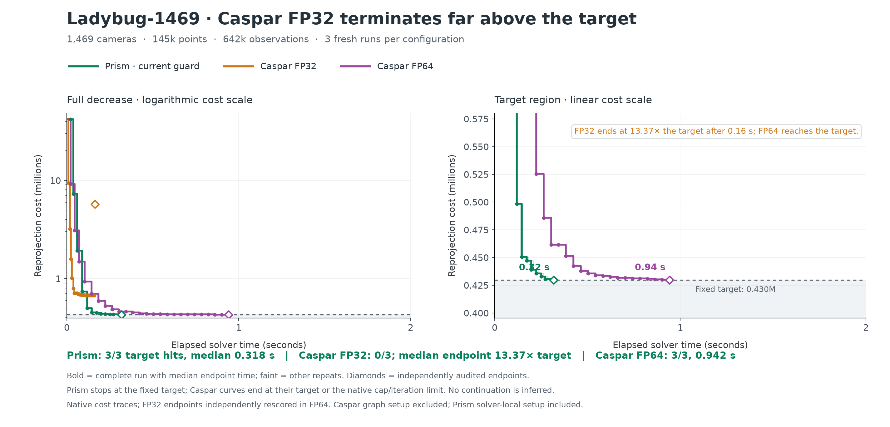

# Ladybug-1469 convergence

FP32 ends at 13.37× the target after 0.16 s; FP64 reaches the target.

| Configuration | Target hits | Median target time | Median final audited cost | Final / target |
|---|---:|---:|---:|---:|
| Prism · current guard | 3/3 | 0.318 s | 429,634.390 | 1.000× |
| Caspar FP32 | 0/3 | — | 5,744,723.973 | 13.368× |
| Caspar FP64 | 3/3 | 0.942 s | 429,722.183 | 1.000× |

Fixed historical target: **429,742.369936**, 1% above its historical anchor. It was copied unchanged from `/workspace/prism-schur-recovery/extension/protocol.json`. All nine fresh endpoints passed the independent FP64 audit (relative tolerance 1e-6).

Ladybug subsets are correlated recordings; this is a precision diagnostic, not a separate independent panel win.

The bold curve is the complete run with median endpoint time; faint curves are the other repeats. The plot does not smooth, interpolate, or continue a stopped solver. Prism uses the frozen current guard configuration. Caspar FP32 uses its predeclared 0.1% inward native stop margin; target qualification uses the independent original-observation FP64 audit.

[PNG](figures/convergence/ladybug1469_convergence.png) · [PDF](figures/convergence/ladybug1469_convergence.pdf) · [SVG](figures/convergence/ladybug1469_convergence.svg) · [curve data CSV](ladybug1469_convergence.csv)
