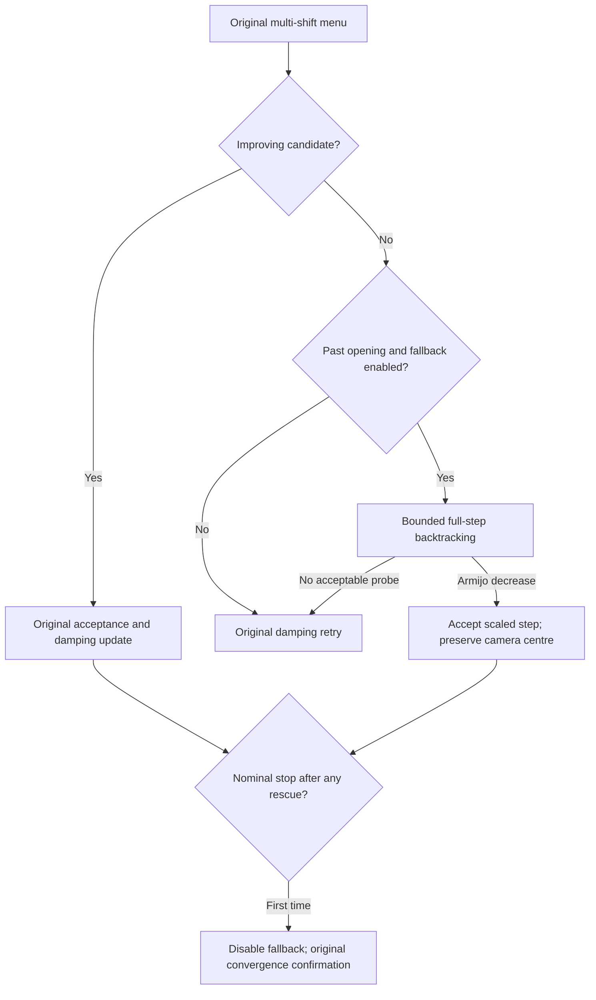

# Reducing failed-menu rebuilds (2026-09-07)

**Verdict:** full-step backtracking substantially reduces expensive damping
retries, but it is not a universally faster replacement for the existing
controller. The final guarded implementation remains opt-in.

Config A final-4585, 60-outer budget, N=3 per arm (medians):

| Metric | Existing execution-optimized solver | With guarded backtracking | Change |
|---|---:|---:|---:|
| Rebuild retries | 454 | 27 | −94.1% |
| All candidate/alpha/backtracking cost evaluations | 2,244 | 1,233 | −45.1% |
| Solver wall | 70.931 s | 51.274 s | −27.7% |
| Endpoint cost | 12,109,193 | 8,217,450 | −32.1% |

All runs accept 60 steps. Each new run rescues 57 failed menus; the remaining
failed attempts still use the original retry ladder. The new method performs
more matvecs (median 1,246 versus 722), but avoids much repeated factorization
and scoring. Observed time ranges are 70.804–70.950 s versus 49.900–53.043 s.
The controls are shared earlier measurements, not interleaved with this final
variant. This is a bounded-workload result, not a full final-4585 convergence
claim. Both arms already include the earlier execution optimizations.

Full-budget Config A gates, N=3 per arm:

| Scene | Median rebuild retries | Median solver wall | Median cost change |
|---|---:|---:|---:|
| venice-52 | 15 → 0 | 29.174 → 31.199 s | −2.179% |
| ladybug-1197 | 389 → 211 | 34.279 → 25.936 s | −0.0556% |
| final-3068 | 82 → 0 | 164.171 → 260.499 s | +0.1129% |

Venice has a resolved lower cost under the protocol, but overlapping timing
ranges. Ladybug has a lower median wall with overlapping timing ranges; its
cost difference is not resolved. Final-3068 is consistently slower across these
observed timing ranges and has a slightly higher median cost; its cost difference
is not resolved. All three final-3068 candidates exhaust 600 outers while the
references stop at 330–469. No candidate triggers convergence confirmation on
that scene. Eliminating retries there buys more accepted short steps, but does
not reduce the total work: median matvecs rise 57.5% and scoring rises 53.5%.

Recommendation: retain the safeguarded path as an experimental option, not the
default. It demonstrates a useful way to avoid rebuilding a failed menu, and
fixes a substantial execution bottleneck on the principal storm workload.
Quality and total work must still be checked for a new scene. These four scenes
do not establish a universal or worst-case performance claim.

See [measured costs, timings, crossings and work counts](menu_retry_results.md).

## Diagnosis

The multi-shift sweep solves `(S(tau) + sigma I) x = b(tau)` for five camera
dampings while holding point damping fixed. The recovered point step contains
`V(tau)^-1 bp`, which generally remains nonzero as camera damping increases. Thus even
the highest camera shift can leave an oversized point relaxation. The existing
alpha grid only runs after an improving candidate has already been found.

This explains why a menu of camera dampings does not necessarily avoid a retry
of the complete factor/RHS/CG/scoring pipeline. Giving each shift a different
point damping would change both the Schur operator and its RHS; those systems
cannot use the existing scalar-shift recurrence unchanged.

## Implemented safeguard

`OCA_MENU_BACKTRACK=8` adds bounded full-step Armijo backtracking **only after
the original shift/depth menu fails**. It is off by default and currently enabled
only for unshared, fp64, nine-parameter cameras. The first three accepted
outers retain the original damping/retry policy to preserve the established
early basin-selection phase.

1. Retain the lowest-cost rejected full tangent direction `d` while evaluating
   the original candidates. A nonfinite first candidate can be replaced by a
   finite one; a nonfinite/non-descent direction cannot enter the line search.
2. Compute `g^T d` from the original camera and point gradients. Require a finite
   negative value.
3. Evaluate `alpha = 1/2, 1/4, ..., 1/256`, scaling cameras and points together.
   Accept the first full fp64 objective satisfying strict decrease and
   `f(Retract(alpha*d)) <= f(x) + 1e-4*alpha*g^T d`.
4. Preserve the pre-retry camera damping centre on a rescue. Its Schur-only
   prediction omits the scaled point relaxation, so it must not be fed into
   the original Nielsen update. Clean menu accepts retain the original policy.
5. If the bounded search fails, use the original damping retry ladder.
6. At the first nominal convergence after a rescue, permanently disable the
   fallback, reset the flatness/failure streaks, and let the original solver
   confirm convergence within the remaining **same** outer budget. This
   prevents a series of tiny line-search steps from masquerading as convergence.
   A run can still exhaust the outer budget before confirmation finishes.

Each extra check needs a retraction and residual evaluation, with no additional
point factorization, diagonal construction, CG or point back-substitution. It
uses one extra full-step GPU buffer. It does not prune the shift/depth menu,
change point damping, lower precision, or use subsampled costs.



The line search is bounded: it is not a guarantee of acceptance. It also changes
trajectories, so fewer rebuild retries alone is not a quality or speed verdict.
A failed menu rescued by backtracking is reported separately, not hidden as a
successful unscaled menu. Total scoring includes every backtracking evaluation.

## Controller correction during development

The first prototype increased the camera centre by `1/alpha` after a rescue.
Its short pilot looked good, but inspection of its 60-outer trace showed the
centre reaching `1e8` and CG depth collapsing to zero. A point-driven overshoot
was being misinterpreted as evidence for stronger camera damping. That version's
ongoing experiments were stopped and all partial/completed measurements retained
in `/workspace/prism-retries`, with `STOPPED.json` explanations.

Revision 2 preserves the pre-streak centre on a rescue. It completed the
large-scene gate with fewer retries and lower cost, but its Ladybug full-run
endpoints were consistently worse. Revision 3 additionally protects the first
three accepted outers: the repository identifies these as the basin commitment
window, and Ladybug's first rescued menu was in outer three. This is one fixed
rule applied to every scene, not selection of configurations by scene.
Its single Ladybug pilot still stopped early. Revision 4 adds one original-policy
convergence confirmation. In the diagnostic Ladybug run this continued from
367,703.7 to 365,950.7, with the opening guard and permanent fallback shutdown
verified by the trace checker. This pilot is exploratory, not an N=3 verdict.
Revision 2 uses the same frozen executable in both arms. Both versions keep
cache, batched scoring and the forward-norm diagonal enabled in both arms.
Revision 4 retains every completed reference from revision 2: three each
for final-4585, Venice and Ladybug, and the first final-3068 reference. Those
shared controls are not interleaved with their new optimized runs. The two missing
final-3068 controls were collected by the normal interleaved harness. No completed
reference is discarded. Timing verdicts disable phase profiling.

## Validation and reproduction

All runs use the fp64 SIMPLE_RADIAL objective, `--dof9 --zero_k2`, Config A,
independent initial-cost agreement at relative 1e-6, and serialized GPU work.
The fixed validation rule is N=3 per arm: 60 outers on final-4585, and the
600-outer quality budget on venice-52, ladybug-1197 and final-3068. A full-budget
run may reach its outer limit while still descending; it is not automatically
a converged endpoint. The new controller has not been validated under Config B.
This is an initial algorithm study, not a complete BAL ledger or a Caspar comparison.

The harness now accepts `--reference-env` to hold execution optimizations equal
across arms, and records all scoring counts without profiling. Example:

```sh
python bench/profile_iterations.py \
  --reference /workspace/prism-retries/backtrack-v2 \
  --optimized /workspace/prism-retries/backtrack-v4 \
  --data /workspace/bal --out /workspace/prism-retries/new-study \
  --scenes final-4585 --reps 3 --max-iter 60 --config A \
  --reference-env OCA_RETRY_CACHE=1 --reference-env OCA_MULTI_RHS=1 \
  --reference-env OCA_DIAG_NORM=1 --optimized-env OCA_DIAG_NORM=1 \
  --optimized-env OCA_MENU_BACKTRACK=8
```

For a diagnostic run, set `OCA_LEARN_LOG` to a fresh JSONL path. Then run
`python bench/check_menu_backtrack.py <path> --preserve-center --warmup-accepts 3` to check that
backtracking only follows failed menus, uses descent directions, accepts the
first sufficient-decrease probe, preserves the camera centre, and respects
the protected opening and permanent shutdown during convergence confirmation. The existing
learning logger's lowercase nonfinite diagnostic literals are normalized by
the checker before parsing. Use `bench/summarize_retries.py` for work counts
and `bench/summarize_iterations.py` for costs, timing and both crossings.

The profiling-corrected revision 2 charges retained-direction copying to candidate
phase profiling; the timed comparisons have phase profiling disabled. Compute
Sanitizer memcheck on ladybug-49 (20 outers) reports zero errors, and the trace
checker verifies four rescued menus in both revision 2 builds.
The camera-centre regression check correctly rejects the first prototype's
trace. Python syntax checks and `git diff --check` pass.

One completed large-scene log had its summary split by the existing stderr CSV
announcement. The harness now keeps stderr separate and can recover a completed
run after a parsing failure. That run was recovered from its retained raw log
and CSV, with input hash and initial objective rechecked; it was not discarded
or rerun. Its JSON record explicitly marks the recovery.

Revision 4 passes Compute Sanitizer on ladybug-49 with a deliberately loose
`OCA_FTOL=1e-3 OCA_FTOL_K=2` diagnostic (100-outer cap): 15 attempts, one
rescued menu, and a completed switch into original-policy confirmation, with
zero memory errors. The trace checker verifies all three safeguards. This
loose-stop diagnostic is a correctness test and is excluded from the timing
and quality tables, which retain Config A's prescribed stop settings.
