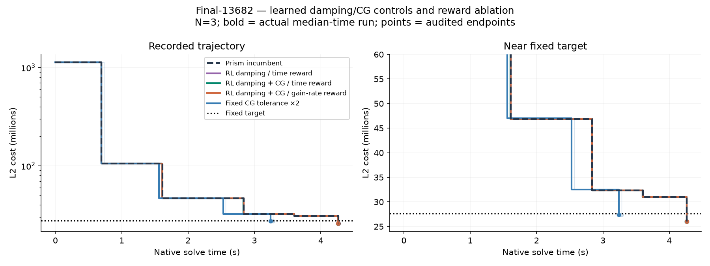
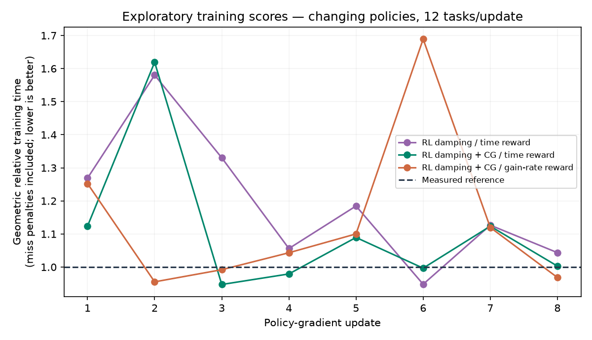

# Learned damping/CG control and reward comparison

**Verdict: retain the incumbent; no general learned-policy promotion.**

Best aggregate point estimate: Fixed CG tolerance ×2. All results use host2237c6528e79 / RTX2000 Ada. These are new matched comparisons; previous Caspar timings are not pooled with them.

## What was tested

Three on-policy REINFORCE actors with linear logits on20 bounded nonlinear/history features: damping-only with a time reward (60 parameters), joint damping/CG accuracy with a time reward (100), and the same joint action space with a summed gain-rate reward (100). This is fitted stochastic-policy learning, not a threshold grid or SAC/PPO. Eight updates ×12 tasks =96 episodes per actor. Final weights are frozen, then evaluated greedily.

Lambda corrections are factors1/2 or2, with baseline always available. Joint actors can halve/double the forcing tolerance for one outer, capped at.5. At most3 nonzero actions, an idle boundary between them, temporary abstention after bad agreement/rejection and permanent abstention after numerical repair. Incumbent true-objective acceptance, radius guard, rescue and residual verification remain in force. A fixed eta×2 comparator separates learning from a useful constant setting.

## Greedy policies: fresh time-to-target results

| Scene | Initial lambda | Arm | Hits | Seconds: median[min,max] | Audited cost | Outers | Rejects | Matvecs |
|---|---:|---|---:|---:|---:|---:|---:|---:|
| trafalgar-126 | 0.1 | Prism incumbent | 3/3 | 0.132 [0.128, 0.144] | 105234.222 | 7 | 0 | 237 |
| trafalgar-126 | 0.1 | RL damping / time reward | 3/3 | 0.133 [0.133, 0.133] | 105234.215 | 7 | 0 | 237 |
| trafalgar-126 | 0.1 | RL damping + CG / time reward | 3/3 | 0.140 [0.133, 0.145] | 105234.211 | 7 | 0 | 237 |
| trafalgar-126 | 0.1 | RL damping + CG / gain-rate reward | 3/3 | 0.131 [0.129, 0.206] | 105234.216 | 7 | 0 | 237 |
| trafalgar-126 | 0.1 | Fixed CG tolerance ×2 | 3/3 | 0.116 [0.112, 0.162] | 105290.474 | 7 | 0 | 195 |
| final-1936 | 0.1 | Prism incumbent | 3/3 | 0.561 [0.551, 0.575] | 5095070.524 | 4 | 0 | 22 |
| final-1936 | 0.1 | RL damping / time reward | 3/3 | 0.557 [0.550, 0.562] | 5095070.524 | 4 | 0 | 22 |
| final-1936 | 0.1 | RL damping + CG / time reward | 3/3 | 0.550 [0.549, 0.550] | 5095070.524 | 4 | 0 | 22 |
| final-1936 | 0.1 | RL damping + CG / gain-rate reward | 3/3 | 0.551 [0.551, 0.552] | 5095070.524 | 4 | 0 | 22 |
| final-1936 | 0.1 | Fixed CG tolerance ×2 | 3/3 | 0.502 [0.501, 0.510] | 5098339.730 | 4 | 0 | 16 |
| muell-gba146 | 0.1 | Prism incumbent | 3/3 | 4.538 [4.536, 4.558] | 1945371.476 | 16 | 0 | 1065 |
| muell-gba146 | 0.1 | RL damping / time reward | 3/3 | 4.534 [4.525, 4.538] | 1945371.437 | 16 | 0 | 1065 |
| muell-gba146 | 0.1 | RL damping + CG / time reward | 3/3 | 4.531 [4.528, 4.552] | 1945371.432 | 16 | 0 | 1065 |
| muell-gba146 | 0.1 | RL damping + CG / gain-rate reward | 3/3 | 4.529 [4.525, 4.540] | 1945371.419 | 16 | 0 | 1065 |
| muell-gba146 | 0.1 | Fixed CG tolerance ×2 | 3/3 | 4.235 [4.234, 4.237] | 1946467.147 | 16 | 0 | 980 |
| muell-gba146 | 10.0 | Prism incumbent | 3/3 | 4.215 [4.210, 4.266] | 1945209.657 | 19 | 0 | 927 |
| muell-gba146 | 10.0 | RL damping / time reward | 3/3 | 4.216 [4.208, 4.220] | 1945209.658 | 19 | 0 | 927 |
| muell-gba146 | 10.0 | RL damping + CG / time reward | 3/3 | 4.225 [4.216, 4.234] | 1945209.685 | 19 | 0 | 927 |
| muell-gba146 | 10.0 | RL damping + CG / gain-rate reward | 3/3 | 4.232 [4.217, 4.260] | 1945209.674 | 19 | 0 | 927 |
| muell-gba146 | 10.0 | Fixed CG tolerance ×2 | 3/3 | 6.196 [6.185, 6.199] | 1945493.781 | 25 | 0 | 1405 |
| final-13682 | 0.1 | Prism incumbent | 3/3 | 4.264 [4.259, 4.266] | 26022217.673 | 5 | 0 | 28 |
| final-13682 | 0.1 | RL damping / time reward | 3/3 | 4.261 [4.260, 4.264] | 26022217.677 | 5 | 0 | 28 |
| final-13682 | 0.1 | RL damping + CG / time reward | 3/3 | 4.261 [4.258, 4.262] | 26022217.678 | 5 | 0 | 28 |
| final-13682 | 0.1 | RL damping + CG / gain-rate reward | 3/3 | 4.262 [4.261, 4.263] | 26022217.770 | 5 | 0 | 28 |
| final-13682 | 0.1 | Fixed CG tolerance ×2 | 3/3 | 3.243 [3.237, 3.282] | 27422876.294 | 4 | 0 | 19 |

| Arm | Geometric mean speedup, five transfer tasks | Training-task speedup, greedy N=3 |
|---|---:|---:|
| RL damping / time reward | 1.0000x | 0.9918x |
| RL damping + CG / time reward | 0.9919x | 0.9969x |
| RL damping + CG / gain-rate reward | 1.0055x | 0.9941x |
| Fixed CG tolerance ×2 | 1.0415x | Not assigned / not evaluated |

Targets/caps are unchanged from the preceding curvature comparison. Final13682:13,682 cameras,4,456,117 points,28,987,644 observations; target27,591,576.557625167, cap20s. All use original observations, SIMPLE_RADIAL/k2=0, half-sum squared pixel error. Muell lambda.1 and10 are related settings, not independent scenes. Native clocks include policy/features/solver work, exclude input loading, state export and CPU audit.

Curves are recorded-cost staircases; no interpolated target crossing. Successful CSV clocks are aligned to adjacent terminal TARGET events by a constant setup offset; intermediate alignment is approximate. Misses retain CSV clocks. Table target times come directly from TARGET events and require an independent endpoint audit. No eventual-convergence claims are made from these target-terminated curves.

## Frozen stochastic policies: separate matched comparison

Before any transfer result was read, a registered training-side amendment added sampling evaluation: all three greedy actors chose baseline on the collected training states. Preserve those greedy results and test the trained stochastic behavior against a fresh baseline and an untrained five-action sampler. Medium tasks use N=5 and Final13682 uses N=3, seeds910000+repeat, with logging off. This panel is not pooled with the greedy timings. The untrained joint sampler matches the joint actors action space; it is not a matched untrained control for the damping-only actor.

| Scene | Initial lambda | Sampling arm | Hits | Seconds: median[min,max] | Audited cost | Outers | Rejects | Matvecs |
|---|---:|---|---:|---:|---:|---:|---:|---:|
| trafalgar-126 | 0.1 | Prism incumbent | 5/5 | 0.144 [0.129, 0.148] | 105234.268 | 7 | 0 | 237 |
| trafalgar-126 | 0.1 | RL damping / time reward | 5/5 | 0.148 [0.130, 0.167] | 105234.255 | 7 | 0 | 237 |
| trafalgar-126 | 0.1 | RL damping + CG / time reward | 5/5 | 0.130 [0.125, 0.149] | 105235.014 | 7 | 0 | 237 |
| trafalgar-126 | 0.1 | RL damping + CG / gain-rate reward | 5/5 | 0.147 [0.135, 0.157] | 105222.587 | 7 | 0 | 258 |
| trafalgar-126 | 0.1 | Untrained joint sampler | 5/5 | 0.139 [0.122, 0.161] | 105222.694 | 7 | 0 | 246 |
| final-1936 | 0.1 | Prism incumbent | 5/5 | 0.554 [0.550, 0.561] | 5095070.524 | 4 | 0 | 22 |
| final-1936 | 0.1 | RL damping / time reward | 5/5 | 0.565 [0.548, 0.623] | 5095070.524 | 4 | 0 | 22 |
| final-1936 | 0.1 | RL damping + CG / time reward | 5/5 | 0.567 [0.541, 0.626] | 5093853.681 | 4 | 0 | 24 |
| final-1936 | 0.1 | RL damping + CG / gain-rate reward | 5/5 | 0.551 [0.542, 0.590] | 5095070.524 | 4 | 0 | 22 |
| final-1936 | 0.1 | Untrained joint sampler | 5/5 | 0.582 [0.541, 0.630] | 5083820.800 | 4 | 0 | 24 |
| muell-gba146 | 0.1 | Prism incumbent | 5/5 | 4.533 [4.522, 4.546] | 1945371.445 | 16 | 0 | 1065 |
| muell-gba146 | 0.1 | RL damping / time reward | 5/5 | 4.652 [4.537, 4.870] | 1945371.479 | 16 | 0 | 1065 |
| muell-gba146 | 0.1 | RL damping + CG / time reward | 5/5 | 4.515 [4.187, 4.977] | 1945413.602 | 16 | 0 | 1065 |
| muell-gba146 | 0.1 | RL damping + CG / gain-rate reward | 5/5 | 4.533 [4.126, 4.976] | 1946085.397 | 16 | 0 | 1065 |
| muell-gba146 | 0.1 | Untrained joint sampler | 5/5 | 4.720 [4.181, 4.982] | 1946085.405 | 16 | 0 | 1129 |
| muell-gba146 | 10.0 | Prism incumbent | 5/5 | 4.209 [4.204, 4.218] | 1945209.705 | 19 | 0 | 927 |
| muell-gba146 | 10.0 | RL damping / time reward | 5/5 | 4.461 [4.193, 6.300] | 1945269.894 | 20 | 0 | 980 |
| muell-gba146 | 10.0 | RL damping + CG / time reward | 5/5 | 4.225 [3.775, 6.585] | 1945415.528 | 19 | 0 | 927 |
| muell-gba146 | 10.0 | RL damping + CG / gain-rate reward | 5/5 | 4.222 [4.032, 4.286] | 1945209.645 | 19 | 0 | 927 |
| muell-gba146 | 10.0 | Untrained joint sampler | 5/5 | 3.866 [3.784, 6.349] | 1946104.329 | 18 | 0 | 840 |
| final-13682 | 0.1 | Prism incumbent | 3/3 | 4.263 [4.261, 4.266] | 26022217.679 | 5 | 0 | 28 |
| final-13682 | 0.1 | RL damping / time reward | 3/3 | 4.269 [4.262, 5.398] | 26022217.680 | 5 | 0 | 28 |
| final-13682 | 0.1 | RL damping + CG / time reward | 3/3 | 4.265 [4.222, 4.928] | 25601119.907 | 5 | 0 | 28 |
| final-13682 | 0.1 | RL damping + CG / gain-rate reward | 3/3 | 4.257 [4.225, 4.262] | 26022217.672 | 5 | 0 | 28 |
| final-13682 | 0.1 | Untrained joint sampler | 3/3 | 4.707 [4.216, 4.944] | 25567118.583 | 5 | 0 | 29 |

| Sampling arm | Geometric mean speedup vs this panel baseline |
|---|---:|
| RL damping / time reward | 0.9736x |
| RL damping + CG / time reward | 1.0167x |
| RL damping + CG / gain-rate reward | 0.9964x |
| Untrained joint sampler | 0.9873x |

Sampling distributions include action randomness as well as GPU numerical/timing variation. A better training reward is not necessarily a faster sampled deployment. Original and amended protocols, timing of the amendment and hashes are preserved in the evidence.

## Reward and training evidence

The time actor receives negative remaining native seconds divided by a measured task reference, plus remaining capped progress as a potential term. Failure receives an additional4×cap/reference penalty. The potential telescopes to a constant across absorbing trajectories and preserves the underlying time objective; it does not create new information. Training optimizes expected normalized time, whereas the reporting aggregate is geometric mean median speedup.

The gain-rate actor sums per-outer normalized gain divided by normalized duration. This is intentionally a different objective: splitting an unchanged constant-rate trajectory into two steps can double that reward. Total capped gain alone is also insufficient: it equals1 for every successful solve. The implementation tests both statements and the softmax gradient.

Training logs include per-action probabilities/features and native timestamps. A ridge value baseline uses only earlier batches; current samples do not fit their own baselines. Greedy deployment differs from exploratory training. Per-action training logging adds overhead absent in performance runs; this bounded pilot does not claim to estimate deployment rewards without that instrumentation difference.

Training uses six scenes (Ladybug49/598,Dubrovnik88/356,Venice52/89), each at lambda.1 and10. Three added small-scene targets are frozen from eight-outer parent reference endpoints; the other targets are inherited unchanged. All twelve reference tasks hit reliably. Transfer families are excluded from this fit but are familiar from prior research. There is one fitted training seed per actor: N=3 solver repeats do not establish retraining stability.

## Separate mechanism traces

| Scene | Initial lambda | Actor | Nonzero requests | Eligible decision sequence |
|---|---:|---|---:|---|
| trafalgar-126 | 0.1 | lambda-time | 0 | 1:base, 2:base, 3:base, 4:base, 5:base, 6:base |
| trafalgar-126 | 0.1 | joint-time | 0 | 1:base, 2:base, 3:base, 4:base, 5:base, 6:base |
| trafalgar-126 | 0.1 | joint-rate | 0 | 1:base, 2:base, 3:base, 4:base, 5:base, 6:base |
| final-1936 | 0.1 | lambda-time | 0 | 1:base, 2:base, 3:base |
| final-1936 | 0.1 | joint-time | 0 | 1:base, 2:base, 3:base |
| final-1936 | 0.1 | joint-rate | 0 | 1:base, 2:base, 3:base |
| muell-gba146 | 0.1 | lambda-time | 0 | 1:base, 2:base, 3:base, 4:base, 5:base, 6:base, 7:base, 8:base, 9:base, 10:base, 11:base, 12:base |
| muell-gba146 | 0.1 | joint-time | 0 | 1:base, 2:base, 3:base, 4:base, 5:base, 6:base, 7:base, 8:base, 9:base, 10:base, 11:base, 12:base |
| muell-gba146 | 0.1 | joint-rate | 0 | 1:base, 2:base, 3:base, 4:base, 5:base, 6:base, 7:base, 8:base, 9:base, 10:base, 11:base, 12:base |
| muell-gba146 | 10.0 | lambda-time | 0 | 1:base, 2:base, 3:base, 4:base, 5:base, 6:base, 7:base, 8:base, 9:base, 10:base, 11:base, 12:base, 13:base, 14:base, 15:base, 16:base, 17:base, 18:base |
| muell-gba146 | 10.0 | joint-time | 0 | 1:base, 2:base, 3:base, 4:base, 5:base, 6:base, 7:base, 8:base, 9:base, 10:base, 11:base, 12:base, 13:base, 14:base, 15:base, 16:base, 17:base, 18:base |
| muell-gba146 | 10.0 | joint-rate | 0 | 1:base, 2:base, 3:base, 4:base, 5:base, 6:base, 7:base, 8:base, 9:base, 10:base, 11:base, 12:base, 13:base, 14:base, 15:base, 16:base, 17:base, 18:base |
| final-13682 | 0.1 | lambda-time | 0 | 1:base, 2:base, 3:base |
| final-13682 | 0.1 | joint-time | 0 | 1:base, 2:base, 3:base |
| final-13682 | 0.1 | joint-rate | 0 | 1:base, 2:base, 3:base |

These labeled diagnostics are excluded from timing medians. A requested eta change can saturate at its cap; request counts are not proof of effective changes. Forced abstentions and cooldowns do not sample a policy action. Full probabilities and feature histories are retained.

## Verification and artifacts

692 original-observation FP64 endpoint audits; maximum relative native/audit discrepancy 5.61e-11. Native solver total 792.278s; primary target hits 190/190. Calibration, fitting, greedy training evaluations and diagnostics are separate from the75 greedy and115 stochastic primary repeats.

Host checks cover softmax finite differences, Python/C++ probabilities, potential telescoping, failure handling, gain-rate partition counterexample, forcing bounds, action mapping, budget/cooldown, repeated-outer idempotence and repair abstention. N=3 parent/new-off/zero-actor smoke runs preserve work counts and costs within1e-7 GPU numerical repeatability.

- [Registered protocol](rl_actor_protocol.md), [research and reward derivations](rl_reward_control_research.md), [preceding curvature results](rl_curvature_results.md).
- Code: `gpu/rl_actor.h`, `gpu/test_rl_actor.cc`, `bench/build_rl_actor.py`, `bench/rl_actor_study.py`, `bench/test_rl_actor.py`, `bench/report_rl_actor.py`, `bench/audit_rl_rewards.py`.
- Raw frozen build, policy snapshots, seeds, gradient/value data, manifests, traces and endpoints: `/tmp/prism-rl-actor/`. Durable reports/package: `/workspace/prism-rl-actor/`. No production defaults or new Caspar binaries changed.
