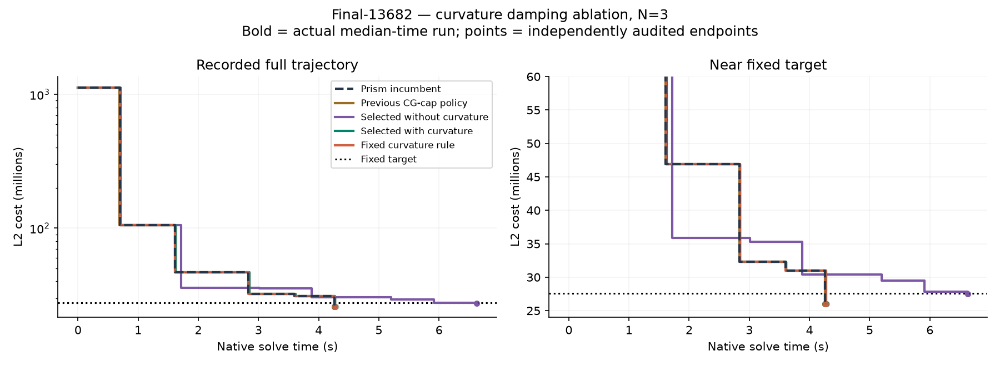

# Curvature-informed damping policy results

**Verdict: retain the incumbent; no general curvature-policy promotion.**

Finite direct policy search over four controllers per feature class, using complete target-terminated episodes. This is not SAC/PPO or a fitted neural network. All new timings use the same host (2237c6528e79, RTX 2000 Ada) and binary; no production defaults changed.

## What changed

The isolated build exposes the full-step GN directional minimizer `-g^T d / ||Jd||^2`, its prior value, and Ritz extrema/condition estimates reconstructed from existing PCG scalars. It adds no GPU matrix products, reductions or observation passes. CPU feature extraction and policy decisions are inside the native target clock. These are previous-outer observations; they cannot anticipate unseen curvature at the next state.

PCG features describe the preconditioned damped Schur operator, not the true nonlinear Hessian. Spectral estimates are disabled below four CG steps or after invalid recurrence; every CG attempt resets the recurrence. Missing weak directions and finite-precision loss of orthogonality limit their interpretation. Directional alpha describes the actual scored step, which can have been shortened by the radius guard or rescue, so it is not an isolated measurement of excessive lambda.

## Fresh time-to-target transfer

| Scene | Initial lambda | Arm | Hits | Seconds: median [min, max] | Audited final cost | Outers | Rejects | Matvecs |
|---|---:|---|---:|---:|---:|---:|---:|---:|
| trafalgar-126 | 0.1 | Prism incumbent | 3/3 | 0.130 [0.129, 0.144] | 105234.226 | 7 | 0 | 237 |
| trafalgar-126 | 0.1 | Previous CG-cap policy | 3/3 | 0.128 [0.128, 0.129] | 105234.223 | 7 | 0 | 237 |
| trafalgar-126 | 0.1 | Selected without curvature | 3/3 | 0.158 [0.157, 0.169] | 105182.744 | 6 | 0 | 316 |
| trafalgar-126 | 0.1 | Selected with curvature | 3/3 | 0.131 [0.129, 0.132] | 105234.213 | 7 | 0 | 237 |
| trafalgar-126 | 0.1 | Fixed curvature rule | 3/3 | 0.132 [0.131, 0.137] | 105574.271 | 6 | 0 | 251 |
| final-1936 | 0.1 | Prism incumbent | 3/3 | 0.565 [0.550, 0.573] | 5095070.524 | 4 | 0 | 22 |
| final-1936 | 0.1 | Previous CG-cap policy | 3/3 | 0.556 [0.555, 0.569] | 5095070.524 | 4 | 0 | 22 |
| final-1936 | 0.1 | Selected without curvature | 3/3 | 0.502 [0.492, 0.526] | 5074129.608 | 4 | 0 | 15 |
| final-1936 | 0.1 | Selected with curvature | 3/3 | 0.550 [0.549, 0.550] | 5095070.524 | 4 | 0 | 22 |
| final-1936 | 0.1 | Fixed curvature rule | 3/3 | 0.551 [0.549, 0.589] | 5095070.524 | 4 | 0 | 22 |
| muell-gba146 | 0.1 | Prism incumbent | 3/3 | 4.526 [4.517, 4.553] | 1945371.447 | 16 | 0 | 1065 |
| muell-gba146 | 0.1 | Previous CG-cap policy | 3/3 | 4.873 [4.861, 4.876] | 1946344.648 | 16 | 0 | 1168 |
| muell-gba146 | 0.1 | Selected without curvature | 3/3 | 4.834 [4.830, 4.837] | 1942495.563 | 17 | 0 | 1139 |
| muell-gba146 | 0.1 | Selected with curvature | 3/3 | 4.871 [4.869, 4.890] | 1946344.618 | 16 | 0 | 1168 |
| muell-gba146 | 0.1 | Fixed curvature rule | 3/3 | 4.825 [4.819, 4.833] | 1942495.534 | 17 | 0 | 1139 |
| muell-gba146 | 10.0 | Prism incumbent | 3/3 | 4.208 [4.207, 4.211] | 1945209.690 | 19 | 0 | 927 |
| muell-gba146 | 10.0 | Previous CG-cap policy | 3/3 | 4.587 [4.576, 4.593] | 1945557.438 | 19 | 0 | 1040 |
| muell-gba146 | 10.0 | Selected without curvature | 3/3 | 5.549 [5.538, 5.550] | 1945294.923 | 22 | 1 | 1274 |
| muell-gba146 | 10.0 | Selected with curvature | 3/3 | 5.557 [5.543, 5.558] | 1945294.939 | 22 | 1 | 1274 |
| muell-gba146 | 10.0 | Fixed curvature rule | 3/3 | 5.550 [5.538, 5.566] | 1945294.983 | 22 | 1 | 1274 |
| final-13682 | 0.1 | Prism incumbent | 3/3 | 4.261 [4.259, 4.263] | 26022217.676 | 5 | 0 | 28 |
| final-13682 | 0.1 | Previous CG-cap policy | 3/3 | 4.262 [4.261, 4.263] | 26022217.673 | 5 | 0 | 28 |
| final-13682 | 0.1 | Selected without curvature | 3/3 | 6.627 [6.622, 6.627] | 27463773.194 | 7 | 1 | 44 |
| final-13682 | 0.1 | Selected with curvature | 3/3 | 4.274 [4.258, 4.288] | 26022217.673 | 5 | 0 | 28 |
| final-13682 | 0.1 | Fixed curvature rule | 3/3 | 4.267 [4.262, 4.284] | 26022217.676 | 5 | 0 | 28 |

All targets and caps are unchanged from the registered protocol. Final-13682 has 13,682 cameras, 4,456,117 points and 28,987,644 observations; target 27,591,576.557625167, cap20s. Original observations, SIMPLE_RADIAL/k2=0, half-sum squared pixel errors. Native timing excludes loading, endpoint export and CPU audit. N=3 describes repeat spread, not population confidence. Prior research already used these scenes; they are excluded from this policy fit but are not pristine unseen datasets.

| Controller | Geometric mean speedup vs incumbent, all five tasks |
|---|---:|
| Previous CG-cap policy | 0.9733x |
| Selected without curvature | 0.8412x |
| Selected with curvature | 0.9352x |
| Fixed curvature rule | 0.9348x |

Plot uses causal staircases. For hits, CSV clocks are aligned to the adjacent terminal TARGET event with a constant offset to include setup; intermediate alignment is approximate because the final feature summary follows the last CSV row. Reported target times come directly from TARGET events, never from interpolating or shifting a crossing. Intermediate costs are native; final points are CPU FP64 audits. Bold traces are real median-time runs. Aliased policies are drawn once. These are target-terminated trajectories, not runs to eventual convergence.

## Training and family transfer

162 full episodes: three families, two initial lambdas, nine arms, three repeats. Both feature classes collect the same telemetry during training; only feature access differs. Four candidate templates per class share action size, budget, cooldown and fallback. Primary transfer disables JSON logging. The deterministic comparator was fixed before training.

| Policy | Mean penalized log-time loss (lower better) |
|---|---:|
| curv-mixed-strict | -0.105770 |
| curv-mixed-lenient | -0.048114 |
| curv-down-lenient | +0.006572 |
| baseline | +0.007260 |
| curv-down-strict | +0.016809 |
| plain-down-lenient | +0.093625 |
| plain-mixed-strict | +0.098225 |
| plain-down-strict | +0.100103 |
| plain-mixed-lenient | +0.108486 |

curv: training choice including baseline **curv-mixed-strict**; best nonbaseline carried to transfer **curv-mixed-strict**. Frozen policy SHA256 `f588ad01a74049cb8f925e44f4d35a2aea9f60133423dcf5d73d54805e638bd9`.

| Omitted family | Choice from other families | Held-family loss minus baseline |
|---|---|---:|
| dubrovnik-356 | baseline | +0.000000 |
| ladybug-598 | curv-mixed-strict | -0.102804 |
| venice-89 | curv-mixed-strict | +0.306137 |

plain: training choice including baseline **baseline**; best nonbaseline carried to transfer **plain-down-lenient**. Frozen policy SHA256 `9791e8d8f6e4b40021f16015e57e594f1f2cce447446f5082a2fddf8286d4c4e`.

| Omitted family | Choice from other families | Held-family loss minus baseline |
|---|---|---:|
| dubrovnik-356 | baseline | +0.000000 |
| ladybug-598 | baseline | +0.000000 |
| venice-89 | plain-down-lenient | +0.356752 |

Training loss includes a 4×cap penalty for misses; it is never reported as a measured time to target. The best nonbaseline controller is evaluated for diagnosis even when baseline wins selection. Training outcomes do not override transfer evidence.

## Mechanism diagnostics (excluded from timing medians)

| Scene | Initial lambda | Nonzero actions | Decision sequence |
|---|---:|---:|---|
| trafalgar-126 | 0.1 | 0 | 1:+0, 2:+0, 3:+0, 4:+0, 5:+0, 6:+0 |
| final-1936 | 0.1 | 0 | 1:+0, 2:+0, 3:+0 |
| muell-gba146 | 0.1 | 2 | 1:+0, 2:+0, 3:+0, 4:+0, 5:+0, 6:+0, 7:+0, 8:+1, 9:+0, 10:+1, 11:+0, 12:+0, 13:+0, 14:+0, 15:+0 |
| muell-gba146 | 10.0 | 2 | 1:-1, 2:+0, 3:-1, 4:+0, 5:+0, 6:+0, 7:+0, 8:+0, 9:+0, 10:+0, 11:+0, 12:+0, 13:+0, 14:+0, 15:+0, 16:+0, 17:+0, 18:+0, 19:+0, 20:+0, 21:+0 |
| final-13682 | 0.1 | 0 | 1:+0, 2:+0, 3:+0, 4:+0 |

Full causal decision features (rho, alpha, spectral condition/mask, previous raw camera norm/radius and fallback) are in `diagnostic-summary.json`. A zero-action timing difference is instrumentation or measurement variation, not learned acceleration.

## Validation and reproducibility

- Host tests independently compare the reconstructed full PCG Ritz spectrum with a dense preconditioned eigensystem; also cover invalid/short recurrences, reset, budget, cooldown, curvature veto and rejected-outer fallback.
- N=3 parent/new-off/collection-only smoke runs have identical outers/rejects/matvecs and endpoint costs within 1e-7 numerical repeatability. Recorded slope and curvature reconstruct the incumbent model prediction.
- 252 independently audited endpoints; maximum relative native/audit discrepancy 3.39e-11. Total native solver time 369.106s. Primary transfer/large hits 75/75. Aliases do not add samples.
- [Registered protocol](rl_curvature_protocol.md) and [feature derivations and limitations](rl_curvature_math.md). Source: `gpu/rl_curvature.h`, `gpu/test_rl_curvature.cc`, `bench/build_rl_curvature.py`, `bench/rl_curvature_study.py`, `bench/report_rl_curvature.py`.
- Raw frozen build, policies, manifests, traces and exported endpoints: `/tmp/prism-rl-curvature`. Small durable package: `/workspace/prism-rl-curvature`. No production default changes or new Caspar runs.
- [Previous fresh Caspar comparison](rl_damping_trajectory_results.md) remains separate historical context; its timings are not pooled with this pilot.
