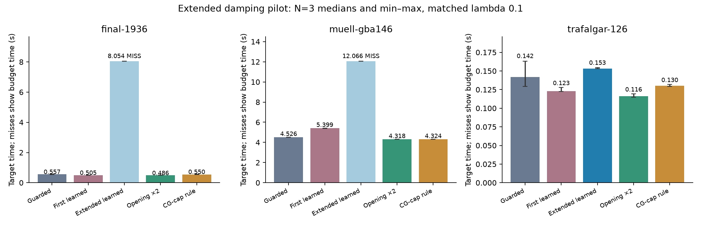
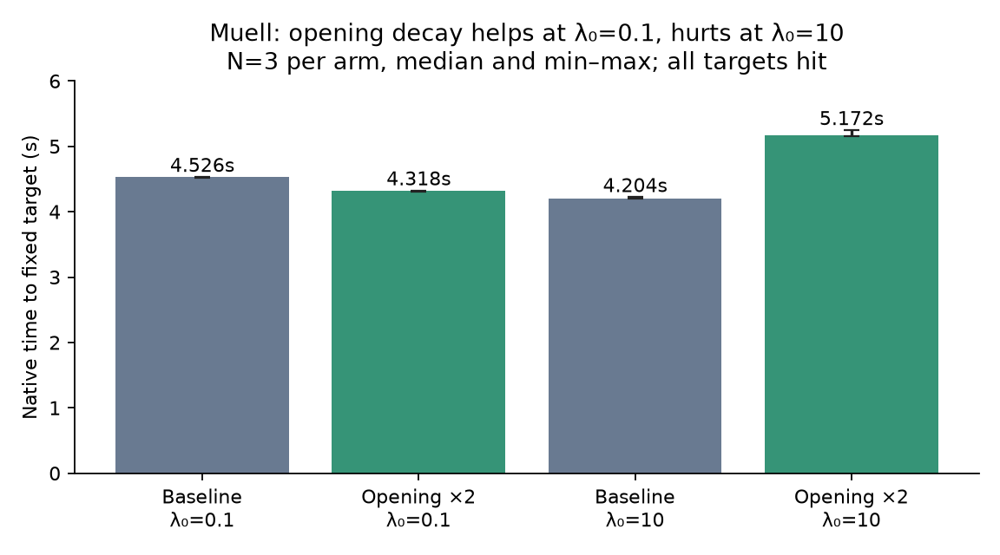

# Extended learned-damping pilot

**Final decision: retain the incumbent.** Opening-2 passes the initial-lambda-0.1 screen, but regresses in the subsequent matched Muell check at the historical champion setting, initial lambda 10. The extended learned model fails family transfer and misses two targets. These results do not establish a new general winner.

The extended pilot adds deep-CG training checkpoints and twelve-outer returns, and compares learning against a fixed two-boundary opening decay. It is a rollout-trained linear controller, not a full on-policy RL experiment. All comparisons run on host 2237c6528e79 / RTX 2000 Ada, with identical solver flags and explicit initial lambda 0.1. Detailed policy logging is disabled in final timing; controller execution is included.

## Complete-solve results

| Scene | Arm | Hits | Native target seconds: median [min, max] | Outers | Rejects | Matvecs | Audited cost |
|---|---|---:|---:|---:|---:|---:|---:|
| trafalgar-126 | baseline | 3/3 | 0.1421 [0.1291, 0.1632] | 7 | 0 | 237 | 105234.209 |
| trafalgar-126 | old-learned | 3/3 | 0.1228 [0.1224, 0.1278] | 5 | 0 | 229 | 104972.149 |
| trafalgar-126 | extended-learned | 3/3 | 0.1532 [0.1531, 0.1544] | 8 | 0 | 293 | 104993.173 |
| trafalgar-126 | opening-2 | 3/3 | 0.1160 [0.1146, 0.1194] | 5 | 0 | 218 | 104582.370 |
| trafalgar-126 | work-rule | 3/3 | 0.1300 [0.1293, 0.1318] | 7 | 0 | 237 | 105234.208 |
| final-1936 | baseline | 3/3 | 0.5566 [0.5506, 0.5644] | 4 | 0 | 22 | 5095070.524 |
| final-1936 | old-learned | 3/3 | 0.5050 [0.4888, 0.5066] | 4 | 0 | 14 | 5078768.533 |
| final-1936 | extended-learned | 0/3 | MISS; solve 8.0542 [8.0414, 8.0553] | 75 | 0 | 158 | 5502814.359 |
| final-1936 | opening-2 | 3/3 | 0.4861 [0.4859, 0.4905] | 4 | 0 | 14 | 5078849.559 |
| final-1936 | work-rule | 3/3 | 0.5503 [0.5495, 0.5638] | 4 | 0 | 22 | 5095070.524 |
| muell-gba146 | baseline | 3/3 | 4.5264 [4.5221, 4.5296] | 16 | 0 | 1065 | 1945371.443 |
| muell-gba146 | old-learned | 3/3 | 5.3994 [5.3912, 5.4042] | 17 | 0 | 1353 | 1946114.585 |
| muell-gba146 | extended-learned | 0/3 | MISS; solve 12.0665 [12.0534, 12.0669] | 166 | 0 | 335 | 2040895.494 |
| muell-gba146 | opening-2 | 3/3 | 4.3181 [4.3097, 4.3240] | 16 | 0 | 1006 | 1944996.757 |
| muell-gba146 | work-rule | 3/3 | 4.3245 [4.3015, 4.3250] | 15 | 0 | 1016 | 1945562.894 |

| Scene | Current local winner | Time change vs matched baseline |
|---|---|---:|
| final-1936 | opening-2 | -12.7% |
| muell-gba146 | opening-2 | -4.6% |
| trafalgar-126 | opening-2 | -18.3% |

Targets were frozen at Trafalgar-126 = 105579.58394455544; Final-1936 = 5125687.352261469; Muell = 1946488.746262194. Native caps were 4, 8, and 12 seconds respectively. Small endpoint differences below the fixed threshold are not failures. These scenes have already been observed in research and are transfer diagnostics, not untouched test recordings.

The historical Muell champion at 4.220 s used initial lambda 10. The matched lambda-0.1 table does not supersede that external winner ledger, and contains no new Caspar measurements.

## Confirmatory check at the historical champion setting

After the initial panel, pre-register a six-run Muell check: same binary, target and 12-second cap, initial lambda 10, baseline versus opening-2, N=3 with alternating order. Neither controller is retuned. This directly tests the known starting-damping discrepancy instead of inferring an incumbent win from the lambda-0.1 panel.

| Arm, initial lambda 10 | Hits | Target seconds: median [min, max] | Outers | Rejects | Matvecs | Audited cost |
|---|---:|---:|---:|---:|---:|---:|
| baseline | 3/3 | 4.2044 [4.2024, 4.2205] | 19 | 0 | 927 | 1945209.675 |
| opening-2 | 3/3 | 5.1721 [5.1596, 5.2459] | 21 | 1 | 1180 | 1945303.445 |

Opening-2 takes 23.0% more time at this setting. The work count increases from 927 to 1,180 matvecs and from 19 to 21 outers, with one reject instead of zero. The result is a convergence-speed regression despite all target hits. The fresh baseline median is 4.204 seconds; it also beats the 4.318-second opening-2 result at lambda 0.1. The panel improvement is therefore conditional on the starting configuration and does not replace the existing Muell champion.

## Training and horizon evidence

Twelve checkpoints, three actions, three repeats: 108 branches, up to twelve outers each. 3 decision states have previous CG depth >=64; maximum history depth is 128/128, compared with 32/128 in the first pilot. 7/12 states have a hindsight nonbaseline AUC improvement larger than the baseline repeat range. This is descriptive, not a significance test.

| Scene / boundary | Prior CG | Common horizon s | Best action, 4-outer horizon | Best action, long horizon | Baseline AUC − best AUC |
|---|---:|---:|---:|---:|---:|
| ladybug-598 / 1 | 0 | 0.1490 | +0 | +0 | 0 |
| ladybug-598 / 3 | 20 | 0.2103 | +1 | +0 | 0 |
| ladybug-598 / 14 | 114 | 0.7737 | -1 | +1 | 3.29443e-06 |
| ladybug-598 / 18 | 1 | 0.7172 | -1 | +1 | 1.34882e-05 |
| dubrovnik-356 / 1 | 0 | 0.8421 | +1 | +1 | 0.0389242 |
| dubrovnik-356 / 3 | 26 | 0.7937 | -1 | -1 | 0.00911592 |
| dubrovnik-356 / 6 | 128 | 0.7349 | -1 | -1 | 0.00445124 |
| dubrovnik-356 / 11 | 128 | 0.7636 | +1 | +1 | 3.05588e-05 |
| venice-89 / 1 | 0 | 0.2273 | -1 | -1 | 0.013121 |
| venice-89 / 3 | 9 | 0.2033 | +0 | +0 | 0 |
| venice-89 / 6 | 13 | 0.1936 | +1 | +1 | 0.00401596 |
| venice-89 / 78 | 11 | 0.2412 | +1 | +1 | 1.81429e-06 |

Completed continuation lengths range 12–12 outers. The shared elapsed horizon is the shortest of each state's nine actual branch durations, so different states have different horizons. Four-outer comparisons above are rescored prefixes of these same trajectories, not extra GPU runs.

Scouting selected four deep boundaries; the freshly captured Ladybug-598 boundary 18 had previous depth 1 rather than the scout’s 128. The actual saved features therefore contain three deep decision states, not four. All nine branches at each checkpoint restore identical feature histories, radius, numerical floor and baseline damping. The selection was not changed after observing branch outcomes.

Leave-one-whole-family-out normalized AUC advantages (positive is better): dubrovnik -0.0079204, ladybug -0.0007505, venice -0.0078892; mean -0.0055200.

The objective is the integral of the causal, right-continuous accepted-cost curve divided by checkpoint cost and elapsed horizon. The current cost remains in the integral while the next step is being computed. Labels compare a single intervention followed by baseline continuation; deployment repeats interventions. Consequently, good branch labels do not guarantee good full-solve behavior. Late-state absolute normalized improvements can also be much smaller than opening improvements.

The fixed opening comparator multiplies the baseline next damping by 0.1 at boundaries 1 and 2, then yields to the unchanged guarded controller. The CG-cap rule cancels one decade of decay when previous CG depth reaches 128. All arms preserve the actual-objective acceptance, radius updates, numerical floor, and retry logic.

## Why the extended policy fails

A separate twelve-outer diagnostic on Final-1936 logs action +1 at every boundary 1–11. The baseline proposes lambda 0.025 each time; the policy changes it back to 0.25 each time. Thus repeated decisions cancel the intended LM damping decay. This trace is a mechanism diagnostic, not an additional timing repeat. In the N=3 timing experiment the controller spends 75 outers and about 8 seconds without reaching the target; baseline reaches it in four outers. Muell similarly uses a median 166 outers and 335 matvecs without hitting its target, versus baseline 16 outers and 1,065 matvecs with a hit.

For an unclipped damped step on a fixed quadratic, with positive damping metric D and error e relative to the minimizer, e_next = lambda (H + lambda D)^(-1) D e. In a D-scaled curvature eigendirection with eigenvalue mu, the error contraction factor is lambda/(mu + lambda). Holding damping high makes the linear system easier while retaining slow progress in weak-curvature directions. This local calculation explains the measured tradeoff; it is not a convergence proof for the nonlinear guarded implementation.

The teacher evaluates one correction followed by baseline continuation. Deployment repeatedly applies the approximate learned correction. The diagnostic exposes that mismatch directly: a transient action becomes persistent regularization. Three of twelve hindsight action choices also change between the short and long horizons. Rescoring the same states with four-outer returns gives a negative family-held-out mean advantage of -0.0137423, versus -0.0055200 with twelve-outer returns: the longer horizon reduces the offline loss but does not produce a useful policy.

The opening comparator avoids this measured failure by limiting its intervention to two boundaries. It reproduces the useful early work reduction without maintaining learned damping corrections during later convergence. Any further learning study should train/evaluate complete controller trajectories against time-to-target, include a baseline fallback, and beat this deterministic comparator. Merely adding more one-action AUC labels is not sufficient evidence for deployment.

## Verification and evidence

- Old derivative, new derivative off and opening=0 agree in work counts across N=3 and within numerical repeatability in cost. The opening schedule is verified from logged actions and effective damping ratios.
- Host inference matches Python on all twelve final training feature vectors. Causal AUC, rejection-time accounting, and held-out-label isolation tests pass.
- All 108 replay branches match the saved controller/history state exactly before intervention; see `branch-replay-audit.json`.
- 187 audited endpoints; maximum relative independent FP64 audit discrepancy 8.19e-11. Total native solve time 244.829 seconds; process wall time 453.3 seconds, excluding compilation and Python audits.
- Model SHA-256: `011a21e025563d281eb4f5ab31dbc22762d9f62fed45890662897c79e8aba929`.
- [Frozen protocol and pre-branch coverage amendment](rl_damping_extended_protocol.md). Source: `bench/rl_damping_extended.py`, `bench/report_rl_damping_extended.py`, `gpu/rl_damping.h`, existing isolated builder.
- Raw runs/checkpoints/endpoints: `/tmp/prism-rl-damping-extended/`. Persistent compact evidence: `/workspace/prism-rl-damping-extended/`.

N=3 quantifies local repeat spread; three correlated research scenes cannot establish general superiority. Per-scene winners are descriptive and are not an automatically selected deployment policy.
