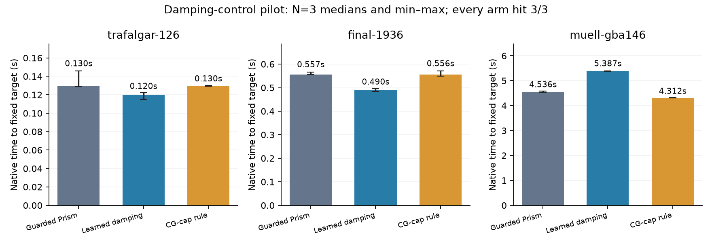

# RL damping pilot results — 2026-09-09

**Verdict: retain the guarded Prism incumbent.** The frozen rollout-trained damping controller improves two BAL transfer checks but regresses on the production scan. All target hits and endpoint audits pass; the learned policy fails the predeclared 10% panel promotion threshold. No fresh Caspar extension was triggered.

This is a completed rollout-guided policy-improvement pilot, not a completed SAC/PPO training study. A small regularized value model was fitted to branched multi-step returns, then deployed to make repeated decisions. No claim that RL is necessary, novel, or generally faster follows from this result.

## Complete-solve comparison

Same binary, flags, original data and explicitly `--lam0 0.1`; N=3 rotated serial runs on host 2237c6528e79 / RTX 2000 Ada. Targets are fixed historical useful-quality thresholds; model fitting uses none of these three scenes. They have been used in earlier research and are not pristine unseen recordings. Feature extraction and policy inference are included in native timing; detailed policy logging is disabled.

| Scene | Arm | Hits | Target time, median [min, max] s | Accepted outers, median | Rejects, median | Matvecs, median | Audited final cost, median |
|---|---|---:|---:|---:|---:|---:|---:|
| trafalgar-126 | baseline | 3/3 | 0.130 [0.129, 0.146] | 7 | 0 | 237 | 105234.223 |
| trafalgar-126 | learned | 3/3 | 0.120 [0.115, 0.122] | 5 | 0 | 228 | 104959.036 |
| trafalgar-126 | work-rule | 3/3 | 0.130 [0.129, 0.130] | 7 | 0 | 237 | 105234.270 |
| final-1936 | baseline | 3/3 | 0.557 [0.556, 0.567] | 4 | 0 | 22 | 5095070.524 |
| final-1936 | learned | 3/3 | 0.490 [0.484, 0.496] | 4 | 0 | 14 | 5078768.533 |
| final-1936 | work-rule | 3/3 | 0.556 [0.549, 0.571] | 4 | 0 | 22 | 5095070.524 |
| muell-gba146 | baseline | 3/3 | 4.536 [4.535, 4.578] | 16 | 0 | 1065 | 1945371.470 |
| muell-gba146 | learned | 3/3 | 5.387 [5.380, 5.391] | 17 | 0 | 1353 | 1946114.598 |
| muell-gba146 | work-rule | 3/3 | 4.312 [4.304, 4.323] | 15 | 0 | 1016 | 1945562.916 |

| Scene | Learned time change versus baseline | Work-rule time change |
|---|---:|---:|
| trafalgar-126 | -7.6% | +0.1% |
| final-1936 | -11.9% | -0.1% |
| muell-gba146 | +18.8% | -4.9% |

The learned policy is 1.082x faster on Trafalgar and 1.135x faster on Final-1936, but takes 1.188x as long on Muell. On the latter, it increases matvecs from 1,065 to 1,353 and accepted outers from 16 to 17. Its median scene speedup is 1.082x, below the frozen 1.10x threshold. All nine learned runs meet their target, so this is a speed/transfer failure rather than a quality failure. Small final-cost differences within the registered tolerance are not counted as regressions.

The simple work rule cancels one decade of the nominal lambda decrease when the previous CG solve reaches its depth cap. It reduces Muell matvecs to 1,016 and target time by 4.9%, while leaving the work counts on the other two scenes unchanged. That is a useful deterministic reference, but it also misses the panel promotion threshold.

The previous 4.220 s Muell champion result used initial lambda 10. The current table is an internally matched comparison at lambda 0.1 and does not replace that older configuration in the external winner ledger.

## What was learned

After each accepted step, the controller chooses a factor 0.1, 1, or 10 relative to the baseline next lambda, clipped to the existing numerical floor and ceiling. Camera and point damping remain coupled. Radius updates, true-objective acceptance, retry escalation, linear tolerances, precision and stopping rules remain the baseline implementation. Action zero leaves damping arithmetic untouched.

The model uses 16 scalar features over four outer steps (64 inputs): damping/floor, model agreement, relative progress, camera-step/radius ratio, RHS norm, forcing tolerance, CG depth fraction, rejection/repair counts, normalized cost and scene size, acceptance and action history. A regularized linear action-value model needs only a few kilobytes and no new GPU kernels. The first intervention occurs after the first accepted step.

Training data: 24 complete checkpoints, eight each from Ladybug-49, Dubrovnik-88 and Venice-52. Three actions x three repeats x four-outer continuations gives 216 branched rollouts. Each comparison uses a shared elapsed-time horizon and the integral of the right-continuous accepted-cost curve, normalized by initial checkpoint cost and duration. A future accepted cost is never credited before its solve time. This development reward captures short-horizon progress; it is not identical to final time-to-target reward.

| Training family | Checkpoints with non-baseline advantage beyond baseline repeat spread | Hindsight best actions (-1 / 0 / +1) |
|---|---:|---:|
| ladybug-49 | 5/8 | 1 / 2 / 5 |
| dubrovnik-88 | 4/8 | 2 / 3 / 3 |
| venice-52 | 4/8 | 1 / 4 / 3 |

Thirteen of 24 checkpoints clear that development signal gate. These are correlated states and the comparison is selected in hindsight; the count is not a statistical significance claim. Leaving one whole family out gives normalized AUC improvements of +0.008690 on Ladybug, +0.019053 on Dubrovnik, and -0.019179 on Venice (positive is better). Mean +0.002855 beats the train-selected constant action (-0.006393) and the simple cap rule (0), satisfying the provisional gate for the frozen final test. The Venice reversal was disclosed before testing.

## Why transfer failed on Muell

The largest previous CG depth in any training observation/history is **32 of 128** (normalized fraction 0.25). Muell later operates repeatedly at 128. Thus the initial small-scene dataset did not cover the expensive-linear-solve regime motivating this research. The simple cap rule is inactive at every training decision for the same reason. This is a measured coverage gap, not proof that it is the sole cause of the regression.

The frozen policy initially lowers damping on all three transfer scenes. Muell subsequently receives repeated upward corrections and still accumulates more Krylov work. A four-outer rollout return does not directly teach the consequences of repeated interventions throughout a long polishing phase. Geometry/controller distribution shift and the development reward horizon both need investigation.

The next bounded training experiment should include true late checkpoints with deep CG from training-only medium problems, compare longer/budgeted continuation returns, and evaluate a policy that can abstain outside its training support. Any abstention rule must be frozen on development data and validated afresh. Muell has now served as a failure diagnostic and cannot be relabelled an untouched test. Also compare a simple faster opening-decay schedule to establish whether learning contributes beyond selecting two or three early reductions.

## Implementation and verification

- Added an isolated builder and `gpu/rl_damping.h`; production solver defaults were not changed. Legacy menu-learning hooks are not used by this single-shift controller.
- Extended accepted-boundary replay for the champion: geometry, radius, LM state, persistent numerical floor/rebuild count, stopping/history state, PCG counters and policy history. Derived assembly is rebuilt; cache reuse modes outside the verified scope are rejected.
- Original binary, derivative off, and action-zero checks use three repeats each. All require 112 matvecs; endpoint differences stay within ordinary numerical repeatability.
- Three restored continuations agree with the continuous trajectory in cost, lambda, rho, model prediction, CG work, rejects and repairs within the declared tolerance. A separate repaired Ladybug-1723 checkpoint restores floor, radius, lambda and all history features exactly. An incompatible checkpoint configuration is rejected.
- Nonzero-action smoke tests verify actual decade changes. Exported C++ inference agrees with Python for all 24 observed feature vectors.
- Three host tests check causal reward integration, rejection-time accounting, and independence of held-out predictions from held-out labels.
- 286 independently audited solver endpoints; maximum relative solver/audit disagreement 6.18e-13. One additional deliberate configuration-mismatch run fails as expected.
- Total native solver time across the pilot and verification: 70.574 s, within the 600 s ceiling. Summed subprocess wall time: 266.7 s; compilation and Python-side input parsing/audits are additional.

## Artifacts

- [Research and prior art](rl_damping_research.md), [frozen pilot protocol](rl_damping_pilot_protocol.md).
- Code: `bench/build_rl_damping.py`, `gpu/rl_damping.h`, `bench/rl_damping_pilot.py`, `bench/validate_rl_damping.py`, `bench/test_rl_damping_pilot.py`, `bench/report_rl_damping.py`.
- Full local working evidence: `/tmp/prism-rl-damping/`, including checkpoints and all exported endpoint states. Persistent compact evidence package: `/workspace/prism-rl-damping/`.
- Frozen policy SHA-256: `b963aba3fe06df870535b101393c49901fb56eb2d34de957172d1f318baaeb6c`. Binary/source/header hashes and exact commands are in the build and run manifests.

The published conclusion is a mixed, reproducible pilot result. Guarded Prism remains the general incumbent; no new RL-versus-Caspar speed claim is made.
