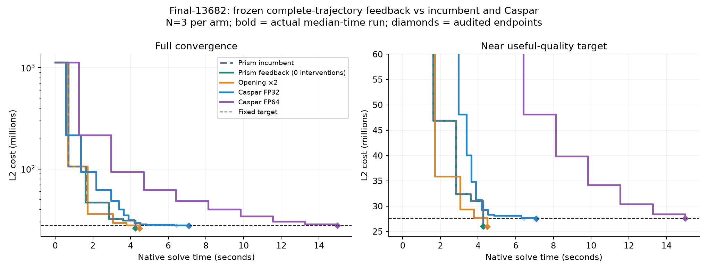

# Complete-trajectory damping-policy search

**Verdict: retain the incumbent; no general promotion.**

Selected feedback policy: **cap-2**. Selection uses complete target-terminated training episodes, including every repeated intervention and fallback. This is finite direct policy search over eight small feedback controllers, not SAC/PPO or a fitted value network. The baseline remains a selection option, and opening-2 is an additional fixed comparator.

## Largest BAL scene: fresh comparison

Final-13682 has 13,682 cameras, 4,456,117 points, and 28,987,644 observations. It is excluded from training and policy selection. Fixed historical target: **27,591,576.557625167**, initial Prism lambda0.1,20-second native cap,600-outer/attempt cap,N=3. All arms use SIMPLE_RADIAL with k2 fixed to zero; cost is half the sum of squared pixel residuals on the original observations. Same host 2237c6528e79 / RTX 2000 Ada.

| Algorithm | Hits | Target time: median [min, max] s | Audited endpoint cost | Outers | Rejects |
|---|---:|---:|---:|---:|---:|
| Prism incumbent | 3/3 | 4.263 [4.260, 4.265] | 26022217.674 | 5 | 0 |
| Trajectory-selected feedback | 3/3 | 4.262 [4.260, 4.263] | 26022217.674 | 5 | 0 |
| Opening ×2 | 3/3 | 4.485 [4.485, 4.487] | 25953838.848 | 5 | 1 |
| Caspar FP32 | 3/3 | 7.093 [6.421, 7.097] | 27553503.833 | 13 | 1 |
| Caspar FP64 | 3/3 | 14.985 [14.975, 14.986] | 27580841.408 | 9 | 0 |

The fastest median on this scene is Trajectory-selected feedback. Feedback/incumbent speedup: 1.0004x.

Prism incumbent versus Caspar FP32: 1.664x at the common target.
Prism incumbent versus Caspar FP64: 3.515x at the common target.
Trajectory-selected feedback versus Caspar FP32: 1.664x at the common target.
Trajectory-selected feedback versus Caspar FP64: 3.516x at the common target.

The separate mechanism trace applies 0 nonzero policy actions. Logged decisions: outer1=+0, outer2=+0, outer3=+0, outer4=+0. This diagnostic is excluded from timing medians. The feedback policy abstains throughout: its near-baseline timing does not establish a learned acceleration.

Curves are causal staircases of recorded costs; no interpolated crossing. Prism CSV times are shifted to the adjacent terminal TARGET event to include local setup. Caspar uses native TRACE/runtime clocks. Graph setup is excluded for Caspar and reported in raw rows; loading, export and CPU audits are excluded for both. Internal curve points are not individually rescored; final diamonds are independent original-observation FP64 audits. FP32 uses the predeclared 0.1% inward native threshold. Curves stop at recorded endpoints, not eventual convergence.

## Frozen transfer panel

| Scene | Initial lambda | Arm | Hits | Target seconds: median [min, max] | Cost | Matvecs |
|---|---:|---|---:|---:|---:|---:|
| trafalgar-126 | 0.1 | baseline | 3/3 | 0.128 [0.128, 0.145] | 105234.217 | 237 |
| trafalgar-126 | 0.1 | feedback | 3/3 | 0.129 [0.129, 0.134] | 105234.171 | 237 |
| trafalgar-126 | 0.1 | opening-2 | 3/3 | 0.121 [0.115, 0.144] | 104972.130 | 228 |
| trafalgar-126 | 10.0 | feedback | 3/3 | 0.136 [0.135, 0.138] | 105349.455 | 240 |
| trafalgar-126 | 10.0 | opening-2 | 3/3 | 0.159 [0.158, 0.159] | 105497.591 | 315 |
| trafalgar-126 | 10.0 | baseline | 3/3 | 0.138 [0.135, 0.148] | 105349.469 | 240 |
| final-1936 | 0.1 | feedback | 3/3 | 0.550 [0.548, 0.558] | 5095070.524 | 22 |
| final-1936 | 0.1 | opening-2 | 3/3 | 0.490 [0.486, 0.531] | 5078849.559 | 14 |
| final-1936 | 0.1 | baseline | 3/3 | 0.554 [0.553, 0.567] | 5095070.524 | 22 |
| final-1936 | 10.0 | opening-2 | 3/3 | 0.673 [0.670, 0.677] | 5070733.978 | 26 |
| final-1936 | 10.0 | baseline | 3/3 | 0.823 [0.823, 0.823] | 5086634.451 | 23 |
| final-1936 | 10.0 | feedback | 3/3 | 0.823 [0.823, 0.824] | 5086634.451 | 23 |
| muell-gba146 | 0.1 | opening-2 | 3/3 | 4.310 [4.308, 4.314] | 1944996.750 | 1006 |
| muell-gba146 | 0.1 | baseline | 3/3 | 4.521 [4.519, 4.534] | 1945371.431 | 1065 |
| muell-gba146 | 0.1 | feedback | 3/3 | 4.859 [4.859, 4.867] | 1946344.658 | 1168 |
| muell-gba146 | 10.0 | baseline | 3/3 | 4.204 [4.204, 4.206] | 1945209.685 | 927 |
| muell-gba146 | 10.0 | feedback | 3/3 | 4.577 [4.576, 4.591] | 1945557.403 | 1040 |
| muell-gba146 | 10.0 | opening-2 | 3/3 | 5.159 [5.154, 5.165] | 1945303.471 | 1180 |

Targets and arms are frozen before these outcomes. Both initial lambdas are evaluated to expose configuration dependence rather than silently switch to a favorable setting. These scenes have been seen in prior research and are not pristine recordings.

## Training returns and family checks

180 complete training episodes: three families × two initial lambdas × ten configurations × three repeats. Three reference endpoints define 1%-tolerant training targets. The 32 initial trials at tighter targets were abandoned and retained separately; the correction was made after seeing development outcomes, before any transfer results. See the dated protocol amendment.

| Policy | Mean penalized log-time loss (lower better) |
|---|---:|
| opening-2 | -0.216071 |
| cap-2 | -0.045074 |
| cap-4 | -0.022660 |
| baseline | +0.010511 |
| strict-4 | +0.032469 |
| mixed-4 | +0.048362 |
| strict-2 | +0.082006 |
| mixed-2 | +0.091588 |
| fast-2 | +0.110941 |
| fast-4 | +0.413496 |

The full-data training choice including baseline is cap-2. The best nonbaseline feedback policy is still carried to transfer for diagnosis. Loss uses matched baseline timing as denominator; misses receive a 4×cap penalty for training only, never a reported target time or speedup.

| Omitted training family | Policy selected using other families | Held-out log loss | Baseline log loss |
|---|---|---:|---:|
| dubrovnik-356 | fast-4 | +1.285997 | -0.000098 |
| ladybug-598 | cap-4 | +0.072762 | +0.032998 |
| venice-89 | cap-2 | +0.019711 | -0.001367 |

The optimized quantity is J(theta) = mean_task mean_repeat log(T_theta / median_repeat T_baseline), with the declared terminal miss penalty. The same theta controls every decision within an episode. This directly includes the consequences of repeated actions and the runtime of policy inference. It does not rely on a critic fitted to isolated interventions.

For an intervention budget B, sum_k |a_k| <= B with a_k in {-1,0,+1}; the raw multiplicative corrections therefore have product between 10^(-B) and 10^B before clipping. The cooldown also prevents consecutive nonzero corrections. This bounds the added damping interventions, not regret against a counterfactual baseline trajectory: accepted geometry and subsequent baseline radius/lambda updates can differ.

Fallback preserves the incumbent acceptance and numerical safeguards and stops further interventions after poor agreement, tiny progress, rejection or repair. It does not restore the counterfactual baseline geometry or guarantee baseline speed. Budget and cooldown prevent indefinite repeated damping increases. Policies are selected from full closed-loop outcomes rather than one-action baseline continuations.

## Verification and artifacts

- N=3 old-binary/new-off/zero-policy compatibility: equal work counts and costs within GPU numerical repeatability. Host tests cover intervention budget, cooldown, support abstention, permanent fallback including exhausted rejected outers, and rejection of unsupported replay.
- All claimed hits require independent original-observation FP64 endpoint audits. Frozen binary, policy and dataset hashes, commands, target thresholds, caps and complete raw traces are retained.
- 303 independently audited endpoints in total, including the abandoned development trials and one completed solver run whose collector was interrupted. That extra run is audited separately and excluded from fitting/headline timing. Maximum relative audit discrepancy 9.36e-11. Total native solver time 407.375 seconds, below the 900-second study ceiling. Primary transfer/large target hits: 69/69.
- [Protocol and disclosed training correction](rl_damping_trajectory_protocol.md). Code: `gpu/rl_damping.h`, `gpu/test_rl_episode.cc`, `bench/rl_damping_trajectory.py`, `bench/report_rl_damping_trajectory.py`.
- Full raw evidence: `/tmp/prism-rl-damping-trajectory/`; persistent compact package: `/workspace/prism-rl-damping-trajectory/`. No production defaults changed.

N=3 describes repeat spread. A small, correlated research panel does not establish broad generalization or RL novelty.
