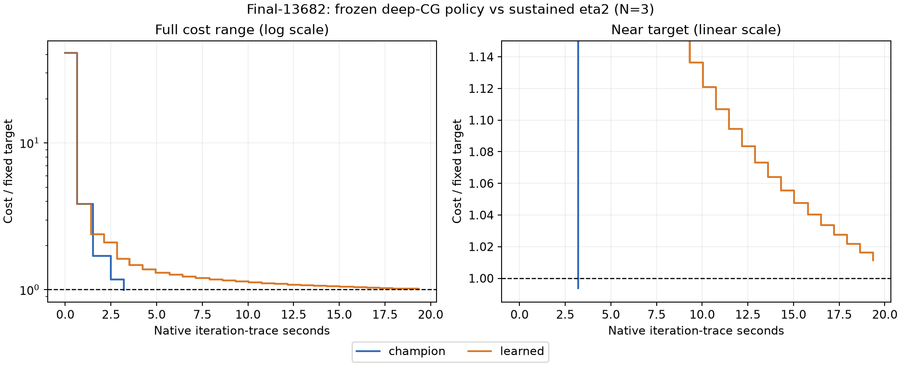

# Final-13682: frozen deep-CG learned damping

At least one arm misses a target repeat; a finite paired speedup is withheld.

**Result: champion 3/3 target hits at about 3.24s; learned 0/3 within the 20s cap.** The learned endpoint is 1.1268% above the fixed target, versus the champion 0.6114% below. This is a same-target speed failure with a modest endpoint gap, not a cost explosion.

Current general selection remains the sustained-eta2 champion. This user-authorized largest-scene extension follows the completed round6 retry and cannot erase its prior Final1936 and family-transfer counterexamples. No policy was fitted or changed using Final13682.

13,682 cameras, 4,456,117 points, 28,987,644 original observations. Fixed historical target 27,591,576.557625167; initial cost approximately1,126,369,344.674. SIMPLE_RADIAL original-observation half-sum squared pixel residuals, k2 fixed zero. No perturbations. Both arms use the same round6 binary, lambda0.1 and sustained eta multiplier2 capped at0.5. The learned arm adds the exact frozen full ridge policy.

## Matched time to target

N3, alternating first arm, serialized on host2237c6528e79 / RTX2000 Ada. Native cap20s, outer cap600. Target timing includes policy inference and local solver setup; loading, export and audit are excluded. Detailed policy logging is off for the six timing runs.

| Arm | Hits | Target seconds median [min,max] | Audited endpoint cost | Gap to target | Outers | Rejects | Matvecs |
|---|---:|---:|---:|---:|---:|---:|---:|
| champion | 3/3 | 3.2400 [3.2386, 3.2412] | 27422876.110635 | -0.6114% | 4 | 0 | 19 |
| learned | 0/3 | MISS; native solve 20.1129 [20.1121, 20.1137] | 27902487.873883 | +1.1268% | 27 | 0 | 86 |

Actual TARGET events and independently audited endpoint <=target are both required. Misses and sub-percent endpoint gaps are retained; costs already below the threshold receive no additional quality credit. These are useful-quality crossings, not full convergence.

## Damping mechanism

A separate learned diagnostic uses 27 outers, applies 26 nonzero actions, and has a longest consecutive positive-action streak of 24. Exact0.025 ->0.25 corrections: 2. This diagnostic is excluded from timing medians.

| Boundary | Action | Champion-proposed lambda | Used lambda | Previous CG depth |
|---|---:|---:|---:|---:|
| 1 | +1 | 0.025 | 0.25 | 0 |
| 2 | +1 | 0.025 | 0.25 | 2 |
| 3 | +0 | 0.025 | 0.025 | 1 |
| 4 | +1 | 0.0025 | 0.025 | 1 |
| 5 | +1 | 0.0025 | 0.025 | 0 |
| 6 | +1 | 0.0025 | 0.025 | 1 |
| 7 | +1 | 0.0025 | 0.025 | 1 |
| 8 | +1 | 0.0025 | 0.025 | 2 |
| 9 | +1 | 0.0025 | 0.025 | 1 |
| 10 | +1 | 0.0025 | 0.025 | 1 |
| 11 | +1 | 0.0025 | 0.025 | 2 |
| 12 | +1 | 0.0025 | 0.025 | 1 |
| 13 | +1 | 0.0025 | 0.025 | 1 |
| 14 | +1 | 0.0025 | 0.025 | 1 |
| 15 | +1 | 0.0025 | 0.025 | 1 |
| 16 | +1 | 0.0025 | 0.025 | 1 |
| 17 | +1 | 0.0025 | 0.025 | 1 |
| 18 | +1 | 0.0025 | 0.025 | 1 |
| 19 | +1 | 0.0025 | 0.025 | 1 |
| 20 | +1 | 0.0025 | 0.025 | 1 |
| 21 | +1 | 0.0025 | 0.025 | 1 |
| 22 | +1 | 0.0025 | 0.025 | 2 |
| 23 | +1 | 0.0025 | 0.025 | 1 |
| 24 | +1 | 0.0025 | 0.025 | 1 |
| 25 | +1 | 0.0025 | 0.025 | 1 |
| 26 | +1 | 0.0025 | 0.025 | 1 |
| 27 | +1 | 0.0025 | 0.025 | 1 |

At boundaries 1 and 2 the policy changes lambda 0.025 to 0.25. It abstains at boundary 3, then changes 0.0025 to 0.025 at every boundary 4–27: 24 consecutive positive decisions, despite previous reported CG counts of only 0–2. The last attempted step is discarded at the before-commit budget check; 27 steps are accepted. Work totals include that final attempt.

The trace shows repeated cancellation of damping decay. Each linear solve stays shallow, but the algorithm takes many more small accepted steps: 27 accepted outers and 86 matvecs versus champion 4 and 19. Both have zero rejections. The true-cost acceptance test does not reject a step merely because it makes slow progress. Deep-state training and longer one-action returns did not prevent this repeated-decision failure.

A correction multiplies the proposed lambda by0.1,1 or10, subject to the existing numerical floor and ceiling. Actual objective acceptance, radius updates, retries and forcing remain unchanged. The diagnostic is the observed learned trajectory; its proposed lambdas are not a counterfactual champion trajectory after the geometries diverge.

## Convergence

All N3 traces are causal recorded-cost steps and may overlap. The CSV iteration clock starts after some local setup, so it is slightly shorter than the TARGET clock used in the table. No interpolated crossings.

## Verification and evidence

All seven original-observation FP64 endpoint audits passed, maximum relative discrepancy 8.61e-14. Total native solver work 90.315s, including the separate diagnostic. Frozen input/binary/policy/code hashes and all seven raw endpoint hashes reverified after completion.

No new Caspar measurements or production-default changes. The earlier Caspar comparison remains historical and is not mixed into these fresh paired timings.

[Protocol](rl_deep_eta2_large_protocol.md). Driver `bench/rl_deep_eta2_large.py`; reporter `bench/report_rl_deep_eta2_large.py`. Raw results and states `/tmp/prism-rl-deep-eta2-large/`; compact durable package `/workspace/prism-rl-deep-eta2-large-evidence.tar.xz`.
