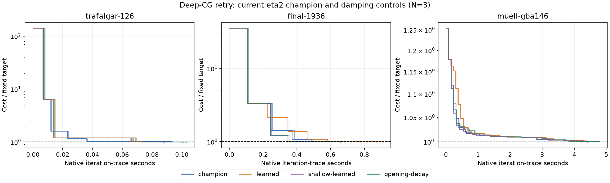

# Deep-CG learned damping versus sustained eta2

**Retain the sustained-eta2 champion. The learned policy fails the registered transfer promotion gate.**

This retries the original rollout-trained linear damping policy with actual deep-CG states and up to 32-outer returns. Every arm uses the current champion: initial lambda 0.1 and sustained eta multiplier 2, capped at 0.5. The fixed comparator applies one extra decade of opening decay at boundaries 1 and 2. The shallow-only model uses the same long returns and ridge recipe, excluding the added deep-source scenes.

Muell-gba146, Final1936 and Trafalgar126 supply no training states, normalization, labels or model selection. Their earlier results are known, so this is a held-out retry on a research panel, not a claim of pristine unseen evaluation. Models were frozen before the family and transfer solves.

## Fixed-target transfer

N3, same binary and host2237c6528e79 / RTX2000 Ada, rotating serialized arm order. Native time includes inference and solver setup; loading, state export and CPU audits are excluded. Detailed logging is off. Targets/caps: Traf126 105579.58394455544 / 4s; Final1936 5125687.352261469 / 8s; Muell 1946488.746262194 / 12s. Half-sum original squared pixel residuals, SIMPLE_RADIAL with k2 fixed zero.

| Scene | Arm | Hits | Target seconds median [min,max] | Audited cost | Gap to target | Outers | Rejects | Matvecs |
|---|---|---:|---:|---:|---:|---:|---:|---:|
| trafalgar-126 | champion | 3/3 | 0.1137 [0.1127, 0.1139] | 105290.471153 | -0.2738% | 7 | 0 | 195 |
| trafalgar-126 | learned | 3/3 | 0.0911 [0.0898, 0.0937] | 105495.509122 | -0.0796% | 5 | 0 | 154 |
| trafalgar-126 | shallow-learned | 3/3 | 0.1017 [0.1008, 0.1311] | 105049.013745 | -0.5025% | 5 | 0 | 182 |
| trafalgar-126 | opening-decay | 3/3 | 0.1168 [0.1142, 0.1195] | 104944.101650 | -0.6019% | 5 | 0 | 210 |
| final-1936 | champion | 3/3 | 0.5062 [0.5007, 0.5135] | 5098339.729757 | -0.5335% | 4 | 0 | 16 |
| final-1936 | learned | 3/3 | 0.9285 [0.9282, 0.9290] | 5108123.169143 | -0.3427% | 8 | 0 | 25 |
| final-1936 | shallow-learned | 3/3 | 0.6731 [0.6713, 0.6769] | 5057145.306403 | -1.3372% | 4 | 0 | 37 |
| final-1936 | opening-decay | 3/3 | 0.6890 [0.6721, 0.6962] | 5057145.306403 | -1.3372% | 4 | 0 | 37 |
| muell-gba146 | champion | 3/3 | 4.2429 [4.2403, 4.2448] | 1946467.165053 | -0.0011% | 16 | 0 | 980 |
| muell-gba146 | learned | 3/3 | 4.4047 [4.3892, 4.4454] | 1946443.112498 | -0.0023% | 18 | 0 | 986 |
| muell-gba146 | shallow-learned | 3/3 | 4.4379 [4.4340, 4.4459] | 1945237.417531 | -0.0643% | 17 | 0 | 1032 |
| muell-gba146 | opening-decay | 3/3 | 4.8035 [4.8001, 4.8144] | 1945981.603776 | -0.0261% | 17 | 0 | 1136 |

Endpoint/work columns use all repeats, including misses. A miss has no fabricated finite crossing time. Small endpoint gaps are reported explicitly; endpoints already below target receive no extra quality reward.

| Scene | Learned / champion speedup | Shallow-only / champion speedup | Opening-decay / champion speedup |
|---|---:|---:|---:|
| trafalgar-126 | 1.2487x | 1.1189x | 0.9741x |
| final-1936 | 0.5452x | 0.7520x | 0.7347x |
| muell-gba146 | 0.9633x | 0.9561x | 0.8833x |

All-scene median/geometric learned speedups: 0.9633x / 0.8688x.
The registered gate requires every learned repeat to hit, median scene speedup >=1.10 against sustained eta2, and no scene >5% slower. Passing that gate would still require explaining the family checks and whether learning beats opening-decay.

### What changed

All 36 transfer runs hit their fixed targets. The learned model wins Trafalgar at1.249x, but takes83.4% longer on Final1936 and3.8% longer on Muell. Muell's small slowdown is not the decisive objection; Final1936 is a large same-target speed regression. Median scene speedup0.963x also misses the1.10x requirement.

Adding the deep-source data improves the Muell median only slightly against the matched shallow-only32-outer model (4.405s versus4.438s), while worsening Final1936 (0.928s versus0.673s). This does not confirm that the original coverage gap was the sole cause or that it is now fixed. The opening schedule loses to the champion on all three transfer scenes, so it also earns no promotion under sustained eta2.

## Training coverage and return horizon

23 saved training states, 7 with actual previous CG depth >=64/128. Three actions times N3 yields 207 branch continuations. Every branch restored the exact saved feature history before its action. Up to 32 outers, cap6s; actual continuation lengths range 21–32. No Muell checkpoints.

| Training scene | Boundary | Previous CG | Common long horizon s | Long best action | Four-outer best action |
|---|---:|---:|---:|---:|---:|
| ladybug-49 | 1 | 0 | 0.1487 | +0 | -1 |
| ladybug-49 | 3 | 13 | 0.1308 | +0 | +0 |
| ladybug-49 | 5 | 2 | 0.1473 | +1 | +1 |
| ladybug-49 | 7 | 28 | 0.1430 | +0 | +1 |
| dubrovnik-88 | 1 | 0 | 0.3529 | -1 | -1 |
| dubrovnik-88 | 3 | 9 | 0.3036 | +0 | +0 |
| dubrovnik-88 | 5 | 7 | 0.3122 | +1 | +1 |
| dubrovnik-88 | 7 | 19 | 0.2600 | +1 | +1 |
| venice-52 | 1 | 0 | 0.3489 | -1 | -1 |
| venice-52 | 3 | 6 | 0.3266 | +0 | +0 |
| venice-52 | 5 | 8 | 0.3188 | +1 | +1 |
| venice-52 | 7 | 5 | 0.3174 | +0 | +0 |
| ladybug-598 | 1 | 0 | 0.9176 | +0 | +0 |
| ladybug-598 | 3 | 15 | 0.9421 | +1 | +1 |
| ladybug-598 | 20 | 128 | 1.1618 | +1 | -1 |
| ladybug-598 | 24 | 128 | 1.6683 | -1 | +1 |
| ladybug-598 | 34 | 128 | 1.2216 | -1 | +0 |
| ladybug-598 | 39 | 128 | 1.1119 | +0 | -1 |
| dubrovnik-356 | 1 | 0 | 1.6618 | +1 | +1 |
| dubrovnik-356 | 3 | 19 | 1.6163 | +0 | -1 |
| dubrovnik-356 | 8 | 128 | 1.5736 | +1 | +1 |
| dubrovnik-356 | 44 | 128 | 2.3878 | +0 | +1 |
| dubrovnik-356 | 49 | 128 | 3.9275 | +1 | -1 |

The reward integrates the causal accepted-cost curve over the shortest measured elapsed horizon among all nine branches at a checkpoint. Costs are normalized by the checkpoint cost. Four-outer prefixes are rescored from the same traces, not extra runs. Hindsight best actions are descriptive. Late states with very little remaining cost reduction can have tiny AUC labels despite large runtime differences.

## Whole-family exclusion

Each fit excludes all sizes of the omitted family, including normalization. Models use fixed ridge10 / intercept0.01 with no parameter search. Positive offline AUC advantage favors learning. Full-solve family checks use the corresponding excluded-family policy and cannot select the transfer model.

| Omitted family | Offline normalized AUC advantage |
|---|---:|
| dubrovnik | -0.00039770 |
| ladybug | -0.00028086 |
| venice | -0.00762892 |

| Scene | Arm | Hits | Target seconds median [min,max] | Audited cost | Gap to target | Outers | Rejects | Matvecs |
|---|---|---:|---:|---:|---:|---:|---:|---:|
| ladybug-598 | champion | 3/3 | 0.0944 [0.0940, 0.1038] | 182108.571475 | -0.0587% | 8 | 0 | 51 |
| ladybug-598 | learned | 0/3 | MISS; solve 4.0086 [4.0049, 4.4995] | 183296.090975 | +0.5930% | 544 | 0 | 1464 |
| ladybug-598 | opening-decay | 3/3 | 0.0959 [0.0958, 0.1012] | 181476.865473 | -0.4053% | 7 | 1 | 58 |
| dubrovnik-356 | champion | 3/3 | 1.0044 [1.0028, 1.0057] | 728611.979443 | -0.3770% | 11 | 0 | 324 |
| dubrovnik-356 | learned | 3/3 | 0.8619 [0.8545, 0.8768] | 730023.502136 | -0.1840% | 9 | 0 | 276 |
| dubrovnik-356 | opening-decay | 3/3 | 1.2203 [1.2166, 1.2246] | 727636.988593 | -0.5103% | 11 | 0 | 416 |
| venice-89 | champion | 3/3 | 0.4430 [0.4429, 0.4651] | 306304.226418 | -0.0049% | 25 | 1 | 103 |
| venice-89 | learned | 0/3 | MISS; solve 4.0167 [4.0154, 4.0176] | 306911.877545 | +0.1935% | 226 | 0 | 1271 |
| venice-89 | opening-decay | 3/3 | 0.5107 [0.5106, 0.5150] | 305995.117690 | -0.1058% | 29 | 6 | 103 |

## Final1936 mechanism check

Separate logged solves, up to32 outers and8s, stop at the same target. These are mechanism diagnostics, excluded from N3 timing medians. The earlier extended policy is run unchanged as a historical pathology control, now on sustained eta2.

| Controller | Outers | Cost | Exact lambda0.025 ->0.25 corrections | Longest consecutive +1 streak |
|---|---:|---:|---:|---:|
| champion | 4 | 5098339.729757 | 0 | 0 |
| learned | 8 | 5108123.169143 | 1 | 4 |
| old-pathology | 32 | 5951524.404048 | 31 | 31 |

The new policy makes0.025 ->0.25 at boundary1, then lets damping decay at boundaries2–3, but makes0.00025 ->0.0025 at boundaries4–7. It reaches the target in8 outers versus champion4. The older policy makes0.025 ->0.25 at all31 observed boundaries and remains above target at outer32. Thus the runaway high-damping behavior is reduced, while repeated decay cancellation survives at a smaller scale.

All decision histories, including proposed and used lambda, are in `diagnostic.json`. A missing exact numerical signature does not by itself show useful convergence; the transfer table is decisive.

## Interpretation limits

Adding actual deep-CG states and using longer returns tests whether those changes are sufficient for this learned-policy recipe. It does not isolate all possible causes of a failure: labels still measure one intervention followed by champion continuation, whereas deployment repeats learned interventions. This mismatch can turn a locally useful damping increase into persistent regularization. The matched shallow-only model helps assess the contribution of the additional deep-source data; it does not make the finite, correlated panel a population study.

A negative outcome establishes a reproducible counterexample for this controller and protocol. It does not establish that all learned damping or state-dependent controllers lose to constants. No new RL or novelty claim follows.

The fold-specific policy does win Dubrovnik356 at1.165x. Ladybug and Venice fold policies miss their fixed targets, but the endpoint gaps are only0.593% and0.193%; these are not catastrophic quality failures. Final1936 supplies a clear speed counterexample independently of those near-target classifications.

## Verification and evidence

323 independently audited FP64 endpoints; maximum relative discrepancy 2.77e-09. Native solver total 378.311s. One deliberately mismatched-eta replay is expected to fail. All fitted policies pass C++/Python inference parity on every saved training feature vector.

The only solver-source change adds the fixed forcing flag to the replay fingerprint. N3 parent/new/zero checks pass. Exact restored history and first-four-step continuation parity pass. The initial overly strict32-step field parity failed near stationarity; repeated uninterrupted runs also vary in late CG work. The pre-label amendment retains the1e-7 endpoint tolerance, requires restored work inside continuous repeat spread, and preserves all original failed evidence.

[Registered protocol and validation amendment](rl_deep_eta2_protocol.md). Driver `bench/rl_deep_eta2.py`; isolated builder `bench/build_rl_deep_eta2.py`; reporter `bench/report_rl_deep_eta2.py`. Raw artifacts `/tmp/prism-rl-deep-eta2/`; durable compact archive `/workspace/prism-rl-deep-eta2-evidence.tar.xz`. No production defaults changed and no fresh Caspar comparison.

The plotted CSV iteration clock starts after some local setup and is slightly shorter than the native TARGET clock used for every table. Curves are causal recorded steps; no interpolated target crossings are used.

