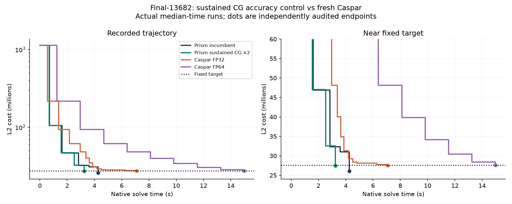

# Sustained CG forcing: confirmation

**Verdict: candidate passes the registered six-scene gate.**

Candidate uses one global initial lambda0.1 and twice the incumbent adaptive CG tolerance, capped at0.5. Incumbent uses its previously established lambda10 on Muell and0.1 elsewhere. All other settings match. This is a fixed numerical configuration, not a learned-policy improvement.

Six-scene geometric mean speedup: 1.1633x.

| Panel | Scene | Arm | Hits | Native target seconds: median [min,max] | Audited cost | Outers | Rejects | Matvecs |
|---|---|---|---:|---:|---:|---:|---:|---:|
| primary | trafalgar-126 | incumbent | 5/5 | 0.1296 [0.1283, 0.1433] | 105234.224 | 7 | 0 | 237 |
| primary | trafalgar-126 | eta2 | 5/5 | 0.1160 [0.1128, 0.1262] | 105290.457 | 7 | 0 | 195 |
| primary | final-1936 | eta2 | 5/5 | 0.5094 [0.5065, 0.5469] | 5098339.730 | 4 | 0 | 16 |
| primary | final-1936 | incumbent | 5/5 | 0.5517 [0.5502, 0.5954] | 5095070.524 | 4 | 0 | 22 |
| primary | muell-gba146 | incumbent | 5/5 | 4.2098 [4.2058, 4.2218] | 1945209.675 | 19 | 0 | 927 |
| primary | muell-gba146 | eta2 | 5/5 | 4.2352 [4.2301, 4.2461] | 1946467.135 | 16 | 0 | 980 |
| primary | final-13682 | eta2 | 5/5 | 3.2386 [3.2375, 3.2589] | 27422876.132 | 4 | 0 | 19 |
| primary | final-13682 | incumbent | 5/5 | 4.2624 [4.2583, 4.2988] | 26022217.676 | 5 | 0 | 28 |
| extension | final-871 | incumbent | 3/3 | 1.5730 [1.5520, 2.1186] | 1952081.029 | 15 | 0 | 121 |
| extension | final-871 | eta2 | 3/3 | 0.9770 [0.9768, 1.0196] | 1950393.405 | 10 | 0 | 86 |
| extension | venice-951 | eta2 | 3/3 | 1.5012 [1.4970, 1.5047] | 1994117.534 | 13 | 0 | 54 |
| extension | venice-951 | incumbent | 3/3 | 1.4602 [1.4601, 1.4799] | 2013038.379 | 12 | 0 | 63 |
| tighter | final-13682 | incumbent | 3/3 | 4.2625 [4.2579, 4.2630] | 26022217.676 | 5 | 0 | 28 |
| tighter | final-13682 | eta2 | 3/3 | 4.1173 [4.1135, 4.1194] | 26557507.887 | 5 | 0 | 21 |
| caspar | final-13682 | caspar32 | 3/3 | 7.0838 [6.4205, 7.0857] | 27516921.447 | 13 | 1 | — |
| caspar | final-13682 | caspar64 | 3/3 | 14.9734 [14.9728, 14.9736] | 27580841.408 | 9 | 0 | — |

Target sensitivity matters: largest-scene speedup is 1.316x at the primary target, versus 1.035x at the tighter historical anchor. The tighter target requires an additional candidate outer. The primary speedup is not a uniform claim over convergence quality.

Primary discovery scenes use fresh N5; two additional scenes and tighter-target sensitivity use N3. No outcome was used to retune this configuration. These are familiar research scenes, not pristine holdouts. Within-scene repeats do not establish population certainty.

The original five-setting actor panel remains a counterexample to universally loosening CG: eta2 with lambda10 on Muell was about47% slower. This new test explicitly evaluates the combined global lambda0.1/eta2 configuration against the previous best initialization map.

## Fresh Caspar comparison on Final13682

- Candidate speedup versus caspar32: 2.187x at target27591576.557625167.
- Candidate speedup versus caspar64: 4.623x at target27591576.557625167.

Caspar32 requests0.999×target to provide a conservative precision buffer; all reported endpoints pass the same original-observation CPU FP64 audit. Native solve time excludes input loading, state export and audit. Caspar graph setup is also excluded; its median seconds are caspar32: 1.809, caspar64: 3.056.

Curves show actual median-time runs with recorded-cost staircases; no target interpolation. Prism CSV timestamps receive a constant terminal TARGET offset, so intermediate timing alignment is approximate. Tables use native TARGET events. Caspar uses native trace timestamps and audited terminal runtime.

## Evidence

64/64 target hits; 195.319 native solver seconds; maximum relative native/audit discrepancy 9.85e-13. Host2237c6528e79, RTX2000 Ada16GB. All endpoints use half-sum squared original pixel residuals, SIMPLE_RADIAL with k2fixed0.

[Protocol](rl_sustained_protocol.md), [actor results](rl_actor_results.md), [reward research](rl_reward_control_research.md). Frozen manifests, hashes, endpoints and logs: `/tmp/prism-rl-sustained/`; compact export: `/workspace/prism-rl-sustained/`. Production defaults remain unchanged.
