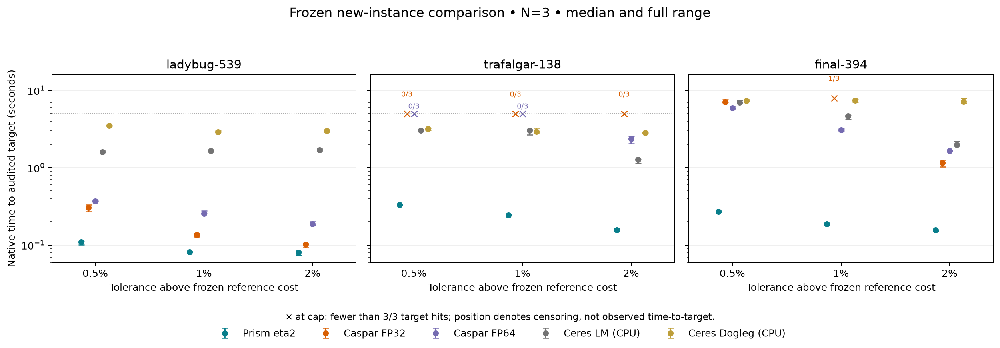

# Frozen new-instance speed and curvature results

The frozen sustained-eta2 champion was evaluated on three previously unmeasured local BAL instances. All targets were frozen after separate reference calibration and before measured runs. These are instances from familiar dataset families, not three independent new capture domains.

Prism had the lowest median time among evaluated configurations in all nine scene–tolerance comparisons, with 27/27 audited target hits. Caspar FP32 reached 16/27 and FP64 reached 21/27; both Ceres arms reached 27/27. This supports a fastest-among-tested claim for this frozen three-instance panel on this host. It does not establish the globally fastest BA solver. The practical-target results do not establish incremental value from curvature sizing because numerical recovery never activated before those targets.

Measured runs: **153**, valid independent endpoint audits: **153**. Native solve time: **340.58 s**. N=3 per cell; all times below are median [min, max] seconds. A miss remains a miss and is not assigned the cap as its observed time to target.

## Primary time-to-target comparison

| Scene | Prism eta2 | Caspar FP32 | Caspar FP64 | Ceres LM CPU | Ceres Dogleg CPU | Fastest 3/3 arm |
|---|---:|---:|---:|---:|---:|---|
| ladybug-539 | 0.0808 [0.0805, 0.0821] | 0.1360 [0.1284, 0.1426] | 0.2557 [0.2555, 0.2767] | 1.6517 [1.6382, 1.6609] | 2.9110 [2.8903, 2.9890] | Prism eta2 |
| trafalgar-138 | 0.2443 [0.2425, 0.2498] | 0/3 hits | 0/3 hits | 3.0499 [2.6668, 3.1125] | 2.9190 [2.8193, 3.2665] | Prism eta2 |
| final-394 | 0.1862 [0.1845, 0.1881] | 1/3 hits | 3.0683 [3.0006, 3.1843] | 4.6668 [4.2293, 4.7174] | 7.4372 [7.0967, 7.6205] | Prism eta2 |

All algorithms optimize the same original-observation SIMPLE_RADIAL L2 objective, with k2 fixed to zero. The primary target is 1% above the frozen bounded-calibration anchor. Caspar FP32 stops against an additional conservative 0.1% native margin; original-observation FP64 endpoint auditing determines qualification.

| Scene | Anchor | 0.5% target | 1% target | 2% target | Native cap |
|---|---:|---:|---:|---:|---:|
| ladybug-539 | 163977.959587339 | 164797.849385276 | 165617.739183213 | 167257.518779086 | 5 s |
| trafalgar-138 | 102575.518104909 | 103088.395695433 | 103601.273285958 | 104627.028467007 | 5 s |
| final-394 | 304825.465775665 | 306349.593104543 | 307873.720433422 | 310921.975091178 | 8 s |

## Target sensitivity: every registered comparison cell

| Scene | Tolerance above anchor | Prism eta2 | Caspar FP32 | Caspar FP64 | Ceres LM CPU | Ceres Dogleg CPU |
|---|---:|---:|---:|---:|---:|---:|
| ladybug-539 | 0.5% | 0.1096 [0.1012, 0.1105] | 0.3049 [0.2719, 0.3306] | 0.3693 [0.3692, 0.3715] | 1.6004 [1.5912, 1.6445] | 3.5076 [3.4425, 3.5630] |
| ladybug-539 | 1.0% | 0.0808 [0.0805, 0.0821] | 0.1360 [0.1284, 0.1426] | 0.2557 [0.2555, 0.2767] | 1.6517 [1.6382, 1.6609] | 2.9110 [2.8903, 2.9890] |
| ladybug-539 | 2.0% | 0.0804 [0.0736, 0.0822] | 0.1018 [0.0930, 0.1044] | 0.1880 [0.1804, 0.2010] | 1.6974 [1.6197, 1.7482] | 2.9836 [2.8860, 3.0089] |
| trafalgar-138 | 0.5% | 0.3305 [0.3272, 0.3326] | 0/3 hits | 0/3 hits | 3.0393 [3.0303, 3.1167] | 3.1678 [3.0237, 3.2162] |
| trafalgar-138 | 1.0% | 0.2443 [0.2425, 0.2498] | 0/3 hits | 0/3 hits | 3.0499 [2.6668, 3.1125] | 2.9190 [2.8193, 3.2665] |
| trafalgar-138 | 2.0% | 0.1560 [0.1556, 0.1642] | 0/3 hits | 2.3635 [2.0553, 2.5332] | 1.2678 [1.1477, 1.2828] | 2.8279 [2.7912, 2.8574] |
| final-394 | 0.5% | 0.2719 [0.2656, 0.2786] | 7.0921 [6.9774, 7.5616] | 5.9008 [5.7411, 6.2936] | 6.9626 [6.8988, 7.3740] | 7.3273 [7.2381, 7.5649] |
| final-394 | 1.0% | 0.1862 [0.1845, 0.1881] | 1/3 hits | 3.0683 [3.0006, 3.1843] | 4.6668 [4.2293, 4.7174] | 7.4372 [7.0967, 7.6205] |
| final-394 | 2.0% | 0.1560 [0.1515, 0.1571] | 1.1605 [1.0255, 1.2607] | 1.6486 [1.6484, 1.6659] | 1.9880 [1.9597, 2.1992] | 7.1137 [6.8407, 7.8749] |

## Curvature attribution at the primary target

| Scene | Guard off | ×4 + retained floor | Curvature + retained floor | ×4 / curvature time |
|---|---:|---:|---:|---:|
| ladybug-539 | 0.0829 [0.0804, 0.0846] | 0.0804 [0.0783, 0.0828] | 0.0808 [0.0805, 0.0821] | 0.994x |
| trafalgar-138 | 0.2604 [0.2550, 0.2732] | 0.2435 [0.2427, 0.2487] | 0.2443 [0.2425, 0.2498] | 0.997x |
| final-394 | 0.2028 [0.2012, 0.2035] | 0.1849 [0.1847, 0.1868] | 0.1862 [0.1845, 0.1881] | 0.993x |

Guard-active instances at the primary target: **0/3**. Registered curvature-sizing criterion met: **False**. This criterion requires at least two 1.10x improvements at equal reliability and no greater than 1.10x regression on another active instance.

There were no numerical repair events in the measured practical-target panel; no repair-formula validation can be inferred from those inactive runs. The separate late-stage diagnostic below exercises and checks the repair rules.

## Endpoints and work at the primary target

| Scene | Arm | Hits | Median audited cost | Median gap above target | Median seconds run | Accepted / rejected per run | Repairs per run | Cap hits |
|---|---|---:|---:|---:|---:|---|---|---:|
| ladybug-539 | Prism eta2 | 3/3 | 165514.082613 | -0.0626% | 0.0850 | [(6, 0), (6, 0), (6, 0)] | [0, 0, 0] | 0/3 |
| ladybug-539 | Caspar FP32 | 3/3 | 165447.466513 | -0.1028% | 0.1360 | [(16, 1), (15, 2), (15, 0)] | [0, 0, 0] | 0/3 |
| ladybug-539 | Caspar FP64 | 3/3 | 165512.776850 | -0.0634% | 0.2557 | [(14, 0), (14, 0), (14, 0)] | [0, 0, 0] | 0/3 |
| ladybug-539 | Ceres LM (CPU) | 3/3 | 164756.932126 | -0.5198% | 1.6517 | [(4, 1), (4, 1), (4, 1)] | [0, 0, 0] | 0/3 |
| ladybug-539 | Ceres Dogleg (CPU) | 3/3 | 165079.087642 | -0.3252% | 2.9110 | [(4, 0), (4, 0), (4, 0)] | [0, 0, 0] | 0/3 |
| ladybug-539 | Prism guard off | 3/3 | 165514.082613 | -0.0626% | 0.0858 | [(6, 0), (6, 0), (6, 0)] | [0, 0, 0] | 0/3 |
| ladybug-539 | Prism ×4 + floor | 3/3 | 165514.082613 | -0.0626% | 0.0833 | [(6, 0), (6, 0), (6, 0)] | [0, 0, 0] | 0/3 |
| trafalgar-138 | Prism eta2 | 3/3 | 103407.427891 | -0.1871% | 0.2466 | [(10, 0), (10, 0), (10, 0)] | [0, 0, 0] | 0/3 |
| trafalgar-138 | Caspar FP32 | 0/3 | 104918.416174 | +1.2714% | 3.0897 | [(350, 250), (356, 244), (356, 244)] | [0, 0, 0] | 3/3 |
| trafalgar-138 | Caspar FP64 | 0/3 | 103953.926038 | +0.3404% | 5.0083 | [(410, 10), (407, 9), (402, 2)] | [0, 0, 0] | 3/3 |
| trafalgar-138 | Ceres LM (CPU) | 3/3 | 102932.262732 | -0.6458% | 3.0499 | [(7, 0), (6, 0), (7, 0)] | [0, 0, 0] | 0/3 |
| trafalgar-138 | Ceres Dogleg (CPU) | 3/3 | 102936.415489 | -0.6417% | 2.9190 | [(20, 17), (20, 16), (20, 17)] | [0, 0, 0] | 0/3 |
| trafalgar-138 | Prism guard off | 3/3 | 103407.434713 | -0.1871% | 0.2626 | [(10, 0), (10, 0), (10, 0)] | [0, 0, 0] | 0/3 |
| trafalgar-138 | Prism ×4 + floor | 3/3 | 103407.651441 | -0.1869% | 0.2459 | [(10, 0), (10, 0), (10, 0)] | [0, 0, 0] | 0/3 |
| final-394 | Prism eta2 | 3/3 | 306992.747052 | -0.2861% | 0.1899 | [(9, 0), (9, 0), (9, 0)] | [0, 0, 0] | 0/3 |
| final-394 | Caspar FP32 | 1/3 | 310140.369138 | +0.7362% | 1.8957 | [(157, 68), (127, 28), (186, 121)] | [0, 0, 0] | 0/3 |
| final-394 | Caspar FP64 | 3/3 | 307854.301323 | -0.0063% | 3.0683 | [(89, 8), (86, 8), (84, 8)] | [0, 0, 0] | 0/3 |
| final-394 | Ceres LM (CPU) | 3/3 | 306986.999451 | -0.2880% | 4.6668 | [(4, 4), (4, 4), (4, 4)] | [0, 0, 0] | 0/3 |
| final-394 | Ceres Dogleg (CPU) | 3/3 | 305910.296227 | -0.6377% | 7.4372 | [(4, 0), (4, 0), (4, 0)] | [0, 0, 0] | 0/3 |
| final-394 | Prism guard off | 3/3 | 306994.956818 | -0.2854% | 0.2065 | [(9, 0), (9, 0), (9, 0)] | [0, 0, 0] | 0/3 |
| final-394 | Prism ×4 + floor | 3/3 | 306990.857223 | -0.2868% | 0.1885 | [(9, 0), (9, 0), (9, 0)] | [0, 0, 0] | 0/3 |

## Late-stage Ladybug-539 diagnostic

The registered activation rule selected Ladybug-539 because its guard-off calibration encountered negative curvature after the practical targets. Nine fresh runs continued to stall or the 15-second/600-iteration cap. These timings are **time to termination**, not fixed time to equal quality, and are excluded from the speed ranking.

| Arm | Time to termination | Median final cost | Accepted / rejected per run | Repairs per run |
|---|---:|---:|---|---|
| Prism guard off | 1.7225 [1.4016, 1.8508] | 163977.964591273 | [(36, 5), (34, 5), (34, 7)] | [0, 0, 0] |
| Prism ×4 + floor | 1.6282 [1.5270, 1.6961] | 163977.958314951 | [(34, 5), (37, 5), (34, 3)] | [0, 0, 1] |
| Prism eta2 | 0.8507 [0.7217, 1.5221] | 163978.023804103 | [(36, 4), (35, 2), (35, 8)] | [1, 1, 1] |

Curvature recovery activated in all three champion repeats, and ×4 recovery in one of its three repeats. Activation locations differ, so this is not a comparison from identical failed Krylov states. The champion terminates sooner at similar endpoint costs in this small diagnostic, but a persistent floor can change when the stall criterion fires. This does not establish a fixed-target speed gain or satisfy the predeclared two-active-instance criterion.

| Arm / repeat | Outer | Lambda before | Failed Rayleigh quotient | Lambda after | Simple implemented ×4 directional lower bound |
|---|---:|---:|---:|---:|---:|
| champion / 1 | 34 | 1e-16 | -0.138019 | 0.552076 | -0.138019 |
| champion / 2 | 20 | 4e-16 | -0.00222026 | 0.00888106 | -0.00222026 |
| champion / 3 | 31 | 1.6384e-16 | -0.00575316 | 0.0230126 | -0.00575316 |
| x4_floor / 3 | 24 | 4e-16 | -1.82096e-07 | 1e-14 | -1.82096e-07 |

The camera-only sufficient bound is negative for these events, including the successful ×4 rebuild. It is sufficient, not necessary: coupled point regularization and recomputation of floating-point factors can restore a usable direction even when this lower bound does not certify it. All observed repair formulas and retained floors match their registered rules.

## Timing scope and limitations

Host `2237c6528e79`, GPU `NVIDIA RTX 2000 Ada Generation, 580.126.09`. Ceres 2.2.0 uses eight CPU threads. GPU and CPU runs were serialized. Native timing includes Prism solver-local setup; external graph setup is separately recorded. Loading, export and independent auditing are excluded. For successful primary cells, adding recorded graph setup yields:

| Scene | Prism eta2 | Caspar FP32 | Caspar FP64 | Ceres LM CPU | Ceres Dogleg CPU |
|---|---:|---:|---:|---:|---:|
| ladybug-539 | 0.0808 [0.0805, 0.0821] | 0.3227 [0.3045, 0.3641] | 0.4861 [0.4733, 0.4869] | 1.8178 [1.7967, 1.8230] | 3.0746 [3.0526, 3.1590] |
| trafalgar-138 | 0.2443 [0.2425, 0.2498] | 0/3 hits | 0/3 hits | 3.1422 [2.7610, 3.2096] | 3.0097 [2.9117, 3.3634] |
| final-394 | 0.1862 [0.1845, 0.1881] | 1/3 hits | 3.3465 [3.2542, 3.5134] | 4.9765 [4.5343, 5.0427] | 7.7402 [7.3937, 7.9395] |

## Caspar stopping and precision diagnostics

Caspar had **2** measured misses with exit reason 2 (`CONVERGED_DIAG_EXIT`), indicating its damping-based termination rather than a target hit or exhausted native time. These runs are retained as misses; increasing the time cap alone would not change their declared stopping rule.

The audit tolerance compares independent FP64 evaluation to the driver's separately computed FP64 `CHECK` value. It does not assert that the native FP32 objective agrees to that tolerance. Maximum observed native-score versus audited-cost relative discrepancies:

| Precision | Maximum relative discrepancy |
|---|---:|
| Caspar FP32 | 0.0016415944 |
| Caspar FP64 | 5.2927956e-14 |

| Scene / target | Repeat | Native cost | Audited cost |
|---|---:|---:|---:|
| final-394 / q1.01 | 1 | 310115.312500 | 310140.369138 |
| final-394 / q1.01 | 2 | 311877.000000 | 312389.817374 |

These are comparisons to frozen, explicitly configured implementations on one host. The extra Ceres arms are CPU baselines, not evidence against all current GPU solvers. No parameters or scene selection were changed after outcomes. Reference endpoints are bounded calibration results, not certified optima. N=3 estimates repeatability on these inputs; it does not establish population certainty.

The original champion binary is unchanged. A preflight-only validator bypass was necessary to test guard-off with eta2; failed preliminary attempts and the amendment are retained. Original/derivative compatibility checks passed on the visited Ladybug-49 trajectories; CUDA device sections are byte-identical. The 100-case dense Schur monotonicity/energy-identity test also passed. See [protocol](speed_novelty_protocol.md) and [novelty assessment](curvature_novelty_assessment.md).

Raw commands, source/binary/input hashes, logs, independently audited compressed states, calibration and frozen targets: `/tmp/prism-speed-novelty/`. Machine-readable result tables: `measure-rows.json`, `measure-summary.json`, `verdict.json`, `repair-validation.json`, `initial-score-check.json`. Rebuild/report scripts are in `bench/build_speed_novelty.py`, `bench/speed_novelty_study.py`, and `bench/report_speed_novelty.py`.

## Invalid measured runs

None.
