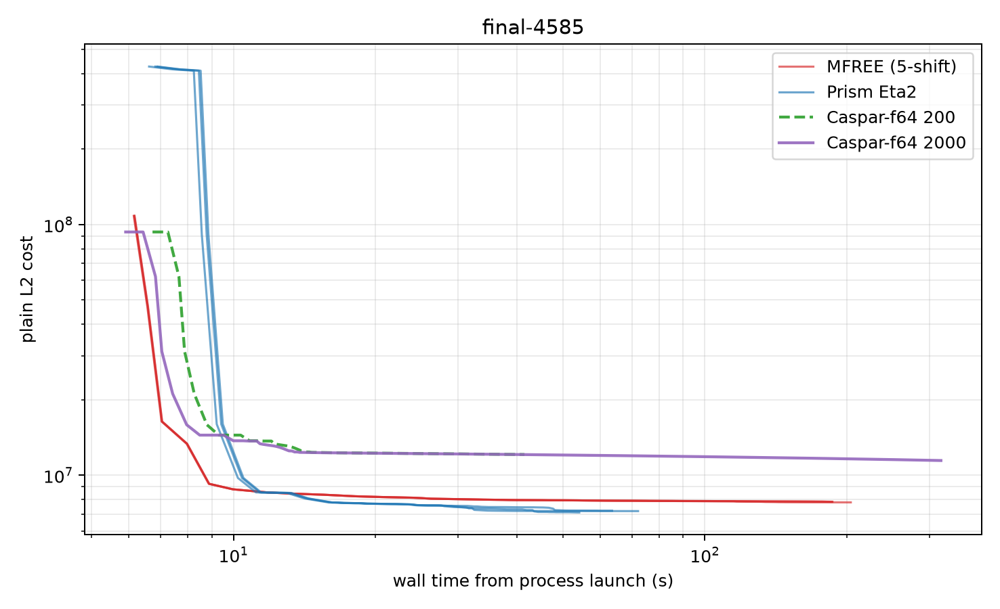
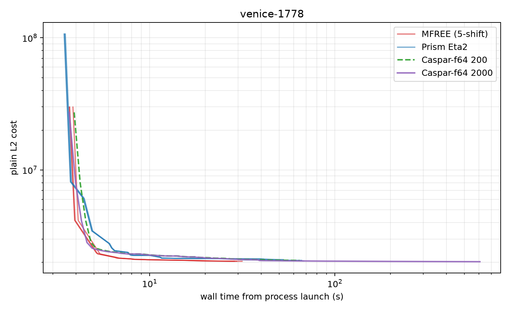

# Independent RTX 2000 Ada speed sanity check

This experiment was preregistered and completed without reading `/workspace/parity/speed*` result files. Every command was serialized with `flock /tmp/prism_gpu.lock`; every stdout/stderr stream was timestamped with `bench/bench/stamp.py`. Costs are the unchanged plain-L2 BAL objective. Wall crossings include process startup and input loading. Caspar prints its detailed `TRACE` block at exit, so its crossing curve uses the live timestamped `solver_iter` lines (`score_best`), not the delayed trace-block timestamps.

## Registered configurations

- **MFREE:** supplied five-shift champion flags and CLI, FP32 fragments, 60 accepted outers.
- **Prism:** frozen sustained-Eta2/lambda-0.1 configuration (`OCA_NSHIFTS=1`, `OCA_RLA_FIXED_ETA=2`), 60 accepted outers.
- **Caspar-f64:** unmodified comparison binary at 200 and 2,000 attempted iterations.
- **Fuchsberg:** the same perturbed 5,592-frame model, MFREE backend, principal point and sensor-from-rig refinement enabled, 60-iteration cap, `OCA_RF_THETA_MAX_DEG=100`; two repetitions.

## Verdict

- **Final-4585 favors Prism decisively.** Prism's measured 60-outer endpoints span `7.06e6–7.38e6` across the independent and post-freeze external cohorts; the independent median is 8.20% lower than MFREE's while its median process wall is 2.93× shorter. At MFREE's median endpoint threshold, Prism crosses in 16.127s median versus 158.849s for the two MFREE runs that reach it. MFREE spends 198–199 retries per run; Prism spends 21–100.
- **Venice-1778 favors MFREE.** MFREE's median endpoint is 1.63% lower than Prism's and its median process wall is 2.24× shorter. It crosses Prism's median endpoint in 15.844s versus 61.807s for the two Prism runs that reach it. MFREE also beats Caspar-200 on quality and wall. Caspar-2000 eventually finishes 0.78% below MFREE, but needs 606.924s versus MFREE's 29.495s median wall.
- **The Fuchsberg parity port fixes correctness rather than raw speed.** It lowers the fixed-cap endpoint from `3.65304e9` to `1.78405e7` (about 205×), reproducibly. Its 611.603s median wall is 1.89× the old adapter's 323.506s because the old adapter enters a 200+ rejection storm and terminates far above the useful basin.

The two BAL scenes therefore reject a universal speed ranking: Eta2 is much stronger on Final-4585, while the five-shift MFREE configuration is stronger on Venice-1778. The full Fuchsberg result is unambiguous on quality and shows why endpoint-matched timing is required.

## final-4585

| arm | rep | final cost | iterations | accepts / rejects | solver seconds | process wall |
|---|---:|---:|---:|---:|---:|---:|
| mfree | 1 | 7801058.933293 | 60 | 60 / 198 | 197.850 | 204.046 |
| mfree | 2 | 7843763.151716 | 60 | 60 / 199 | 179.830 | 185.998 |
| mfree | 3 | 7844170.529195 | 60 | 60 / 199 | 180.319 | 186.529 |
| prism | 1 | 7109884.884828 | 60 | 60 / 21 | 47.650 | 54.161 |
| prism | 2 | 7200403.098539 | 60 | 60 / 100 | 65.926 | 72.186 |
| prism | 3 | 7224234.685175 | 60 | 60 / 51 | 57.020 | 63.580 |
| caspar-200 | 1 | 12105689.037244 | 200 | 192 / 8 | 34.521 | 41.441 |
| caspar-2000 | 1 | 11456039.813948 | 2000 | 1992 / 8 | 310.800 | 316.918 |

Median repeated-arm summary:

| arm | median final cost | median process wall | wall range |
|---|---:|---:|---:|
| mfree | 7843763.151716 | 186.529s | 185.998–204.046s |
| prism | 7200403.098539 | 63.580s | 54.161–72.186s |
| caspar-200 | 12105689.037244 | 41.441s | single run |
| caspar-2000 | 11456039.813948 | 316.918s | single run |

Time to each registered equal-cost threshold. Entries are `hits/N median [range]`; a dash means the arm never reached the threshold. This table contains both MFREE→Prism and Prism→MFREE directions, and every arm against both Caspar endpoints.

| trajectory | MFREE median final 7.84376e+06 | Prism median final 7.2004e+06 | Caspar-200 final 1.21057e+07 | Caspar-2000 final 1.1456e+07 |
|---|---:|---:|---:|---:|
| mfree | 2/3 158.849s [132.183,185.516] | 0/3 — | 3/3 8.882s [8.864,8.884] | 3/3 8.882s [8.864,8.884] |
| prism | 3/3 16.127s [15.943,16.221] | 2/3 57.573s [43.454,71.692] | 3/3 10.430s [10.224,10.503] | 3/3 10.430s [10.224,10.503] |
| caspar-200 | 0/1 — | 0/1 — | 1/1 41.441s | 0/1 — |
| caspar-2000 | 0/1 — | 0/1 — | 1/1 40.244s | 1/1 316.918s |

## venice-1778

| arm | rep | final cost | iterations | accepts / rejects | solver seconds | process wall |
|---|---:|---:|---:|---:|---:|---:|
| mfree | 1 | 2034776.000700 | 60 | 60 / 0 | 25.670 | 29.495 |
| mfree | 2 | 2035235.658004 | 60 | 60 / 0 | 27.774 | 31.582 |
| mfree | 3 | 2036104.006627 | 60 | 60 / 0 | 24.673 | 28.646 |
| prism | 1 | 2097085.760659 | 60 | 60 / 1 | 49.137 | 52.743 |
| prism | 2 | 2068873.474439 | 60 | 60 / 1 | 62.625 | 66.173 |
| prism | 3 | 2046853.607936 | 60 | 60 / 1 | 64.281 | 67.831 |
| caspar-200 | 1 | 2061024.443051 | 200 | 163 / 37 | 60.514 | 64.507 |
| caspar-2000 | 1 | 2019406.553209 | 2000 | 1691 / 309 | 602.982 | 606.924 |

Median repeated-arm summary:

| arm | median final cost | median process wall | wall range |
|---|---:|---:|---:|
| mfree | 2035235.658004 | 29.495s | 28.646–31.582s |
| prism | 2068873.474439 | 66.173s | 52.743–67.831s |
| caspar-200 | 2061024.443051 | 64.507s | single run |
| caspar-2000 | 2019406.553209 | 606.924s | single run |

Time to each registered equal-cost threshold. Entries are `hits/N median [range]`; a dash means the arm never reached the threshold. This table contains both MFREE→Prism and Prism→MFREE directions, and every arm against both Caspar endpoints.

| trajectory | MFREE median final 2.03524e+06 | Prism median final 2.06887e+06 | Caspar-200 final 2.06102e+06 | Caspar-2000 final 2.01941e+06 |
|---|---:|---:|---:|---:|
| mfree | 2/3 30.188s [28.795,31.582] | 3/3 15.844s [15.097,16.053] | 3/3 17.321s [16.372,19.687] | 0/3 — |
| prism | 0/3 — | 2/3 61.807s [57.782,65.833] | 1/3 61.664s | 0/3 — |
| caspar-200 | 0/1 — | 1/1 56.684s | 1/1 64.217s | 0/1 — |
| caspar-2000 | 1/1 131.039s | 1/1 39.031s | 1/1 40.547s | 1/1 606.924s |

## Post-freeze Caspar-fp32 cross-check

These rows were produced independently in `/workspace/parity/speed_caspar32` and were read only after the preceding experiment and report had been frozen. They are therefore supporting rows, not part of the preregistered timing cohort. The driver binary is `/workspace/caspar32-src/build/caspar_bal32` (SHA-256 `6a052ff736ecb0b04fab1cf3898d2eb377919af00bd4142e6666c1981a2cf375`).

| scene | cap/run | status | finite best/final cost | solver time |
|---|---:|---|---:|---:|
| final-4585 | 200/r1 | completed | 12,106,156 | 12.096s |
| final-4585 | 200/r2 | completed | 12,123,777 | 12.108s |
| final-4585 | 2000 | exit 2 at iter 1999 | 11,634,041 | 91.923s |
| venice-1778 | 200/r1 | NaN abort at iter 165 | 2,120,424.5 | 22.354s |
| venice-1778 | 200/r2 | completed | 2,117,737 | 27.458s |
| venice-1778 | 2000 | NaN abort at iter 196 | 2,121,653.75 | 26.444s |

On Final-4585, fp32 Caspar is about 2.9× faster at 200 iterations and 3.4× faster at the long cap than fp64, but the long-run finite endpoint is 1.56% worse (`11.634e6` versus `11.456e6`) and remains far above Prism’s `7.06e6–7.38e6` range. On Venice-1778, two of three runs abort after NaN scores; the sole completed row is also worse than MFREE, Prism, and Caspar-f64 at 200 iterations. The fp32 path is therefore fast per iteration but not a reliable quality baseline on Venice.

## Fuchsberg perturbed full global BA

| build | rep | initial cost | final cost | accepts / rejects | process wall |
|---|---:|---:|---:|---:|---:|
| old_prism | 1 | 5.35201e+09 | 3.65304e+09 | 24 / 212 | 338.070s |
| parity | 1 | 5.35201e+09 | 1.78405e+07 | 60 / 53 | 611.532s |
| old_prism | 2 | 5.35201e+09 | 3.65304e+09 | 23 / 200 | 308.942s |
| parity | 2 | 5.35201e+09 | 1.78405e+07 | 60 / 53 | 611.674s |

- **old_prism:** median final `3.65304e+09`, median wall `323.506s`.
- **parity:** median final `1.78405e+07`, median wall `611.603s`.

The old adapter enters a reject storm and stops near `3.65304e9`; the parity port reaches about `1.78405e7` in both repetitions. The parity solve is slower at the fixed 60-iteration cap because it continues making useful progress instead of terminating in the old false-convergence regime. Absolute time alone is therefore not an equal-quality comparison on this workload.

## Reproducibility

- Raw independent artifacts: `/workspace/independent_speed_sanity`
- Durable raw archive: `migration_artifacts/speed_sanity_raw_20260922.tar.xz` (SHA-256 sidecar committed next to it).
- Runner: `run_independent.py`; protocol and binary/input hashes: `protocol.json`.
- Temporary 2.7 GB Fuchsberg output models were deleted immediately after each run; logs and timing metadata were retained.
- The initial invocation exposed an interface-only difference: old Prism routes the MFREE iteration cap through `BundleAdjustmentCeres.max_num_iterations`, while the parity build exposes `BundleAdjustmentMFree.max_num_iterations`. The failed pre-run did not enter the solver and is excluded.
