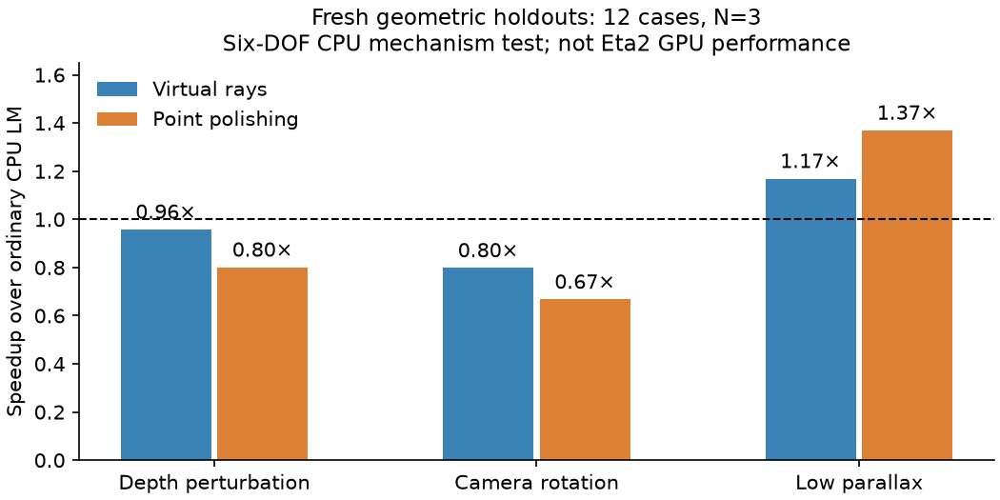
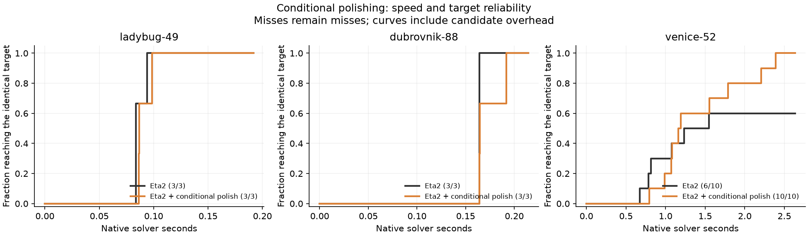

# Point corrections combined with the Eta2 champion

**Verdict: retain Eta2 as the speed champion.** The low-parallax CPU result
survived fresh holdouts, but it did not transfer into a general GPU speedup.
Conditional point polishing is a possible target-attainment aid on Venice52,
with extra cost. Its benefit weakens when the objective tolerance is relaxed,
which matters because the user prioritizes convergence speed and accepts small
objective differences. Nothing is promoted to the original algorithm.

Branch: `research/champion-point-combinations`, based on `a48c554`.
Full implementation, protocols, inputs for synthetic cases, flags, raw logs,
curves, parsed results and validations are in this directory. Native input BAL
files remain external; each run records their SHA256. This experiment makes no
new Caspar comparison or novelty claim.

## Fresh mechanism holdouts

Twelve untouched cases: six low-parallax seeds 510--515, three depth-perturbed
and three camera-rotation cases, seeds 510--512. N=3, 108 runs, all targets hit.
Targets were fixed at 1.01 times an independently calibrated reference cost
before any candidate run. These are the previous six-DOF CPU formulation with
fixed intrinsics and gauge constraints, **not timings of the GPU champion**.
Depth/joint cases with the same seed share geometry and observations.

| Family | Virtual-ray speedup | Point-polish speedup |
|---|---:|---:|
| Depth perturbation | 0.958x | 0.800x |
| Camera rotation | 0.798x | 0.667x |
| Low parallax | **1.169x** | **1.369x** |

Entries are medians of per-case ratios of N=3 median times. On low parallax,
ordinary LM takes a median 26 accepted steps / 2 rejects, virtual rays 18 / 0,
and polishing 13 / 0. Polishing wins on four of six cases, virtual rays on five.
Median point NRMSE is 0.150 / 0.095 / 0.130 respectively; median camera NRMSE
0.716 / 0.345 / 0.579. The geometry remains weak, so objective convergence does
not certify accurate reconstruction.



## Native GPU combinations

The actual frozen Eta2 source is the base, with all champion flags retained,
including the existing zero/full point safeguard, radius controller, mixed
fragments, PCG, numerical guard and dynamic EW forcing. New flags default off.

- `OCA_FOLLOW_POINT=1`: one observed-pixel point GN polish at proposed cameras,
  per-track diagonal regularization 1e-6, trial scales 1, 1/2, 1/4.
- `OCA_FOLLOW_POINT=2`: that polish only when every viewing ray lies within 5
  degrees of its first viewing ray. Gate computation is charged.
- `OCA_FOLLOW_POINT=3`: joint virtual-ray point correction, including the parent
  radial-distortion pixel metric and native effective diagonal point damping.
- `OCA_FOLLOW_LOOSE=1`: keep dynamic EW but raise the final forcing cap from .5
  to .8. This differs from the previous frozen CPU fixed-eta=.8 diagnostic.

All point methods are additional candidates after the incumbent rescue
pipeline. Preserve the incumbent step, recompute the true cost and full GN
prediction for the altered displacement, and replace only for lower objective
and rho > .1. The original camera-radius test still applies. Costs of attempted
corrections, failed probes and extra evaluations are included. The virtual-ray
native overlay consequently differs from the previous CPU nonlinear path
replacement and its original-tangent scoring; this is not an exact transfer of
that CPU solver.

Three original-binary calibration runs per scene froze these primary targets:
Ladybug49 **13,591.5683542795**, Dubrovnik88 **359,304.6543129532**, Venice52
**246,568.2747684669**. Each equals 1.001 times its median calibration endpoint;
none is a certified optimum. 600-outers / 12-second cap, RTX 2000 Ada, serialized
GPU runs under `/tmp/prism_gpu.lock`, rotated arm order, N=3: **72 runs**.

| Addition to Eta2 | Ladybug49 target seconds | Dubrovnik88 target seconds | Venice52 hits |
|---|---:|---:|---:|
| None | **0.084** | **0.165** | 0/3 |
| Point polish | 0.151 | 0.187 | 0/3 |
| Selective polish | 0.140 | 0.180 | 0/3 |
| Virtual rays | 0.169 | 0.209 | 0/3 |
| Looser inner solves | 0.100 | Miss, 0/3 | 0/3 |
| Polish + looser solves | 0.152 | 0.187 | 0/3 |
| Selective + looser solves | 0.114 | 0.180 | 0/3 |
| Virtual rays + looser solves | 0.167 | 0.272 | 0/3 |

Times are medians, not process launch times. Misses are not assigned a fake
speedup. Polishing reduced Dubrovnik's outer count from 10 to 6 and matvecs from
77 to 66, but approximately 0.069 seconds of overlay work erased the savings.
Selective polishing took 7 outers but still cost more wall time. Looser forcing
missed Dubrovnik's tight target by about 0.23%; this is a target miss, not a
claim that such a small objective difference is practically unacceptable.

Venice52 is a basin-sensitive counterexample, including for the baseline.
Always-polished endpoints were about 252k versus the baseline's 247.6k in this
screen. True cost decreased monotonically within every run: this is an altered
trajectory ending at a different objective, not an accepted cost increase.
No arm met the pre-registered gate for extension to larger scenes.

## Conditional correction, exploratory follow-up

The screen motivated a cheap event trigger: reuse the existing full-model
prediction and invoke the point method only when original rho <= .25 or the
prediction is invalid. The .25 threshold is the existing trust-region
contraction boundary, not a fitted threshold. This conditional build can also
attempt repair of the last failed proposal, retaining true-cost, model-ratio
and camera-radius acceptance. Use `OCA_FOLLOW_GATE=1` with point mode 1 or 3.

| Scene | Eta2 hits | Conditional polish hits | Eta2 hit seconds | Polish hit seconds |
|---|---:|---:|---:|---:|
| Ladybug49, N=3 | 3/3 | 3/3 | 0.084 | 0.087 |
| Dubrovnik88, N=3 | 3/3 | 3/3 | 0.164 | 0.164 |
| Venice52, N=10 | **6/10** | **10/10** | **0.946** | **1.177** |

The last two columns condition on target success; their ratio is **not** an
unconditional speedup when either method misses. Venice's median rejects fall
from 4.5 to 1. Conditional polishing invokes a median 9.5 probes, selects seven
alternatives, and spends 0.108 seconds in overlay work. A selected alternative
is counted before the final radius test, so selections are not synonymous with
accepted outer steps. By one second, three baseline runs versus two polished
runs have hit the target. The exact two-sided Fisher p-value for 10/10 vs 6/10
is 0.0867, before accounting for exploratory selection. Treat the observed
attainment advantage as suggestive, not established.

Conditional virtual rays regress Ladybug49 (0.153 seconds), do nothing on
Dubrovnik, and take 1.315 seconds on Venice at N=3 with zero selected corrections
there. Venice's changed outcomes with zero selected proposals underline its
sensitivity to execution and floating-point ordering; they are not attributable
to a mathematical virtual-ray improvement.



A secondary tolerance check preserves the same frozen Venice reference, N=3
per arm and tolerance. It does not replace the primary registered target.

| Target above reference | Eta2 hits / hit seconds | Conditional polish hits / hit seconds |
|---|---:|---:|
| 0.5% | 2/3 / 0.733 s | 3/3 / 0.754 s |
| 1.0% | **3/3 / 0.402 s** | 3/3 / 0.460 s |

At 1% tolerance both reliably hit in this sample; polishing costs **14.5% more
time** while changing 35 outers / 118 matvecs to 34 / 116. Thus the apparent
benefit depends on demanding a particular tight objective. With the user's
speed-first priorities, it does not displace Eta2.

## Mathematics and correctness

For virtual rays, from the parent state use q=RX+t and
v=omega x RX + dt + R dX. Define u=-q_xy/q_z and
u_virtual=u-(v_xy+u v_z)/q_z. At the proposed cameras solve, independently per
point,

    min_delta  1/2 sum || W_parent [I,u_virtual] (R_trial (X_linear+delta)+t_trial) ||²
                + 1/2 delta^T D_tau delta.

Here W_parent is the parent pixel/distortion differential divided by parent
q_z; D_tau exactly matches the native factor's effective diagonal damping and
floor. This is a three-by-three solve centered on the ordinary proposed point,
not retriangulation against measured pixels. Measured-pixel GN polish is a
separate conventional method. The virtual correction vanishes to first order
along a smooth joint step; the actual native displacement is used for scoring.

Independent NumPy checks match CUDA on 12 cases across all three modes, including
moving cameras, changing intrinsics, radial distortion, zero steps, coincident
cameras, and a partial final block of 33 points. Maximum relative vector error
is 1.57e-11. Camera steps are unchanged exactly. CUDA memcheck reports zero
errors for virtual and selective-polish kernels. All native accepted-state
traces are finite and nonincreasing, and reported targets/endpoints match logs.

The first disabled-flags check on Dubrovnik exceeded an initial overly strict
1e-6 relative assertion: 3.98e-6 with identical outers and matvecs. This failed
assertion is recorded in `off_parity.json`, not hidden. N=6 repeated eight-outer
checks show overlapping original/generated distributions, identical 73 matvecs,
and median relative difference 2.94e-7. There is no bitwise-equivalence claim.
Independent Venice N=10 target audits give 7/10 hits for the original and 7/10
for the generated baseline; this confirms the original binary also has target
variability. The conditional N=10 baseline is a separate matched cohort (6/10).

The original champion source and all 44 headers retain their registered hashes.
The isolated binaries and generated source hashes are in both build manifests.
No compiled binaries or large BAL inputs are added to git.

## Reproduction and artifact map

Run from this directory with Python/NumPy, CUDA/nvcc, Eigen and an sm_89 GPU:

```sh
python3 build.py
python3 check_kernels.py
python3 run_native.py calibrate
python3 run_native.py screen
python3 run_holdout.py
python3 build_conditional.py
python3 run_conditional.py
python3 repeat_conditional.py
python3 target_sensitivity.py
python3 audit.py
python3 summarize.py
python3 finalize_summary.py
python3 plot_results.py
```

The native harness defaults to `/workspace/bal` and uses the checksum-verified
original binary at `/tmp/prism-rl-actor/build/prism-tr` for calibration/parity.
On another machine, build the frozen package via `../eta2_champion/build.py` and
set the `ORIGINAL` path in `run_native.py`. Existing `result.json` paths resume
completed runs; use a fresh evidence directory for new measurements. To rerun
these exact target benchmarks on another host, retain the published target JSON
instead of silently replacing it with newly calibrated targets.

`PROTOCOL.md` and `CONDITIONAL_PROTOCOL.md` distinguish primary registration
from exploratory follow-ups. `screen_summary.json`, `holdout_summary.json`,
`conditional_summary.json` contain machine-readable conclusions. `evidence/`
holds each native command, flags, input/binary hashes, raw log and convergence
curve, and the fresh synthetic inputs. There are **170 native runs**, including
calibration and audits, plus **108 CPU holdout runs** and 12 kernel-oracle cases.
`audit.json` records the final validation counts. Figures are available as PNG
and PDF. `FEEDBACK.md` is a concise handoff for the suggesting agent.

Next justified direction: preserve conditional polishing as an opt-in candidate
for difficult target attainment, and test it on fresh scenes before making a
reliability claim. A speed effort would first have to remove most of its extra
per-track projection and model/cost scoring passes. Current evidence does not
justify launching another large-scene sweep or changing the champion defaults.
