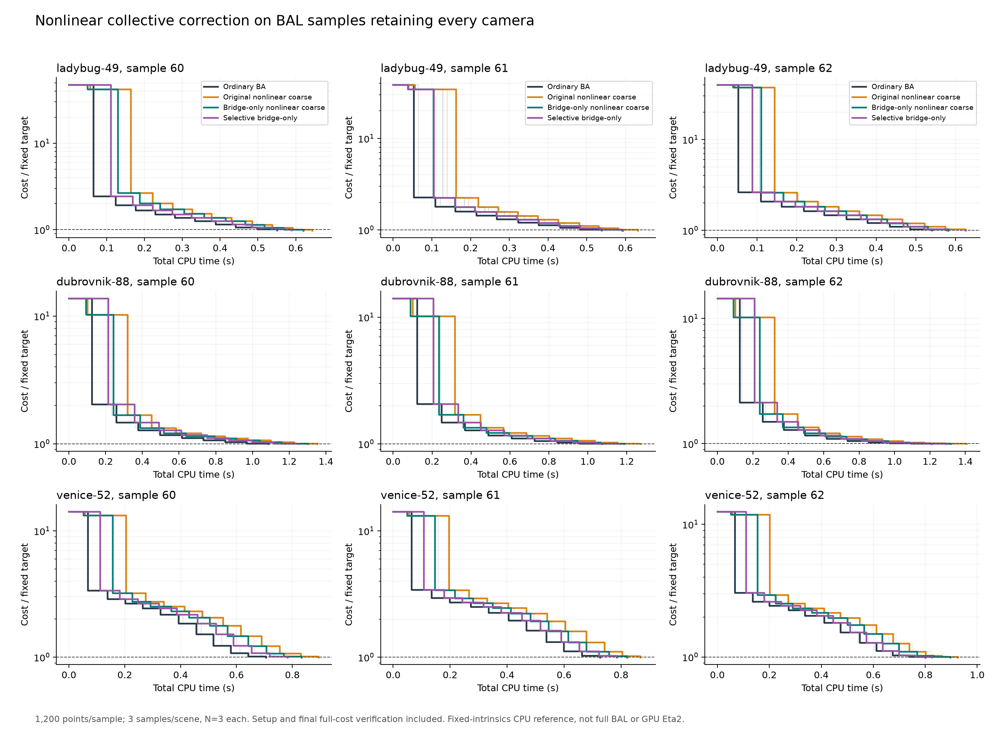

# Nonlinear collective corrections on BAL: broader screen

**No BAL speed win yet.** Keeping all cameras and accelerating the coarse
calculation narrows the loss, but ordinary BA still reaches the common target
faster on these samples. Eta2 remains the production incumbent.

The earlier T4 screen used 24 cameras/300 points from one connected region.
This follow-up keeps all 49/88/52 original cameras and 1,200 points per sample,
with every original observation of each selected point. Three point-sampling
seeds per scene and three timing repetitions give 135 complete runs across
five arms. All 135 reach their frozen targets with zero invalid final depths
and zero recorded numerical failures.

These are **fixed-intrinsics FP64 CPU subproblems**, not the full original BAL
problems and not a GPU Eta2/Caspar comparison. Sampling removes points and can
remove graph edges, even though it retains every camera. Ladybug's ten points
with initially invalid signed depths are excluded from the eligible pool;
Dubrovnik and Venice have none. Exact indices and original/packed hashes are
saved. No new observation noise or pose perturbation is added.

## Time to the same objective

Each cell is the median of three within-sample speed ratios, each based on
N=3 timing medians. Larger than 1 means faster than ordinary BA. Pooling raw
seconds across different samples would mix different problems and is avoided.

| Scene, all cameras | Original nonlinear8 | Bridge-only nonlinear8 | Selective bridge-only |
|---|---:|---:|---:|
| Ladybug49 | 0.858x | **0.909x** | 0.936x |
| Dubrovnik88 | 0.848x | **0.906x** | 0.923x |
| Venice52 | 0.835x | **0.884x** | 0.923x |

Bridge-only remains about 10%, 10%, 13% slower, respectively. The original
nonlinear opening is about 17–20% slower. The matched linear8 arm scores
0.857x/0.850x/0.827x: finite nonlinear motion has no consistent advantage
over the same linear coarse basis here. See [full statistics](summary.json)
and [all run records](results.json), including per-sample paired ratios.

Targets are `Fref+1e-3*(F0-Fref)`, frozen before comparisons. Fref is a feasible
ordinary-LM reference, not a claimed optimum. Reported convergence is to this
target; this screen does not establish performance deep into an accuracy
floor. Every arm has the same 80-fine-attempt/5-second total budget, with
partitioning, coarse work and full-cost verification charged.

## The optimization works, but does not save fine iterations

An exact cluster similarity leaves each within-cluster projection unchanged.
The new implementation evaluates changing bridge observations plus the
constant internal cost, then verifies the complete original objective.
[Derivation and limits](MATH.md).

| Scene | Original coarse stage, median | Bridge-only stage, median | Subsequent fine iterations, either arm |
|---|---:|---:|---:|
| Ladybug49 | 56.6ms | 19.3ms | 10 |
| Dubrovnik88 | 115.3ms | 28.0ms | 9 |
| Venice52 | 92.6ms | 45.3ms | 11 |

The coarse stage is roughly 2–4x cheaper. Total improvement over the previous
nonlinear implementation is only 6–7% at the paired-median level. Partitioning
alone consumes about 5–7% of total runtime. The selector skips eight of nine
samples, yet still pays to construct and inspect their partitions.

No individual sampled problem saves a fine accepted step. Median fine rejects
are zero in every scene/arm. This is therefore not a rejection-storm problem
in the tested regime. A post-result diagnostic measures initial first-step
rotation at 0.3–1.3 degrees. One ordinary BA step removes 75–95% of initial cost,
while eight coarse steps remove 5–29%. Constraining regions to rigid/similarity
motion cannot remove most of their internal reprojection error. The largest
first-step linear/nonlinear cost difference is only 0.18% of initial cost,
and its sign is mixed. See [motion diagnostics](motion_diagnostics.json).

The geometry also challenges a fixed three-cluster partition: Dubrovnik
allocates one cluster to just two cameras; Venice has 35–42% cross-cluster
observations. These are not the clean weakly connected, internally optimized
regions in the positive synthetic example. This is a limited diagnosis of
these inputs, not proof that collective correction cannot help larger BAL.

## What to pursue next

Test a **late selective correction** after a few ordinary steps have reduced
internal error. Its trigger should measure residual progress available in
relative region motion, and charge detection/partitioning costs. Register a
new sample cohort and tighter secondary target before tuning such a schedule.
The current always-opening method fails its 1.10x promotion gate; no expensive
full-BAL/GPU expansion was launched from this negative result.

The bridge-only calculation is a reusable engineering component. It follows
known submap invariance and is not a standalone novelty claim. Promotion
requires total-time gains over the native incumbent on unchanged problems.

## Figures and reproduction



[Exportable PDF](figures/convergence/all_camera_bal.pdf) ·
[Plotted CSV](figures/convergence/traces.csv) · [Protocol](PROTOCOL.md)

From repository root, with dependencies from the sibling geometry agenda:

```bash
export OPENBLAS_NUM_THREADS=1
export OMP_NUM_THREADS=1
python3 research/collective_bal/prepare_cases.py
python3 research/collective_bal/check_bridge.py
python3 research/collective_bal/run_comparison.py
python3 research/collective_bal/diagnose_motion.py
python3 research/collective_bal/plot_results.py
python3 research/collective_bal/validate_artifacts.py
```

Preparation needs the three original T1 captures under
`/tmp/prism-geometry-agenda` and BAL files under `/workspace/bal`. The committed
packed inputs and frozen targets allow comparison, checks and plotting without
those original large files. Use a separate checkout for new timings so the
published records remain intact. The paired endpoints and sampled problems
share the same original objective, intrinsics and explicit gauge.

[Equivalence checks](bridge_checks.json) cover three controlled and three real
inputs. Maximum reduced/full matrix error is 3.6e-16, RHS error 2.4e-15, and
coarse endpoint discrepancy 2.4e-13 relative. Timed runs' largest final
full-cost verification discrepancy is 7.3e-14. Parent immutability and gauge
preservation pass; tests explicitly show the linear path changes internal
residuals and therefore cannot use the same objective shortcut.

Source/results live on `research/nonlinear-collective-bal`, descended from
`e121e91`; the original production solver is unchanged. `artifact_manifest.json`
records package/dependency hashes and environment. `validation.json` records
checks of every frozen input, target match and result row.
