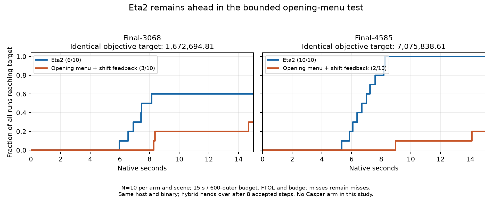

# Eta2 opening multishift hybrid

The frozen single-shift PCG Eta2 configuration remains the champion. A real
five-shift opening sweep, with or without winning-shift feedback, did not
improve time to the identical objective targets in this study. The strongest
counterexample is Final4585: Eta2 reached the target in 10/10 runs; the selected
hybrid reached it in 2/10 within the registered 15-second budget.

This is a negative result for the tested Eta2-side opening prototype, not a
refutation of all phase hybrids, Claude's reverse handover, or the rescue ladder.
No Caspar arm was run, and none of these rows changes the previous Caspar ledger.

**Metadata received after the experiment:**
[joint disposition and SHIFTDIAG reconciliation](METADATA_RECONCILIATION.md)
records the delivered definition/traces, the fixed-matrix nature of the
CG-versus-preconditioner study, and Claude's subsequent consolidation results.
The original experiment, selection and verdict below are unchanged.

## What was implemented

The experiment starts from the hash-verified frozen
[Eta2 source](../eta2_champion/source/prism_eta2.cu) and all 44 original headers.
[build.py](build.py) creates a separate binary. The original solver and its
source files are unchanged. Eta2's name denotes its sustained forcing multiplier
of two; this experiment does not use a learned policy.

`OCA_PHASE_HYBRID` selects one of four arms:

| Value / arm | Opening linear solve | Scored candidates | Next-lambda anchor |
|---|---|---|---|
| 0 / champion | Original single-shift PCG | Original candidate | Original center |
| 1 / shared_center | Shared unpreconditioned five-shift CG | Center only | Original center |
| 2 / shared_menu | Same shared sweep | All five | Original center |
| 3 / menu_feedback | Same shared sweep | All five | Winning shift, if accepted without rescue |

Every sweep holds the Schur operator, point factors, and RHS fixed at the
**central point damping** while testing camera shifts at 0.01, 0.1, 1, 10 and
100 times the center. These are not five independently coupled joint-LM solves.
Inserting PCG into the old zeta recurrence would be invalid for this fixed
damping metric; the prototype uses a separate ordinary-CG recurrence instead.
It then restarts the original PCG cleanly at handover. Details and limitations
are in [MATH.md](MATH.md).

Candidates undergo the existing camera-radius clipping and real nonlinear cost
evaluation, with center first and exact ties retaining center. The selected
candidate then passes the original full-GN model acceptance check. Backtracking,
point safeguards, and stopping rules are retained. This does not evaluate an
independent model acceptance test for every lane before choosing a winner.
There is no deep-CG rescue or storm re-entry in this opening-only implementation.

The collapse diagnostic uses a 5-by-5 camera Gram matrix in equilibrated
coordinates, normalized by the largest candidate norm, after radius clipping.
It requires diameter <= 1e-3 for two consecutive accepted, non-rescued,
residual-qualified menus. That normalization is provisional: Claude's exact
SHIFTDIAG definition had not arrived when this protocol was frozen.

The primary variant has an eight-accepted-step safety cap. A subsequent,
separately recorded diagnostic moves that cap to the existing 600-outer limit
to observe the actual collapse rule. All shared solve, extra residual checks,
Gram and scoring costs are included in native timing. Five fresh true-residual
Schur products per completed sweep are also included in the matvec count.
Failed shared solves fall back to PCG at the unchanged center.

## Fixed targets and large-scene results

The [protocol](PROTOCOL.md) was recorded before candidate measurements. Small
targets use 1.01 times previously recorded original-Eta2 reference endpoints.
Large targets use 1.01 times the median of three fresh original-Eta2 calibration
endpoints, completed before candidate runs. Those endpoints have a 15-second
cap; they are not certified optima. All arms within a scene use the identical
numeric target, input hash, objective, DOF and observation set.

Final3068 target: **1,672,694.8052276426**. Final4585 target:
**7,075,838.613048037**. N=10 per arm, alternating run order, same binary and
RTX 2000 Ada host, 600 outers / 15 native seconds. Native time excludes file
loading and final diagnostics; process time is separately retained in every
row. The time budget is checked at iteration boundaries, so a missed run can
finish slightly beyond 15 seconds.

| Scene | Arm | Target hits | Successful time median [min, max], s | Miss reasons |
|---|---|---:|---:|---|
| Final3068 | Eta2 | **6/10** | **7.166 [5.974, 8.138]** | 4 FTOL |
| Final3068 | Opening menu + feedback | 3/10 | 8.369 [8.281, 14.674] | 5 FTOL, 2 budget |
| Final4585 | Eta2 | **10/10** | **6.847 [5.330, 8.253]** | None |
| Final4585 | Opening menu + feedback | 2/10 | 11.544 [8.975, 14.114] | 8 budget |

Successful-run medians condition on different subsets. Do not divide them and
call the result an unconditional speedup. The attainment plot keeps all misses
in its denominator. No significance test or claim of a converged-basin rate is
made from this short panel. In particular, these are not replications of
Claude's 20% versus 44% deep-reject result or its basin threshold.



The following medians include all ten runs, including early stops and misses;
their different stopping states preclude an equal-work endpoint comparison.

| Scene / arm | Final cost median [min, max] | Accepted outers | Rejects | Schur products |
|---|---:|---:|---:|---:|
| Final3068 / Eta2 | 1,672,426 [1,671,463, 1,888,352] | 79.5 | 9 | 1,033.5 |
| Final3068 / hybrid | 1,740,199 [1,672,087, 1,849,295] | 98 | 12.5 | 1,198 |
| Final4585 / Eta2 | 7,065,251 [6,912,864, 7,075,430] | 21 | 1 | 127 |
| Final4585 / hybrid | 7,206,861 [6,913,084, 7,329,646] | 42 | 3.5 | 225 |

All 20 large hybrid runs handed over through the **eight-step cap**, not the
collapse detector. The extra solve work is only part of the loss: the changed
opening also creates slower later trajectories after the menu has switched off.

## Initial small screen and why the selected arm was tested

N=3 per cell, 12 seconds / 600 outers. Entries are successful target-time
medians in seconds; a miss is never substituted with an early stopping time.

| Arm | Ladybug49 | Dubrovnik88 | Venice52 |
|---|---:|---:|---:|
| Eta2 | **0.0374 (3/3)** | **0.1167 (3/3)** | **0.4016 (3/3)** |
| Shared sweep, center only | 0.0878 (3/3) | Miss (0/3) | 0.9844 (3/3) |
| Shared menu | 0.1432 (3/3) | 0.3624 (3/3) | Miss (0/3) |
| Menu + feedback | 0.1156 (3/3) | 0.4350 (3/3) | Miss (0/3) |

Both menu variants hit 6/9 targets. Under the registered tie-break, feedback's
geometric-mean time on their two fully hit common scenes was 0.2242 s versus
0.2278 s. This merely selected an arm for the already promised N=10 extension;
it was not a win against Eta2. [selection.json](selection.json) preserves that
decision. The small center-only control also changes stopping depth relative to
PCG; it does not isolate hardware overhead while holding the direction fixed.

On Dubrovnik88, menu-feedback saved one accepted outer (6 versus 7), but
required 401 versus 53 Schur products and 0.435 versus 0.117 seconds. Its 30
exit-audit products cannot explain the 348-product increase. The smallest shift
frequently extends unpreconditioned seed CG even when another lane is selected.

The later [repeat extension](SMALL_REPEAT.md) brings Eta2 and the selected arm
to N=10 on Dubrovnik88 and Venice52, which were multimodal under previous
configurations. It preserves the initial screen and selection; final complete
repeat results are in [summary.json](summary.json) and [runs.csv](runs.csv).
These configuration-specific rows should be used instead of importing a noise
floor from Claude's CLI or library configurations.

| Complete repeat panel | Eta2 hits / time | Menu-feedback hits / time |
|---|---:|---:|
| Dubrovnik88, N=10 | **10/10; 0.1168 s** | 10/10; 0.4153 s |
| Venice52, N=10 | **10/10; 0.4006 s** | 1/10; 1.0934 s for the sole hit |

The Dubrovnik88 hybrid is 3.56 times slower by medians with all runs reaching
the target. The Venice52 hybrid's other nine runs stop on FTOL above target;
their stopping times do not count as successful target times.

## Does the collapse switch work?

The [separate diagnostic](COLLAPSE_DIAGNOSTIC.md) removes the eight-step cap,
using a fresh same-binary Eta2 control, the same three targets, and N=3.

| Scene | Eta2 target time, s | Collapse-only hybrid time, s | Hybrid hits | Actual collapse markers |
|---|---:|---:|---:|---|
| Ladybug49 | 0.0400 | 0.1329 | 3/3 | 2/3, outer 13 at target crossing |
| Dubrovnik88 | 0.1266 | 0.4152 | 3/3 | None before target |
| Venice52 | 0.4004 | 5.9596 | 3/3 | None before target |

Venice52's target attainment recovers, but its median time increases to about
14.9 times Eta2's. Its hybrid time range is 2.376–7.113 seconds, so this N=3
mechanism check is not a reliable estimate of a multimodal performance floor.
The collapse policy can stay active for a long time: small diameter alone is
insufficient when the step needs rescue or its residuals fail qualification.

Because the two Ladybug markers occurred exactly at termination, an additional
[three-run integration check](HANDOVER_VALIDATION.md) uses the same binary,
no target and a 20-outer cap. All three trigger actual collapse (outer 13, 15,
13), then execute PCG with monotone accepted objective. This verifies the code
path; it supplies no additional comparative speed claim.

## Correctness, limitations and next decision

Nine fixed-system cases check the shared solver against independent NumPy
solves: three SPD systems, three explicit synthetic BA Schur operators, zero
RHS, a zero bare operator stabilized by positive shifts, and an indefinite
case that must fail cleanly. The maximum true relative residual is 9.54e-11
and maximum relative solution error 1.52e-9 in the solvable checks.
Compute Sanitizer reports zero errors on the SPD-63 case. An initial zeta
underflow was found and corrected **before native candidate measurements**;
the failed attempt and algebraic repair are recorded in
[VALIDATION_NOTES.md](VALIDATION_NOTES.md).

The original/generated mode-off check compares N=3 at eight outers on each
small scene: equal median accept/reject/product counts and relative median
cost differences below 1e-4. It passes, but this is not bitwise identity across
atomic-order trajectories. All native accepted-state curves are finite and
monotone. Source/header hashes, flags, fixed central point damping, target
hit conditions and binary provenance are checked by [audit.py](audit.py).

The final audit covers **149 native runs**: 18 original/off-mode checks, 64
small-panel runs including the N=10 extension, 6 large calibration runs, 40
large comparisons, 18 collapse diagnostics and 3 handover checks. Total native
solve time is 505.57 seconds; process time including loading is 730.33 seconds.
One shared solve failed in the collapse diagnostic and fell back to PCG; it is
retained in the evidence. There were no such failures in the primary panel.

Keep Eta2 as champion. Do not promote this opening menu or winning-shift
feedback. The useful follow-up on Claude's side remains his independently
owned grind handover and rescue ordering. Before another opening-menu attempt,
resolve three measured issues: the least-damped seed's work, loose-CG collapse
versus unresolved soft modes, and feedback that changes next-step point damping
even though the observed menu varied only camera damping. A shared sweep being
cheaper than five PCGs does not establish that it beats the existing one PCG.

## Reproduction and evidence

From the repository root, with CUDA, cuBLAS, Eigen and the existing Python
dependencies available:

```sh
python3 research/eta2_phase_hybrid/build.py
python3 research/eta2_phase_hybrid/check_sweep.py
python3 research/eta2_phase_hybrid/run_study.py small
python3 research/eta2_phase_hybrid/run_study.py large
python3 research/eta2_phase_hybrid/repeat_small.py
python3 research/eta2_phase_hybrid/build_collapse.py
python3 research/eta2_phase_hybrid/run_collapse.py
python3 research/eta2_phase_hybrid/check_handover.py
python3 research/eta2_phase_hybrid/summarize.py
python3 research/eta2_phase_hybrid/export.py
python3 research/eta2_phase_hybrid/plot.py
python3 research/eta2_phase_hybrid/audit.py
```

The committed evidence is resumable: the scripts reuse existing result files.
For fresh measurements, use a separate checkout/evidence directory and preserve
the registered target JSON files. Do not overwrite archived results or retune
targets. Fresh builds may have different binary hashes across toolchains; the
launcher refuses to relabel an archived run with a different binary. Input
files are expected at `/workspace/bal`; their hashes and every native flag and
CLI argument are in per-run manifests. Calibration/parity scripts reference
the historical original binary path on this host; the published Eta2 package
provides its source and build instructions for another machine.

`evidence/` contains stdout, convergence CSV, input/binary/flag manifests and
parsed results for every native run. `runs.csv` and `sweep_observations.csv`
provide portable tables. Build manifests identify generated source, binary and
sweep-header hashes; generated CUDA source is reproduced by the checked build
script. `environment.json` identifies the measurement host and toolchain.
The original frozen source is preserved in its existing package; binaries and
large BAL inputs are not duplicated into git.
