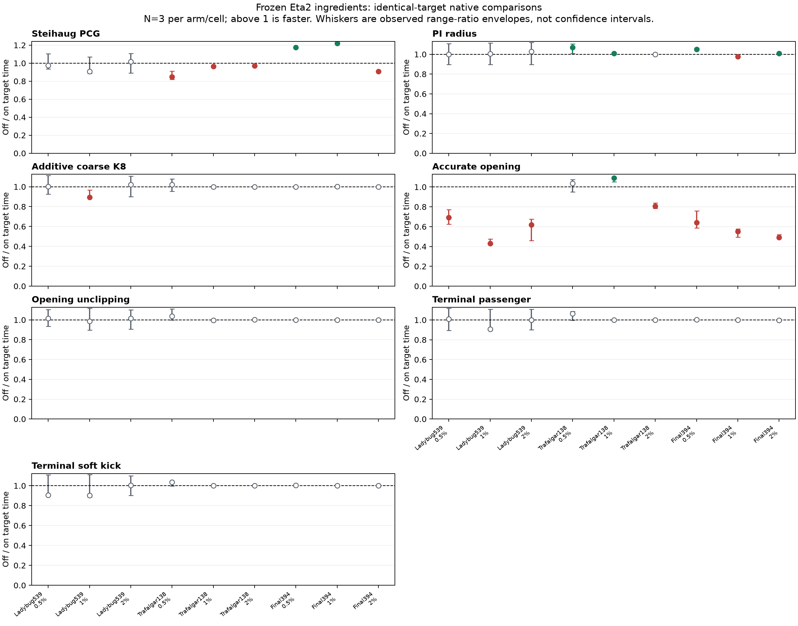
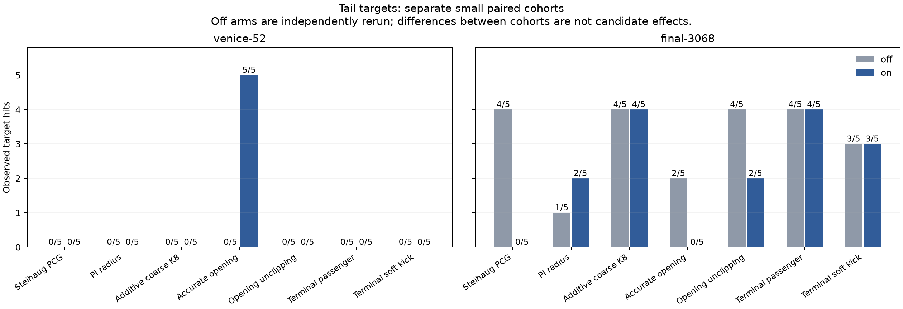
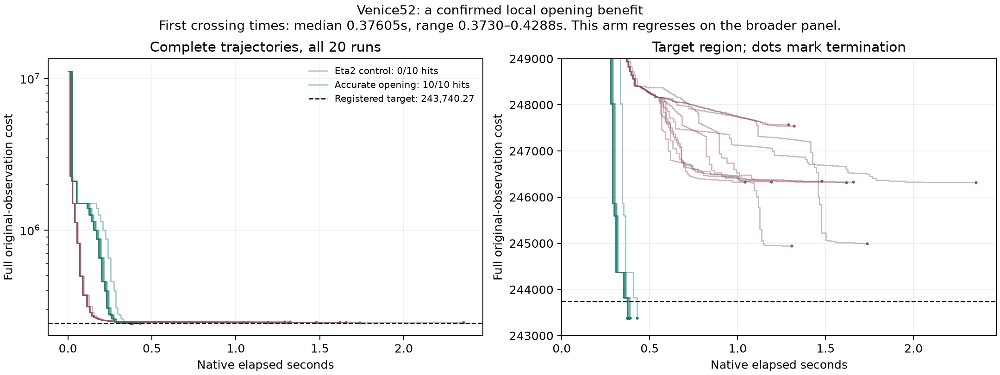

# Eta2 diagnostic-led research campaign, 2026-09-12

The campaign is complete at its registered diagnostic gates: all 13 briefs investigated, seven native comparisons (538 runs), ten additional Venice confirmation runs, and 40 predictor runs. **Frozen Eta2 remains the general champion.** Read the [full report](REPORT.md) for the theory, implementation choices, positive and negative results, and limits. Baseline: `../eta2_champion/champion.json`; source and 44 headers verified in-session. The original source, binary and defaults were not edited.

| Brief | Work | Status |
|---|---|---|
| 0 | Witness solve/model decomposition | Complete: no universal solve-versus-model diagnosis; [audit](analysis/FINDINGS.md) |
| 1 | Rigid-cluster two-level PCG | Strong coherent Venice spectrum result; native K8 additive arm pays setup without target benefit. [Native verdict](coarse/native/VERDICT.md), [METIS coverage control](coarse/graph_pretest/FINDINGS.md) |
| 2 | Homogeneous / frozen-anchor inverse-depth point charts | Plain charts and depth-frozen variant fail original fling gate despite large conditional cost gains; [charts](charts/FINDINGS.md), [depth freezing](charts/FINDINGS_DEPTHFREEZE.md) |
| 3 | Steihaug–Toint PCG | Complete74-run native panel: two practical wins, four regressions, Final3068 hit count4/5 to0/5; [verdict](steihaug/VERDICT.md) |
| 4 | Gram-consistent Jacobian products / nonnegative energy | Numerical mechanism reproduced3000/3000 versus0/3000; denominator-only fix invalid with point-solve error; [findings](gram/FINDINGS.md) |
| 5 | Opening budgets / trajectory racing | Forty-run predictor fails; no racing. Accurate opening reaches Venice 10/10 versus 0/10 but regresses elsewhere; unclipping alone fails to reproduce it. [Opening verdict](frontload/VERDICT.md), [attribution](opening_unclip/VERDICT.md) |
| 6 | PI radius controller | Complete74-run native panel: small practical gains, no clear storm reduction, Venice endpoint12.29% worse; [verdict](pi_radius/VERDICT.md) |
| 7 | ARC root finding | Free coupled-Schur shift graft invalid; valid full-normal64-vector projected-root screen gives virtually identical steps to matched LM; [findings](arc/FINDINGS.md) |
| 8 | Point-only residual-Hessian correction | Complete54-row witness screen; one SPD, sign-preserving point approaches projection horizon and explodes cost; [findings](point_newton/FINDINGS.md) |
| 9 | Nonlinear coarse correction / stopping oracle | Passenger model passes witness gate 2/3; native continuation accepts local corrections but rescues no target miss. [Native verdict](coarse/nonlinear_native/VERDICT.md) |
| 10 | Camera selection / per-track line search | Complete27-row witness screen: no rejected baseline opportunity; camera selection inert, fractions small; [findings](separable_rescue/FINDINGS.md) |
| 11 | Soft-mode perturbations | Seven eligible kicks admitted, zero target rescues; both scenes retain their control hit counts. [Native verdict](soft_kick/VERDICT.md) |
| 12 | Two-stage gradient-flow step | Complete27-row CPU screen: wins per-work comparison1/3 and loses2/3; no native continuation; [findings](rosenbrock/FINDINGS.md) |

Standing protocol: original observations, L2 SIMPLE_RADIAL, unshared intrinsics, k2=0; one registered configuration or global rule before a grid; N>=3 per comparison cell and N>=5 for hit-rate/tail claims; report both improvements and regressions. A verdict requires >0.15% median endpoint difference or disjoint time-to-target ranges. Keep the existing nine scene/tolerance cells and Venice/Final3068 targets, independently audit endpoint cost, and retain misses. Count initialization and all added solver work. No learned methods, outer acceleration, cross-attempt/outer Krylov reuse, periodic retriangulation, controller restoration, mixed-precision factorization, marginal-value stopping, or multi-shift candidate menu.

Some premises in the supplied briefs require testing. The historical 2.4e4 Ladybug point fling came from the older asymmetrically damped solver, not a verified frozen-Eta2 trajectory. Unresolved long-wavelength camera modes are a hypothesis, not an established explanation of its stop witnesses. Sphere-chart angle bounds do not bound Euclidean coordinates or remove projection poles. Literature/algebra corrections are recorded before experiments rather than silently used to reinterpret outcomes.

Large temporary arrays remain in memory or under ignored `build/`; durable compact results, source, protocols, manifests and hashes are committed. The workspace volume quota is nearly full, so existing datasets/evidence are not duplicated.

## What is established

The seven native arms each used an alternating comparison within one derived binary: 54 practical runs plus 20 tail runs, with ten extra Ladybug1197 runs for each opening arm. The accurate opening also received an independent five-pair Venice confirmation. Off-arm Final3068 hit counts differ across these small stochastic cohorts; they are not interchangeable baselines. No candidate passes the complete promotion gate. The [full report's comparison table](REPORT.md#native-comparisons) links every arm's timing ranges, costs and solver counters, including censored misses.

The useful findings concern mechanisms, with limits. Coarse modes really improve the coherent reference spectrum, but native assembly/factor fallback can consume the benefit. Accurate unconstrained GN is still rejected at the Final stop witnesses. A sphere chart bounds angular displacement rather than Euclidean point position. Even positive point curvature, modest world movement and unchanged depth sign do not prevent crossing close to a projection horizon. The original approximate-Schur negative-curvature hypothesis is reproduced on deliberately ill-conditioned toys, but it was inactive before the practical targets.

Prior-art corrections and primary references are in [MATH_AND_PRIOR_ART.md](literature/MATH_AND_PRIOR_ART.md). Multiscale/coarse BA, point-at-infinity charts, truncated CG and shifted-Krylov cubic regularization have established precedents. This campaign does not support claiming those components as new. Its contribution so far is the matched implementation evidence and the localized failure explanations.

The supplied briefs are conditional research directions, not thirteen promised improvements. A stopped prototype remains a scoped negative result; unimplemented variants remain explicitly marked rather than being counted as failures or completed comparisons.

## Figures and local positive

The accurate-opening result is a local positive on Venice, independently repeated: **10/10 target hits versus 0/10 off, median 0.37605s** for successful on runs. The same global configuration loses on Final3068 and slows seven practical cells, so it remains experimental. Pure opening unclipping reaches 0/5 on Venice; the useful interaction between accuracy, numerical consistency and trajectory remains unresolved.

