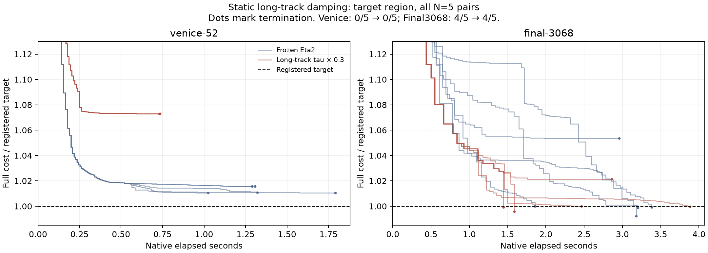

# Static long-track damping transfer to frozen Eta2

**Eta2 does use uniform relative point damping, but the proposed 1/1/0.3 rule does not pass this transfer screen. The original champion remains unchanged.** The registered twenty-run comparison is complete, with independent endpoint audits, the same targets and one binary off/on.

| Scene | Champion target hits | Stratified target hits | Successful-run median crossing | Median endpoint change |
|---|---:|---:|---|---:|
| Final3068 | 4/5 | 4/5 | 3.1911s → 2.0249s | +0.053% |
| Venice52 | 0/5 | 0/5 | Neither reaches target | **+6.134% worse** |

Final's crossing ranges overlap: champion [1.8563, 3.3823]s, stratified [1.4477, 3.8824]s. Those times condition on different successful subsets, so the lower median is a lead, not an established speedup. There is no observed reliability increase. Venice stops near 261,514 versus 246,399. Both registered extension conditions fail, so no larger panel or alternative dose was run. This is a negative transfer of the specified global rule, not a refutation of the other solver's supplied measurements or every form of class-dependent damping.



## Where the change enters

The frozen source sets `tau_eff = lam_cam` when `OCA_CLASSICAL_LM=1` and `attr_split` is false, as in champion.json. `MFPointFactorTau` then augments each point's observation QR with the same scalar tau times its guarded diagonal. For nondegenerate blocks the regularizer is

```
D_j = diag(max(Cdiag_j, 1e-3 * trace(Cdiag_j) / 3))
V_j(lambda) = J_pj^T J_pj + lambda * D_j.
```

There is also a pre-existing tiny positive fallback for zero diagonal sums; it is preserved. No track-length selector is enabled in the frozen champion.

The isolated [new factor kernel](track_factor.cuh) multiplies tau by 0.3 when the existing observation offsets give `m_j >= 6`. All shorter tracks retain multiplier 1. It runs on every attempt, including retries, after the original scalar coupling. No controller feedback, extra solve, new global buffer or additional kernel launch is introduced. It adds CSR-offset reads and a multiplication to the existing kernel; literal zero overhead was not assumed.

The resulting factors feed the reduced RHS, Schur products, diagonal scaling and point back-substitution consistently. The full undamped model and true objective acceptance remain unchanged. Since track classes and their multipliers are fixed within the solve, the original same-tau retry-cache key remains valid. Original camera damping, radius clipping, point keep/move rescue, numerical recovery and stopping are retained. `OCA_TRACK_TAU=0` calls the original point-factor kernel. Unsupported combinations fail a configuration guard.

This is a joint optimization change. For a fixed Jacobian and camera damping, lowering the point regularizer increases the inverse point block and reduces the unscaled camera Schur matrix in the positive-semidefinite order:

```
S(lambda) = U_lambda - W V_lambda^-1 W^T.
```

It also changes the reduced right-hand side. Thus the static law may transfer, but being based on track statistics does not make its effect independent of the optimizer's scaling, forcing and radius trajectory. Track count alone is not geometric conditioning.

## What the saved states show

The multiplier affects 26.85% of Venice points, representing 63.35% of its observations; on Final3068 the corresponding fractions are 15.56% and 59.61%. This is substantial participation despite touching a minority of points.

Every stratified Venice run takes 71 outers, with two rejected attempts and zero curvature repairs, then stops on FTOL. Its terminal raw/clipped camera-step ratio is about **425**, versus a control-cohort median of **1.96**; terminal rho is about 0.308 versus median 0.535. The intervention did not remove the clipping bind. Its faster termination at a worse cost is not faster convergence to the target, and the deterioration is not accompanied by activation of the numerical damping floor.

Endpoint cost increases in **all three track classes in every Venice pair**, including the shorter tracks whose damping coefficient was unchanged. The [class decomposition](tail_diagnostics.json) compares complete coupled trajectories; it does not isolate a causal point-only effect. It supports treating this as a trajectory interaction rather than assuming that less damping on well-observed points must improve the full problem. Final shows both signs across individual pairs and retains the same hit count.

## Validation and reproduction

The [protocol](PROTOCOL.md) was frozen before the grid and committed in `dc3364b`. Source and all 44 header hashes match the champion. The derived binary SHA256 is `37b262dc44c6f75cbd971f24bbb261735c793ff929ba92962bcc0bde27837679`; the reversible builder recovers the original source exactly when its substitutions are undone.

Validation passed:

- 3,084 actual GPU factor evaluations across track-count boundaries and tau values from 1e-14 to 1e3; maximum relative augmented-energy discrepancy 8.68e-16, shorter-track factors bit-identical.
- Thin-only toy off/on agreement and a mixed-track full-solver toy; compute-sanitizer reports zero memory errors for the mixed-track native path.
- N=3 original-versus-derived-off Dubrovnik88 compatibility, median cost difference about +0.000159%, below the registered 0.15% gate.
- All twenty scored rows checked against commands, champion flags, binary/protocol hashes, independent CPU full-objective audits, CSV target crossings, initial scores, acceptance/matvec totals and compressed endpoint hashes. Inputs retain original observations, SIMPLE_RADIAL, unshared intrinsics and k2=0.

Build and checks:

```bash
cd /tmp/prism-ba-coarse
python3 research/eta2_track_damping/build.py
python3 research/eta2_track_damping/check_factor.py
python3 research/eta2_track_damping/run.py toy
python3 research/eta2_track_damping/run.py compatibility
python3 research/eta2_track_damping/check_memcheck.py
python3 research/eta2_track_damping/run.py tail
python3 research/eta2_track_damping/report.py
python3 research/eta2_track_damping/analyze_tail.py
python3 research/eta2_track_damping/plot.py
```

The harness uses the frozen champion flags plus `OCA_TRACK_TAU=0/1`, identical attempt tracing and registered target/cap flags. Existing result files are reused, so these commands do not silently replace evidence; a fresh experiment needs a distinct output directory and its own registration. Exact scored endpoint containers remain local and ignored; compact results, traces, code, hashes and figures are versioned. To make room, ten already-completed accurate-opening endpoints from the prior campaign were moved into an additional verified lossless archive; no earlier numerical evidence was discarded.

The reported MFREE panel and MacKay analysis are supplied external findings; this experiment does not independently reproduce them. There is no new Caspar comparison or novelty claim. [Full measured table](RESULTS.md), [machine-readable summary](summary.json), [factor checks](factor_verification.json).
