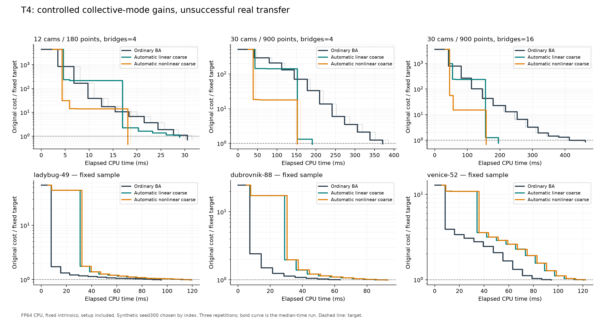

# Geometry research agenda: completed screen

**Frozen Eta2 remains the production incumbent.** All eight tracks in the
[supplied brief](brief.tex) were followed in order, including their stop rules.
No candidate earned promotion. The strongest mathematical mechanism is T4's
finite collective correction; its automatic version is up to **3.06x faster**
than ordinary BA on the controlled larger problems, but loses on all three
sampled real scenes. These are conditional research results, not a new claim
against Caspar or a fastest-solver claim.

All implementations are isolated on `research/geometry-agenda`. The original
solver and its frozen 44-header source manifest remain unchanged. The brief,
registration, protocols, code, raw outcomes, failed cases and figures are
versioned together. [PLAN.md](PLAN.md) records the progression and gates.

| Track | What the evidence says | Decision |
|---|---|---|
| [T1: projection-aware model defect](T1_RESULTS.md) | Exact geometry diagnostics work. Depth features do not improve held-out rejection prediction consistently. | Keep instrumentation; no new controller. |
| [T2: curved updates](T2_RESULTS.md) | Geodesic correction can reduce steps/rejections, but costs more time; pooled speed 0.65x ordinary LM. | Timing gate failed. |
| [T3: point relaxation before ranking](T3_RESULTS.md) | Winners change in 13–19% of menus, but post-acceptance polishing is cheaper. | Pre-ranking novelty gate failed. |
| [T4: collective nonlinear correction](T4_RESULTS.md) | Automatic v2: 3.06x / 2.70x on larger weak/strong bridges; 1.25x / 1.35x over matched linear coarse correction. Real transfer: 0.68–0.79x. | Supported controlled mechanism; no promotion. |
| [T5: observability-aware robust continuation](T5_RESULTS.md) | Recovers one additional mixed-bridge case; protects false bridges and costs time in the counterexample. | Robustness and timing gates failed. |
| [T6: bounded depth smoothing](T6_RESULTS.md) | Larger depth tube improves median low-parallax point error, but only 0.58x speed; normal-parallax benefit disappears after refinement. | No adaptive smoothing controller. |
| [T7: OCA spectral pruning](T7_RESULTS.md) | Algebra is correct; no tested pruning threshold preserves development selection quality. A simple four-candidate menu is 3.80x faster than the full grid. | Keep simpler-menu control; no new filters. |
| [T8: computation allocation](T8_RESULTS.md) | Small tree predicts local utility, but runs at 0.86x on unseen rotation and 0.97–1.05x on real samples. | No sequential RL escalation. |

Speeds above are time to each experiment's **identical fixed objective target**,
with setup, all candidate work, features and inference charged. Ten independent
held-out synthetic seeds per setting, N=3 timing repetitions, are used in the
main comparisons. Misses and geometric failures remain in the records. T5 and
T6 count target hits only at the prescribed final loss/radius. Their temporary
objectives are not substituted for final-objective comparisons.

## Strongest result and its limit

The two coarse methods share the same tangent basis. The nonlinear version
applies an exact finite cluster similarity, preserving all internal projections;
the linear version only preserves them to first order. The synthetic gain
therefore tests a geometric path effect, not a better solve of one linear model.
See [the derivation and closest prior art](T4_MATH.md). Automatic point ownership
matters: v1 loses on small cases; separately registered v2 repairs ownership
without changing observation weights or duplicating points.

Relative scale recovery also improves: on weak bridges the median maximum
absolute relative log-size error drops from 0.0455 (ordinary) to 0.00440
(nonlinear), with one global gauge treatment. Disconnected cases remain wrong
despite low objective values. The [geometry-only audit](t4_relative_scale_audit.json)
exactly reproduces the original endpoints and does not replace timing runs.

The immediate research lead is to detect weakly connected **real** geometric
regions independently of measured solver gains, then test a selective coarse
schedule with charged detection. The current all-scenes opening schedule
fails. A smaller engineering lead is fixed extra damping: T8 measures
1.34–1.55x on the three CPU real samples, but it is slower on depth problems
and has a rotation geometry counterexample. Neither lead is promoted.

## What was and was not compared

T1 reproduces and instruments the original nine-DOF GPU Eta2 solver on
Ladybug49, Dubrovnik88 and Venice52. Native/off CPU cost agreement and fresh
linear residual checks are documented separately. Its measured relative
linear residuals are deliberately loose; nonlinear failure is not proof that
linear accuracy no longer matters.

T2–T8 are FP64 CPU mechanism references with six camera DOFs, fixed intrinsics,
an explicit seven-coordinate gauge, and valid signed-depth checks. Every arm
within a comparison shares variables, observations and final objective. These
references are **not a speed comparison with nine-DOF GPU Eta2 or Caspar**.
Synthetic point/camera errors use one global alignment; real data have no
ground-truth geometry certificate. Reaching a scalar cost target alone can
leave substantial geometric error, which the reports explicitly flag.

The [primary-method ledger](SOURCES.md) covers sixteen inspected sources,
including close submap/coarse-space, geodesic, continuation and learned-damping
precedents. These experiments do not establish publication novelty.

## Artifacts and reproduction

- [Seven convergence figures, PNG/PDF and plotted CSV](figures/convergence/README.md).
- [Reproduction commands and dependency contract](REPRODUCE.md).
- [Source/input/toolchain registration](registration.json) and [capture build](capture_build_manifest.json).
- [Native evidence archives and member hashes](evidence/manifest.json).
- [Paired-seed uncertainty](paired_uncertainty.json), with failed pairs explicitly recorded.
- `t*_*.json`: full outcomes, curves, work, fixed targets and summaries; `evidence/*.npz`: independent parents, real samples and geometry audit endpoints.
- `validation.json` and `artifact_manifest.json`: final checks and package SHA256 inventory.

Native inputs remain at `/workspace/bal`. Packed real subproblems and synthetic
generators make the CPU experiments reproducible without the large original
BAL files. Runtime ratios describe this host and reference implementation;
millisecond timings and ten seeds do not provide universal certainty.
