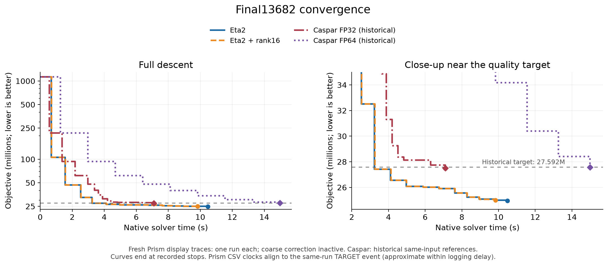
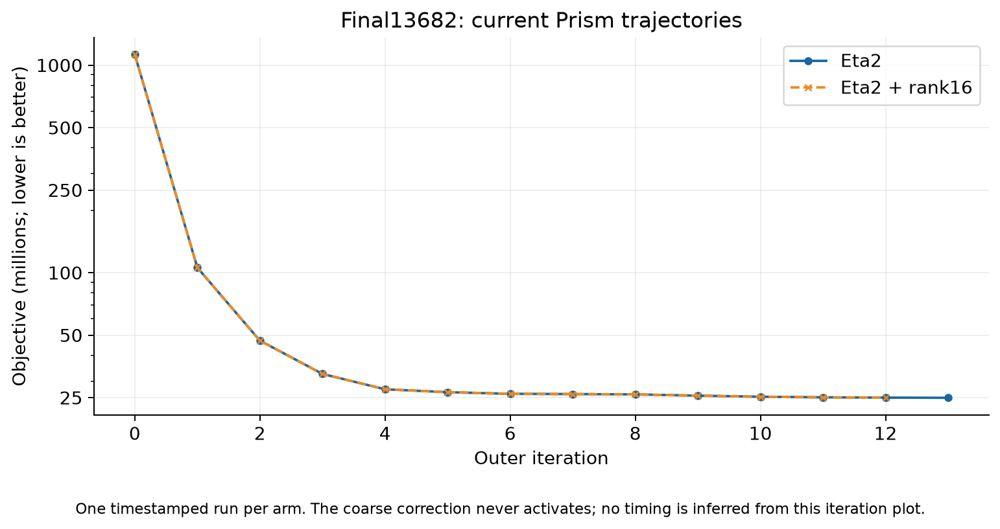

# Final13682 convergence figures

The blue/orange curves are **one new timestamped display run each** of eta2
and eta2 with rank16 history collection. The coarse correction never activates.
Both reach the historical primary target in about 3.25 seconds; the earlier
[N=3 target experiment](LARGEST_RESULTS.md) remains the performance result.
The later small divergence of these two display traces does not establish a
coarse-preconditioning speedup.

The red/purple curves are **historical Caspar FP32/FP64 references**, selected
as the median-target-time run of the previous N=3 same-input/host experiment
in `/workspace/prism-final13682-convergence`. They are not fresh Caspar runs.
Their input SHA256 matches this extension. They stop at their historical
quality target and are not extended horizontally or extrapolated afterward.

For the two new Prism traces, 25M was chosen as a display stopping cost to
show the later trajectory already explored in the capped tests. It is not a
new independent performance gate. The traces end at 24,949,413.994 after
10.4785 seconds / 13 outers and 24,996,076.722 after 9.8285 seconds / 12 outers,
respectively. No endpoint export or new CPU audit was performed for these
display runs. Their final costs use the unchanged native evaluator.

## Clock and plotting conventions

- Staircases hold the last recorded cost until the next measurement.
  No target time is inferred by interpolation or from an iteration count.
- Prism uses the existing `--csv` logger with 0.1ms timestamp resolution.
  Its clock starts after solver setup. The final CSV row immediately precedes
  the native TARGET event, so every CSV timestamp receives the constant
  offset `TARGET_seconds - final_CSV_seconds`: 0.033924394 s for eta2 and
  0.051517599 s for rank16. This restores solver setup and conservatively
  includes the final logging-to-TARGET delay. Intermediate alignment is
  approximate within that delay. Initial objective is placed at time zero.
- Caspar uses its saved native TRACE clock. Diamonds mark the previously
  independently audited FP64 endpoint; intermediate FP32 native costs are
  not rescaled. Caspar graph setup, input loading, export and audits are
  outside the native solve clock, as in the historical comparison.
- The primary target line is 27,591,576.557625167. The plots are descriptive;
  they do not replace matched repeats or establish a new Caspar speed ratio.

Downloads: [time PNG](figures/convergence/final13682_coarse_time.png),
[time PDF](figures/convergence/final13682_coarse_time.pdf),
[time SVG](figures/convergence/final13682_coarse_time.svg),
[iteration PNG](figures/convergence/final13682_coarse_iterations.png),
[iteration PDF](figures/convergence/final13682_coarse_iterations.pdf),
[data CSV](largest_curves.csv), [data JSON](largest_curves.json).

Reproduction: `run_largest_curves.py` collects only missing display runs and
checks the binary/input identity. `plot_largest_curves.py` regenerates the
figures from recorded data without running a solver. Compact evidence is in
[evidence/largest-curves-raw.tar.xz](evidence/largest-curves-raw.tar.xz), with
fingerprints in [evidence/largest-curves-inventory.json](evidence/largest-curves-inventory.json).
