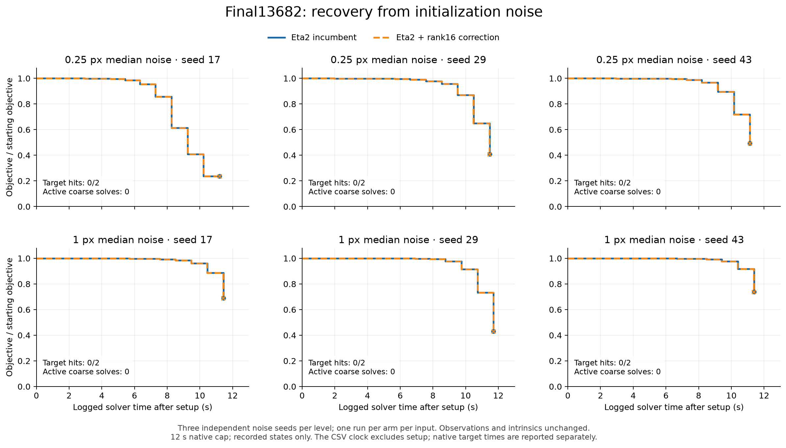

# Final13682 initialization-noise results

**Eta2 remains the incumbent.** Both arms missed the fixed target on all six noisy inputs within the registered short budget. The rank16 correction activated in **0 of 109 preparations**: all observed previous CG depths were one, below its activation threshold of 16. These runs do not measure the benefit of an active coarse correction.

This screen used 0.25 and 1.0 pixel median projected-displacement noise, three initialization seeds per level, and one run per arm per input. Camera poses and points changed; all observations and initial intrinsics remained identical. The two arms used the same existing binary with rank0 versus rank16. See [the registered protocol](NOISE_PROTOCOL.md).

| Median-noise level | Eta2 target hits | Rank16 target hits | Median final cost, both arms | Total rejects per arm |
|---|---:|---:|---:|---:|
| 0.25 px | 0/3 | 0/3 | 1.521952e+18 | 17 |
| 1 px | 0/3 | 0/3 | 2.561962e+19 | 20 |

The target was **27,318,392.631312046**. Every run retained 11 accepted outers; the arms used the same matvec and reject counts on each input. The largest relative paired endpoint difference was 1.212e-09 (1.212e-07%). No time-to-target ratio can be reported because neither arm reached the target. The 12-second native budget is checked at attempt boundaries; measured solve times were 12.163–12.733 seconds, totaling 149.034 seconds.

## What the noise exposed

The old 1.1x-RMS perturbation moved the median observation by only about two to three millionths of a pixel. Calibrating the new perturbation by median projected displacement instead moves the bulk of the scene. It also creates extreme projection errors in the tail: the initial L2 objective rises by many orders of magnitude even though most projections move modestly. Thus this is a severe initialization-sensitivity test, not a calibrated model of ordinary measurement noise.

| Requested px | Seed | Actual median / p95 displacement (px) | Maximum displacement (px) | Depth-sign changes | Initial objective |
|---:|---:|---:|---:|---:|---:|
| 0.25 | 17 | 0.251017 / 1.385213 | 1.896331e+07 | 0 | 1.463064e+18 |
| 1 | 17 | 1.004035 / 5.540657 | 7.585094e+07 | 3 | 2.340800e+19 |
| 0.25 | 29 | 0.250475 / 1.376527 | 3.626153e+07 | 3 | 3.726187e+18 |
| 1 | 29 | 1.001982 / 5.506946 | 1.450589e+08 | 3 | 5.962896e+19 |
| 0.25 | 43 | 0.249526 / 1.340634 | 3.236214e+07 | 1 | 4.407682e+18 |
| 1 | 43 | 0.998106 / 5.362498 | 1.294484e+08 | 1 | 7.052271e+19 |

The measured pattern is consistent with a nonlinear globalization bottleneck. Lambda escalated from 0.1 to as high as 268,435.456. With coupled camera/point damping, the Schur operator has the form `S_lambda = B + lambda D_c - E (C + lambda D_p)^(-1) E^T`. Increasing point damping suppresses the coupling term while camera damping strengthens the diagonal blocks. This explains why a difficult nonlinear recovery can coexist with very shallow preconditioned linear solves. The exact cause of the extreme projection tail has not been isolated here; projection sensitivity needs a separate geometry audit.

An appropriate next control is a bounded perturbation designed to limit extreme image displacement, with all clipping or excluded geometry reported. A separate measurement-noise experiment changes the objective and needs its own shared target. Neither is claimed to have been run here.

## Curves

The main figure normalizes each run by its own initial objective to make its progress visible. The [target-distance figure](figures/convergence/final13682_initialization_noise_target.png) instead plots objective divided by the fixed target on a log scale. The target is far below the recorded endpoints. Both plots use only accepted states and stop at the last recorded state; their unchanged CSV clock starts after solver setup. Native deadline/target accounting is separate. [Main PDF](figures/convergence/final13682_initialization_noise.pdf), [target-distance PDF](figures/convergence/final13682_initialization_noise_target.pdf), [curve data](noise_curves.csv).

Historical clean-input Caspar curves are omitted from this noisy comparison. No fresh Caspar-on-noise result was measured in this screen. Three seeds assess initialization sensitivity; they are not three timing repeats of the same input or a confidence interval.

## Verification and evidence

- Every observation prefix matched SHA256 `89212219a95d8748c068769d8642dbd802c6f59e64833aaece44078a81a81e49`. Every written parameter was read back exactly; intrinsics stayed identical.
- The zero-noise camera-center round trip changed the initial objective by only 8.3235e-11 relatively, changed no depth signs, and moved the median projection by 2.54e-13 pixels.
- All 12 native initial objectives agreed with the CPU calculation; the largest relative difference was 4.864e-13.
- The solver binary and frozen source were unchanged. No rebuild or change to an activation threshold was used.
- One merged stderr message split a `COARSE_PREP` record and interrupted the original Python parser after the solver had completed. The parser now reconstructs the record. That solve was retained, without a timing rerun. Its native RESULT, complete CSV and terminal diagnostics survive, but the process return code and process-wall duration were not saved and remain explicitly null. Eleven other process return codes are recorded as zero.
- The archive retains the original and resumed runner snapshots, manifest hashes, all logs/CSVs/result records, and the zero-noise check. Final runner edits only strengthen resume validation. Temporary full BAL copies were automatically cleaned from `/dev/shm`.

[Summary JSON](noise_summary.json), [compact raw evidence](evidence/noise-raw.tar.xz), [evidence hashes](evidence/noise-inventory.json), [reproduction commands](RUNNING.md).
