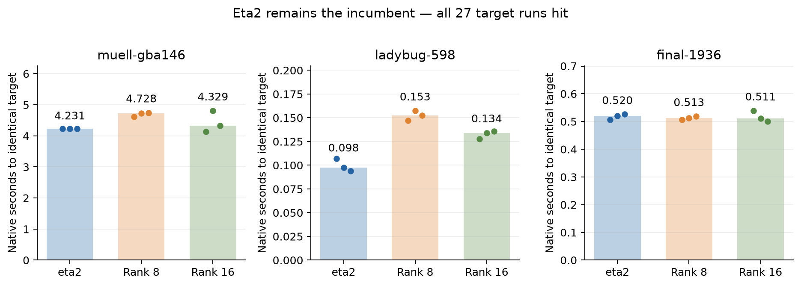
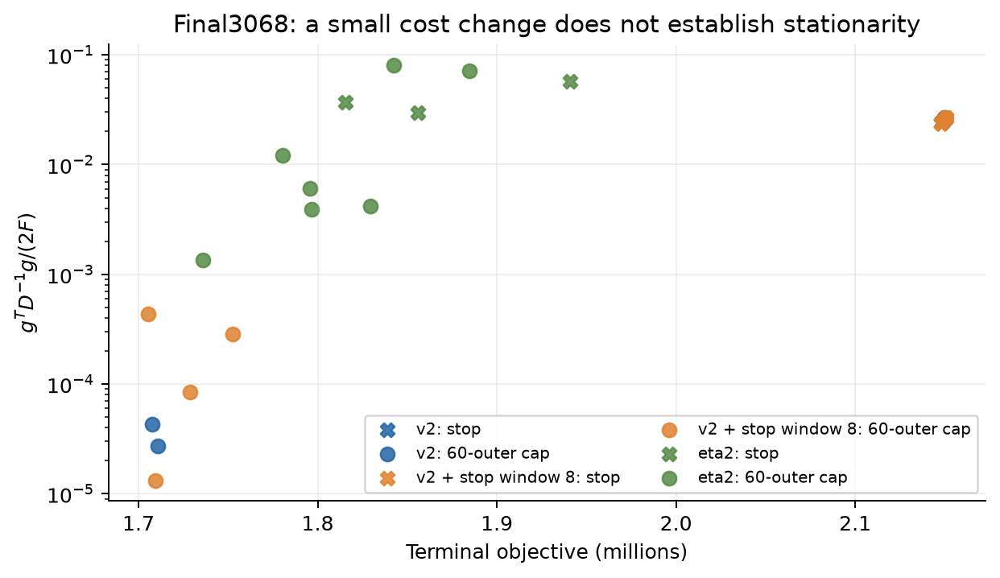

# Schur and physical-control experiments — 10 September 2026

**The frozen eta2 champion remains the incumbent. None of these candidates
earns promotion.** The useful new finding is a measurable mismatch between
the Gauss–Newton model and true directional curvature at Final3068 stalls.
Longer stopping windows and a simple gradient relaxation do not solve it.

Follow-up: [the Final13682 extension](LARGEST_RESULTS.md) ties at two historical
quality targets; the coarse correction remains inactive throughout that
short test. A separate curvature probe supplies a more benign contrast.

This implements the bounded sequence in [PROTOCOL.md](PROTOCOL.md), with
explicit amendments for the nonlinear screen and terminal probes. Code lives
on `research/schur-physics-experiments`; the original solver, frozen source and
default flags are unchanged. No Caspar run was added in this experiment, so
these results do not revise a Prism-versus-Caspar speed ratio.

## Time to identical target: the deciding gate

RTX 2000 Ada, one solver at a time, rotated arms, N=3. Same generated binary
and frozen eta2 configuration in all arms; only `OCA_COARSE_RANK=0/8/16`
changes. Targets were taken from existing experiments before these runs.
The table uses the native **TARGET event**, before terminal reporting.

| Scene and fixed target | Eta2 | Coarse rank 8 | Coarse rank 16 | Target hits |
|---|---:|---:|---:|---:|
| Muell-gba146, 1,946,488.746262194 | **4.231 s** | 4.728 s (+11.8%) | 4.329 s (+2.3%) | 9/9 |
| Ladybug598, 182,215.471430520 | **0.0977 s** | 0.1526 s (+56.2%) | 0.1338 s (+37.0%) | 9/9 |
| Final1936, 5,125,687.352261469 | 0.520 s | 0.513 s | 0.511 s | 9/9 |

Final1936 is a timing tie: the correction never activates, all arms take four
outers, and their cost agrees to roundoff. Rank16 Muell ranges from 4.129 to
4.805 s versus 4.228–4.234 s for eta2. Its median does not justify a change,
and it loses clearly on Ladybug. Rank16 takes seven outers on Ladybug versus
eta2's eight, but each solve costs more. Rank8 adds one rejection there.

Muell uses 16 outers for eta2, 17 for rank8 and 17–18 for rank16, with zero
rejections in these target prefixes. The coarse correction activates 11–12
times on Muell and once on Ladybug. This is a test of setup and solve cost as
well as nonlinear trajectory, not just an iteration-count comparison.

An intermediate chat update quoted Ladybug's complete `solve_seconds`
(0.100/0.155/0.139 s). The table above consistently uses the earlier TARGET
timestamp; both measurements give the same verdict. Muell/Final1936 used a
12-native-second, 600-outer safety cap; Ladybug used four seconds and 600
outers. No target run hit either cap. N=3 is a lightweight screen, not a
precise characterization of endpoint multimodality.

## Coarse Schur correction: valid algebra, unsuccessful basis

The implementation uses the balanced SPD inverse

\[
Q=Z(Z^TSZ)^{-1}Z^T,\qquad
P^{-1}=Q+(I-QS)M^{-1}(I-SQ).
\]

`M` is the existing camera-block preconditioner. Up to 16/32 normalized PCG
directions from the previous solve supply a rank8/16 Ritz basis. The previous
Euclidean Gram matrix is rank-truncated, current `SZ` is refreshed, and the
small current matrix must pass an SPD gate. The preconditioner stays fixed
inside each PCG recurrence. The nonlinear activation gate requires at least
16 iterations in the preceding solve. No extra Schur pass is needed for an
individual preconditioner application once `SZ` is stored.

| Frozen current system | Eta2/Hcc | Rank8 | Rank16 |
|---|---:|---:|---:|
| Muell outer12: current setup + solve | **131.906 ms / 41 CG** | 305.774 ms / 87 CG | 209.297 ms / 49 CG |
| Muell: products including current refresh/validation | **42** | 96 | 66 |
| Ladybug outer8 | 1.897 ms / 2 CG | 1.931 ms / 2 CG | 1.922 ms / 2 CG |
| Final1936 outer0 | 16.268 ms / 1 CG | 16.300 ms / 1 CG | 16.265 ms / 1 CG |

All current solves pass the same true full-operator residual tolerance.
Muell's predecessor, outer11, reaches 128 iterations **without passing**;
that failure is retained in the ledger. Median predecessor-plus-current
computational times are 536.019/711.475/614.794 ms. A separate cold workspace
probe, including allocation/destruction with resident input matrices, gives
538.982/736.339/625.312 ms (one probe each). The regular fixed timing excludes
workspace allocation and destruction; the cold probe supplies that missing
cost. Matrix loading and process startup are outside both linear gates.

Ladybug's predecessor is shallow, so its adjacent-capture correction is
inactive; Final1936 has no history. This motivated the explicitly exploratory
full-trajectory screen even after the fixed Muell loss.

The actual GPU `PrismCoarse::Apply` matches a dense CPU balanced inverse to
5.39e-16 relative error, symmetry to 2.50e-16, and `P^-1 S Z = Z` to 5.51e-16
on an SPD test matrix at both ranks with wrapped history. Positive minimum
eigenvalues and zero-error CUDA memcheck were verified. These tests validate
the algebra, not its usefulness on BA. The result rejects this recycled
Euclidean Ritz basis and activation rule; it does not refute generalized
Ritz selection in the preconditioner metric or geometry-based multigrid.

## Coupled damping menu: both matrix and RHS are correct

For each factor `.25, .5, 1, 2, 4`, the prototype updates camera damping,
point damping, the projected Schur matrix **and the eliminated RHS**. It uses
per-point spectral factors and a current basis containing the center step.
Every candidate is checked against the original Givens-factor full operator
at the captured eta=0.5. Independent Hcc solves are the five-member control;
a single center solve is also reported.

| Frozen system | Single center | Five independent solves | Rank16 projected subtotal | Plus CPU point setup | Projected member hits |
|---|---:|---:|---:|---:|---:|
| Muell outer12 | 134.128 ms | 671.085 ms | 304.905 ms | 2303.527 ms | 15/15 |
| Ladybug outer8 | 2.386 ms | 12.698 ms | 23.770 ms | 140.810 ms | **9/15** |
| Final1936 outer0 | 21.964 ms | 110.172 ms | 101.246 ms | 3085.117 ms | 15/15 |

These are medians of three batches. Actual basis ranks are 16, 2 and 1,
respectively. Rank8 gives the same pass/fail verdict, with subtotals of
312.360/23.672/104.350 ms. Ladybug fails at factors 2 and 4: relative residuals
0.5555/0.6656 exceed 0.5. A retained center fallback is disclosed but is not
counted as a successful five-member menu.

Projected action and RHS parity errors are at most 2.94e-12 and 4.34e-12.
The center RHS reconstruction agrees within 4.69e-14. Thus a projected family
can represent coupled damping correctly; ordinary scalar-shift CG cannot
be assumed to do so when point elimination changes with lambda.

Muell's subtotal is **2.20x faster than five independent solves**, but still
2.27x the single-center cost. This does not beat the champion. Its lambdas
are also tiny and its five residuals are nearly identical, so this gate
does not demonstrate useful nonlinear diversity.

The subtotal includes basis construction, current refresh, projections,
factor updates and true-residual validation. The additional point setup is
a CPU NumPy reference eigendecomposition including input read, measured once
per capture and charged to each menu. It is not a GPU eigensolver performance
claim. Initial matrix/spectral host-to-device loading and final workspace
destruction are excluded, so even the setup-inclusive number is not complete
end-to-end runtime. Optimizing the CPU setup could change that cost, but it
would not remove Ladybug's residual failures or establish a single-solve win.
No nonlinear menu integration passed the prerequisite gate.

## Damping and stationarity audit

Final3068, 60-outers maximum, 30-process-second safety limit, every run kept.
The v2 arm uses the delivered library-equivalent flags including `tau_pt=.003`,
`func-tol=1e-6`, and `max-consec-fail=3`. `window8` changes only the existing
`OCA_STOP_WINDOW=8` option. Eta2 is a separate frozen configuration, not an
ingredient-matched ablation. Gradient-instrumented timings are not used for
an uninstrumented speed claim.

The diagnostic assembles a **fresh undamped** gradient at the terminal state.
Its scale is `nu = g^T D^-1 g / (2F)`, using the undamped Hessian diagonal
with positive per-block floors. This is a stationarity diagnostic, not a
certified distance-to-optimum estimate.

| Cohort, N=10 each | Median endpoint | Cost-stop / outer-cap | Endpoints above 2M |
|---|---:|---:|---:|
| v2, gradient diagnostic on | 2,149,221 | 7 / 3 | 8 |
| v2 + window8, diagnostic on | 2,147,883 | 5 / 5 | 6 |
| eta2, diagnostic on | 1,822,410 | 3 / 7 | 0 |
| Original delivered v2, diagnostic off | 2,148,943 | 9 / 1 | 10 |
| Rebuilt v2, diagnostic off | 2,149,274 | 10 / 0 | 10 |

In the instrumented v2 cohort, the high endpoints have `nu=0.0240–0.0266`,
versus 2.71e-5–4.31e-5 for the two low endpoints. Their last effective point
damping is **3e6–3e8**, often while the post-update camera lambda is near
1e-7. This is not adequately described by a single high camera lambda.
`tau` in terminal telemetry is the last applied point damping; `lambda` is
the controller's current, potentially post-acceptance value.

The longer stopping window still produces high-cost stops. Its 4-versus-2
low-endpoint count is not a statistically established win. Eta2 also has
three cost-based stops with substantial normalized gradient, approximately
0.0299, 0.0576 and 0.0372. Better target speed does not establish stationarity
at every endpoint.

The off controls reproduce the high-cost regime in both the delivered and
rebuilt binaries. Logging and floating-point ordering can alter trajectory
selection: do not interpret these separate batches as paired states or
unbiased estimates of mode probabilities. Earlier endpoint multimodality
must not automatically be described as selection among stationary minima.

## Physical relaxation exposes a model limitation

For unshared 9-DOF L2 BA, each residual row touches at most 12 variables.
With `H=J^T J` and `D=diag(H)`, Cauchy–Schwarz gives `H <= 12D`.
Increasing tiny diagonal entries preserves that inequality. Therefore the
step `d=-D^-1 g`, scaled by `alpha=1/12`, decreases the **GN quadratic** by
at least `alpha*g^T D^-1 g/2`. This is a stiffness-based step-size argument;
it is not a guarantee for nonlinear reprojection cost.

A read-only terminal probe tested that direction with Armijo acceptance and
four backtracking scales. All three v2 stops and two eta2 stops rejected
every permitted scale. The one eta2 outer-cap endpoint accepted alpha=1/12.
Small-scene finite differences validated the gradient sign and scale to
better than 2.1e-7 relative error. All probes leave the solver state unchanged.

An [extended diagnostic](EXTENDED_PROBE_PROTOCOL.md), registered after those
failures, allowed 12 scales and five directional finite-difference radii.
All three new v2 endpoints stopped early near 2.15M. They accepted only after
7–10 backtracks, with alpha between 3.18e-7 and 2.03e-5. Gains were only
**0.0178–0.2306 objective units**, approximately 8e-9–1.1e-7 relative.
This is descent, but not a useful convergence-speed improvement.

| v2 extended probe | Curvature / analytic GN upper bound at epsilon=1e-6 | At epsilon=1e-7 |
|---|---:|---:|
| 00 | 244,929 | 244,942 |
| 01 | 18,505 | 18,513 |
| 02 | 7,463 | 7,457 |

These are finite-difference estimates of true directional curvature along
the existing retraction, divided by `12*g^T D^-1 g`. Stability over adjacent
scales is evidence, not a certified Hessian bound; the smallest scale can
suffer cancellation and the largest scale truncation error. All raw values
are retained. The corresponding first-derivative errors are around
0.04–0.41% at these middle scales.

The three extended eta2 runs all hit the outer cap, not an early stop, and
accepted the opening gradient scale with only 0.0048–0.0646% potential cost
gain. They do not establish that the earlier eta2 stalls are recoverable by
the same rule. No recovery controller was promoted or integrated.

**Interpretation:** the v2 stalls admit descent, but the useful scale can be
extremely narrow. Large residual-weighted curvature, projection geometry,
or a small number of pathological observations are candidates for the
missing stiffness. These mechanisms have not yet been localized. The next
useful mathematical experiment is to decompose
`sum_i r_i d^T Hess(r_i) d` by observation/track, check depth and intrinsics
contributions, then test a selective curvature correction or local step
limit. Increasing backtracking depth alone is not the recommended next step.

## Reproduction and evidence

- [summary.json](summary.json) retains every principal run and the recomputed
  aggregates. `summarize.py` reads raw logs; `plot_results.py` produces PNG/PDF
  figures. See [RUNNING.md](RUNNING.md) for commands and dependencies.
- [evidence/raw-logs.tar.xz](evidence/raw-logs.tar.xz) contains compact raw
  logs, commands, protocols, input/capture hashes, and build manifests.
  Large captured matrices remain in `/workspace/prism-schur-physics`; they
  are not hidden inside the Git repository.
- [evidence/generated-sources.tar.xz](evidence/generated-sources.tar.xz)
  preserves exact generated translation units/headers from the measured
  builds. The original fixed-test source is also retained separately because
  the menu later added an optional output-vector argument.
- [evidence/v2-source.tar.xz](evidence/v2-source.tar.xz) preserves the delivered
  v2 source and headers. Its original binary fingerprint remains
  `fb76817faae3290a9a815f7a8fce1681d2dc34cfa60b25134b54e72998120698`.
- CUDA memcheck reported zero errors for active coarse correction, the menu,
  gradient instrumentation, and both terminal probes. Off-mode objective
  parity passed on Ladybug49 before timing. Frozen source/header checksums
  are unchanged. GPU algebra checks and the earlier CPU derivations passed.

The methods have substantial prior art, collected in the [research review](README.md).
These experiments support a useful negative result and a sharper curvature
hypothesis; they do not establish a novel faster solver.
